Українська система розвитку спорту базується на радянських механізмах, які не працюють в ринковій економіці та демократичному суспільстві. Поки кошти платників податків витрачаються на палліативну підтримку цієї системи, все більше і більше людей прагнуть перевести розвиток спорту на європейську модель.

І якщо загальні принципи європейської клубної системи спорту вже не є секретом, то деталі того як саме європейські країни та міста розвивають спорт знайти непросто, тим паче українською мовою. Окремою проблемою є і той факт, що "європейська модель" – це загальний термін для різноманіття підходів в різних країнах та містах. Хоч і об'єднані спільними рисами, європейські країни мають свої особливості, зумовлені унікальністю історії кожної з країн.

Тож сьогодні ми презентуємо дослідження по муніципальному фінансуванню спорту 10 європейських міст. Мета дослідження – побачити спільні риси та відмінності у підходах до фінансування спорту. Як бонус, дати читачеві можливість побачити очима місцевих мешканців взаємодію зі спортивними департаментами свого міста. На останок, порівняємо ключові принципи та погляди на спорт в Європі та Україні.

Отже, ми обрали 10 міст Європи і спробуємо дати відповіді на наступні питання:

 - Як місцева влада комунікує цілі розвитку спорту?
 - Які суми виділяються на спорт відносно загального бюджету міста?
 - Як саме ці кошти використовуються?
 - Які особливості у цього міста, якого немає в інших?

## Як ми обирали міста?
 
Оскільки метою дослідження є охопити якнайбільше з різноманіття моделей фінансування, ми поглянули на одну з найповніших класифікацій європейських моделей спорту. Це дослідження [Vocasport](http://eose.eu/wp-content/uploads/2014/03/vocasport-Final-Report-English-Version.pdf) 2004-го року, проведене за запитом Єврокомісії. В цій ґрунтовній дослідницькій роботі спортивна система кожної з країн ЄС була проаналізована в політичному, економічному, соціальному та культурному вимірі. Ще одне дослідження, яке відштовхується від Vocasport і варте уваги – це робота Ian Henry ["European Models of Sport: Governance, Organisational Change and Sports Policy in the EU"](https://www2.sed.tohoku.ac.jp/~edunet/annual_report/2009/09-19_henry.pdf). На цих класифікаціях було обрано 10 країн і 10 міст Європи: 5 столиць і 5 менших міст.

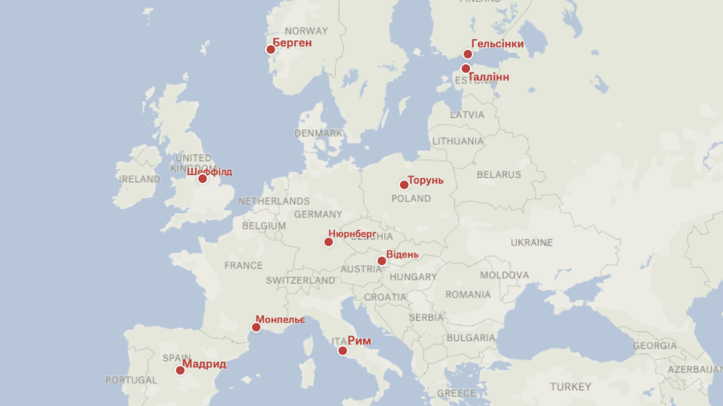

Зміст:
 - [Таллінн (Естонія)](#таллінн-естонія-) 🇪🇪
 - [Мадрид (Іспанія)](#мадрид-іспанія-) 🇪🇸
 - [Гельсінки (Фінляндія)](#гельсінки-фінляндія-) 🇫🇮
 - [Відень (Австрія)](#відень-австрія-) 🇦🇹
 - [Рим (Італія)](#рим-італія-) 🇮🇹
 - [Шеффілд (Великобританія)](#шеффілд-великобританія-) 🇬🇧
 - [Нюрнберг (Німеччина)](#нюрнберг-німеччина-) 🇩🇪
 - [Торунь (Польща)](#торунь-польща-) 🇵🇱
 - [Монпельє (Франція)](#монпельє-франція-) 🇫🇷
 - [Берген (Норвегія)](#берген-норвегія-) 🇳🇴
 - [Висновки](#висновки)

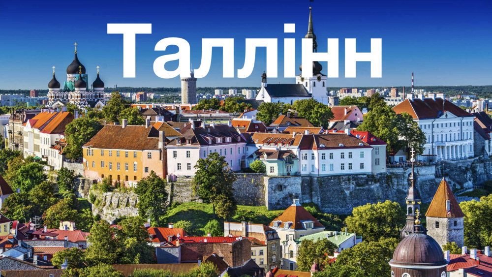

# Таллінн, Естонія 🇪🇪

Таллінн є столицею Естонії і налічує 437 811 мешканців (приблизно як наш Миколаїв чи Маріуполь до окупації).

## 📜 Історична справка

Організація спорту в Естонії історично побудована навколо клубів – добровільних громадських організацій. Перший клуб було створено у 1863 році, як продовження популярної в ті часи німецької системи гімнастики Turnvereine. Розквіт спортивного руху Естонії прийшовся на 1920-ті роки після [здобуття незалежності](https://uk.wikipedia.org/wiki/Війна_за_незалежність_Естонії).

У 1919-му році було створено Естонську Спортивну Асоціацію (Eesti Spordi Liit), що поєднувала клуби і навіть відправила команду на Олімпійські Ігри 1920 в Антверпі, але вона швидко вичерпала свої можливості і заохочувала клуби створювати свої федерації. У 1921-му було створено Естонську Федерацію Футболу та Естонську Федерацію Зимових Видів Спорту, які дали приклад і іншим видам спорту. У 1923-му федерації об'єдналися у Центральну Спортивну Спілку Естонії. Уряд заснував Естонський культурний фонд, кошти з якого використовувались для підтримки спортивних клубів.

Естонія була анексована радянською росією після нацистсько-радянської угоди (Пакт Молотова-Ріббентропа) у 1940-му році і окупована у 1944-му після закінчення Другої Світової Війни. Станом на 1940-й рік Естонія налічувала 10 федерацій і 11 регіональних спортивних ассоціацій, які разом об'єднували 350 спортивних клубів.

Після окупації всі спортивні організації та клуби Естонії були заборонені як "рудименти старого опресивного режиму", а деякі представники колишньої спортивної спільноти Естонії розстріляні чи заслані в табори. СРСР встановили повний державний контроль над системою спорту. З 1944-го по 1990-ий рік спортивні організації Естонії керувались централізовано з Москви. Спортивні клуби були організовані державою і несли функцію підготовки робочої сили для планової економіки та здобуття медалей для престижу СРСР. З 9507 різних спортивних гуртків, секцій, шкіл та клубів лише 37 мали назву "спортивний клуб", проте не мали головних характеристик клубів – свободи прийняття рішень, демократичності прийняття рішень та добровільного членства.

Після розпаду СРСР у 1991-му Естонія повернулась до спортивної моделі, яка була до окупації. Національний Спортивний Конгрес вирішив, що спорт буде розвиватись через громадські об'єднання – спортивні клуби. У 2005-му році новий закон про спорт дозволив спортивним клубам мати також комерційну природу.

## 🎓 Законодавча база

Головні закони та положення, які регулюють спорт у Талліні:

 - ["Закон про спорт"](https://www.riigiteataja.ee/akt/12778251) (2005)
 - ["Закон про школи за інтересами"](https://www.riigiteataja.ee/en/eli/520122013002/consolide)
 - ["Закон про організацію місцевого самоврядування"](https://www.riigiteataja.ee/akt/12849896?leiaKehtiv=)
 	- [Положення "Порядок надання підтримки неприбутковій діяльності"](https://www.riigiteataja.ee/akt/408092021002)
 	- [Положення "Порядок забеспечення спортивної діяльності"](https://www.riigiteataja.ee/akt/410062016012?leiaKehtiv)
 	- [Додаткові умови визначення підтримки неприбуткової діяльності у сфері спорту](https://www.riigiteataja.ee/akt/405112021003)

## 💰 Бюджет

Загальний бюджет Таллінна на 2022-ий рік [становить](https://www.tallinn.ee/en/tallinn-supports-youth-sports-eu66-million-year) 1.03 мільярда євро. З них 16 мільйонів євро (0.015%) [виділено](https://www.riigiteataja.ee/aktilisa/4281/2202/1027/Kulude%20eelarve.pdf#) на сферу спорту та фізичної активності.

З цієї суми:

|   |   |
|---|---|
| Спортивна інфраструктура |  € 8.5 мільйони |
| Гранти на спорт  |  € 6.2 мільйони |
| Таллінська спортивна школа  | € 1.3 мільйони |
|||

Окремо в бюджеті закладено 2.5 мільйони євро на підтримку міжнародних та місцевих змагань, що проводяться федераціями та клубами, та інвестиції у спортивні об'єкти на суму 9 мільйонів євро. З 8.5 мільйонів на інфраструктуру, очікується 3 мільйони прибутку.

## Підхід до розвитку

Місто втілює свої задачі щодо розвитку спорту через спортивні клуби. Це робиться двома шляхами: гранти клубам та членство клубів у Талліннській спортивній школі.

### ✅ Гранти
 [Гранти на спортивну діяльність](https://www.tallinn.ee/en/sports-activity-benefit) направлені на підтримку клубів, що надають послуги дітям від 7 до 19 років і людям з інвалідністю.

#### Процес
Заявки на грант подаються раз на рік через онлайн систему міста. Комісія з 7 людей розглядає заявки та приймає рішення. У випадку позитивного рішення з клубом підписується контракт.

#### Умови для отримання гранту

 - мати щонайменше 25 постійних членів
 - в клубі працюють тренери щонайменше 4-ї категорії (якщо більше 100 людей - то 5-ї)
 - послуги мають бути не "оздоровчим спортом" – не спортзали чи аеробіка

#### На що можна витрачати?

 - на оплату роботи тренерів
 - на оренду інфраструктури
 - до 30% покриття інших витрат (транспорт, участь у змаганнях тощо)

#### Моніторинг

 - після закінчення періоду гранту клуб має надіслати репорт та банківські виписки
 - спортдепартамент в будь який час може проводити рандомні перевірки і запросити документи, що підтверджують цільове використання коштів
 - за невиконання умов контракт скасовується, кошти підлягають поверненню, накладається бан на 3 роки на отримання грантів і публікується інформація на сайті міської ради

 #### Як розраховується сума
 
Таллінн використовує схему коєфіцієнтів для вирахування суми підтримки для кожної заявки. Туди входять такі параметри, як кількість членів, вікові групи, тип спорту, пріоритет спорту, рейтинг у федерації свого спорту, кваліфікації тренерів та рівень клубу. Повний алгоритм розрахунку занадто заплутаний, щоб впевнено його описати на одній сторінці.

Ось приклад одного з пунктів з [положення](https://www.riigiteataja.ee/akt/410062016012?leiaKehtiv):

> 4. Коєфіцієнт рейтингу у спортивних лігах:
>
> 	4.3. У випадку, якщо клуб знаходиться в першій третині рейтингу, сума субсидії X розраховується на базі кількості членів, що отримують допомогу у третій третині рейтингу (параграф 6, пункти 1, 2, 3) помножений на 0.5, або на 0.3, якщо спортивна організація не є в рейтингу, або не приймала участь в національних змаганнях, що є сумою Y. Якщо є такі організації, які мають коєфіцієнт 0.3, то Y отримується додаванням результатів множення X * 0.5 та X * 0.3. Результат Y віднімається від суми субсидії X. Результат віднімання Z (Z = X-Y) розділяється на загальну кількість спортсменів, що отримують допомоги з третьої третини рейтингу. Результат ділення додається до суми підтримки з першої третини рейтингу, вже розрахованому на підставі параграфу 6 секції 1, на базі кількості членів.

🥹

У [анонсі грантів на сайті міської ради](https://www.tallinn.ee/en/tallinn-supports-youth-sports-eu66-million-year) у лютому наведені такі цифри: 160 спортивних організації, 22 290 спортсменів, 555 тренерів, €220 на людину + додаткові €50 на людину для більш розвинутих клубів.

### ✅  Талліннська спортивна школа
З 2016-го року в Таллінні також було створено [Таллінську спортивну школу](http://tsk.ee) – комунальну організацію, що [підпорядковується](https://www.riigiteataja.ee/akt/405042016059?leiaKehtiv=) місту і зосереджується на підготовці конкурентноспроможніх спортсменів. Школа об'єднує під одним дахом клуби з різних видів спорту. Кожен клуб може податись на членство в школі, якщо відповідає певним вимогам і має спортсменів відповідного рівня.

## 🧐 Особливості Таллінна

1. Гранти на розвиток спорту надаються клубам як комерційної, так і громадської форми власності. Це відрізняється від інших міст у цьому дослідженні, де спортивні гранти можуть отримувати виключно громадські організації. (Аналіз причин цього ми наводили у статті ["Чому спортклуби ЄС - громадські організації?"](https://eusport.org.ua/2022/07/nonprofits/))
2. Відсутні стимули клубам розвивати спорт для населення середнього та літнього віку, фокусуючись переважно на дитячому та юнацькому віці. Необхідність стрімко розвивати клубну систему у 1990-х призвело до структури грантів, які стимулювали створення маленьких клубів одним чи двома тренерами-ентузіастами і фокусувались на дітях. Маленькі клуби виживали переважно завдяки грантам і не розвивались в самодостатні громадські організації, що залучають широке коло членів та джерел доходу. Це, в свою чергу, призводило до маленьких зарплат тренерів, відсутності перспектив для молодих талантів, малу зацікавленість потенційних спонсорів, що стримує розвиток спорту в Естонії.
3. Вплив радянської ідеології спорту також вплинув на поточну модель фінансування спорту в Таллінні – створення Талліннської спортивної школи вбачається деякими клубами як "повернення до ДЮСШ". Клуби, які засновані тренерами, що тренували при СРСР, не мають ознак демократичних клубів і є громадськими організаціями лише на папері, а на практиці керуються однією людиною.

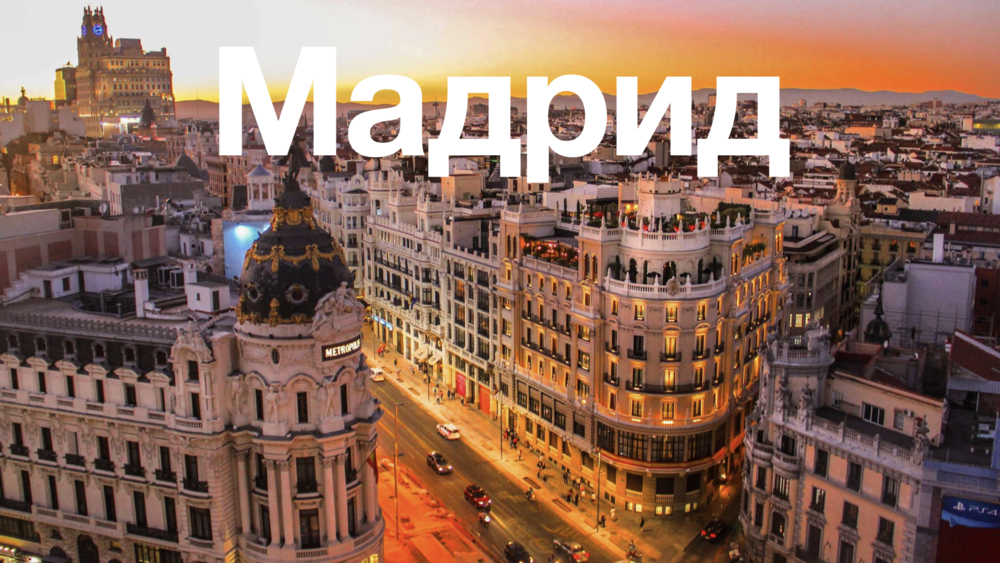

# Мадрид, Іспанія 🇪🇸

Мадрид є столицею і найбільшим містом Іспанії. Населення міста - 3.2 мільйони людей (це більше за Київ).

## 📜 Історична справка

Організований спорт прийшов в Іспанію, як і більшість країн Європи з Британії, хоча й відносно пізно. Перші іспанські спортивні клуби були засновані в кінці 19-го століття і засновувались переважно молоддю, яка їздила навчатись в сусідні країни, або робітниками з інших країн. Одним з найвідоміших прикладів тут є історія Ганса (Хоана) Гемпера - інженера з Швейцарії, який заснував футбольний клуб Барселона. Британська модель заклала принципи демократичності: спортсмени і практики спорту були і менеджерами, і засновниками клубів.

Радикальна зміна в структурі іспанського спорту відбулася по закінченню громадянської війни у 1939-му році, разом з початком диктатури Франсіско Франко. Спортивні клуби та федерації втратили свою автономність, свободу прийняття рішень та демократичність вибору правління. Національна Спортивна Делегація – організація створена новим диктаторським урядом для контролю спорту – тепер призначала керівників федерацій, які, в свою чергу, блокували чи дозволяли певним людям займати керівні посади в клубах. Хоча спортивні клуби і залишались ледь не єдиним джерелом оппозиційного руху, їх функціонування тепер контролювалось державою. У своїх статутах клуби мали погодитись на субординацію Національній Спортивній Делегації.

Диктатура закінчилась зі смертю Франко у 1975-му році. Іспанія стрімко розпочала процес демократизації. Спорт був визначений у новій Конституції 1978-го року, і у 1980-му було прийнято "Закон про фізичну культуру та спорт". Кількість спортивних клубів стрімко зросла, уряд активно почав інвестувати у спортивну інфраструктуру, а муніципалітети – активно розвивати масовий спорт. Цей період навіть називають "муніципалізацією іспанського спорту".  У 1986-му Іспанія стала членом Європейського Союзу. Новий закон про спорт, прийнятий у 1990-му році чітко розділив масовий, професійний та елітний спорт. Спеціальні юридичні форми для професійних клубів (SAD - Sociedad Anónima Deportiva) мали на меті дати більший контроль державі над професійними клубами.

В той же час була проведена децентралізація спортивного управління – іспанські автономії прийняли свої закони про спорт. Це заклало одну з рис іспанської системи спорту – її різноманітність. Хоча іспанська модель базується на співпраці держави з клубами, держава також займає активну роль у наданні спортивних послуг.

## 🎓 Законодавча база

Головні закони та положення, які регулюють спорт у Мадриді:

 - ["Закон про спорт"](https://www.boe.es/buscar/pdf/1990/BOE-A-1990-25037-consolidado.pdf) (1990)
 - ["Закон про гранти"](https://www.boe.es/buscar/act.php?id=BOE-A-2003-20977) (2003)

## 💰 Бюджет

Загальний бюджет Мадриду на 2022-ий рік [становить](https://www.madrid.es/UnidadesDescentralizadas/Presupuestos/PresupuestosAnuales/Ppto2022/PptoDefinitivo_2022/FicherosPpto2022/Tomo1_2022.pdf) 5.8 мільярда євро. З них 2.5 мільйони виділено на гранти клубам.

Бюджет "на спорт" оцінити складно, оскільки він включає в себе і гранти, і інвестиції в [спортивну інфраструктуру](https://www.madrid.es/UnidadesDescentralizadas/Presupuestos/PresupuestosAnuales/Ppto2022/PptoDefinitivo_2022/FicherosPpto2022/Tomo1_2022.pdf), і муніципальні послуги, які йдуть під однією категорією ["культура, туризм та спорт"](https://www.comunidad.madrid/sites/default/files/gobierno_abierto/2022-presupuesto-libro-17-cultura.pdf), але ось приблизна структура на 2022-ий рік:

|   |   |
|---|---|
| Інвестиції у спортивну інфраструктуру |  € 6.9 мільйони |
| Гранти на спорт клубам |  € 2.5 мільйони |
| Муніципальні спортивні проєкти  | € 3.5 мільйони |
|||

## 🏦 Спортдепартамент

Відповідальним за спорт в Мадриді є Головне управління спорту ([Dirección General de Deporte](https://www.madrid.es/portales/munimadrid/es/Inicio/Cultura-ocio-y-deporte/Deportes/Direcciones-y-telefonos/Direccion-General-de-Deporte/?vgnextfmt=default&vgnextoid=9ff8e0e1f181c010VgnVCM1000000b205a0aRCRD&vgnextchannel=9b08151c238fe410VgnVCM2000000c205a0aRCRD)), яке розробляє та втілює стратегію розвитку спорту для жителів Мадриду.

[Сайт спортдепартаменту](https://www.madrid.es/portales/munimadrid/es/Inicio/Cultura-ocio-y-deporte/Deportes?vgnextfmt=default&vgnextchannel=c7a8efff228fe410VgnVCM2000000c205a0aRCRD) містить наступні розділи:

 - Групові спортивні заняття
 - Спортивні об'єкти
 - Гранти для спортивних громадських організацій на проведення змагань
 - Гранти для спортивних громадських організацій на підтримку спорту для жінок
 - Мобільний додаток
 - Каталог "Мадрид – спортивна столиця світу"
 - Спорт на вулиці
 - Муніципальні медичні центри для спортсменів
 та інше.
 
Мадрид активно формує бренд "спортивної столиці світу". В основі лежить плідна співпраця та гранти спортивним громадським організаціям: клубам та федераціям, співпраця зі школами, медичними закладами та інвестиції в спортивну інфраструктуру.

[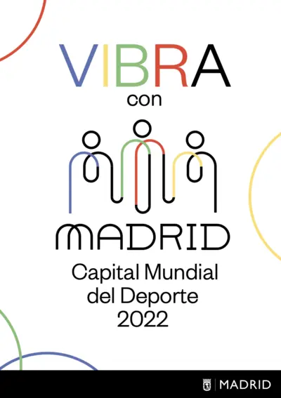](https://www.madrid.es/UnidadesDescentralizadas/Deportes/Colecciones/MadridCapitalMundialDeporte/Ficheros/folletovibra.pdf)

Також Мадрид має мережу власних спортивних центрів – 78 мультифункціональних спортзалів у всіх районах міста, які [надають](https://www.madrid.es/UnidadesDescentralizadas/Deportes/Promocionales/Ficheros/programadeportivomunicipal22.pdf) безкоштовно базові послуги: тренажерні зали, майданчики для різних видів спорту, групові заняття. Орендувати майданчики чи записатись на класи можна через [мобільний додаток](https://www.madrid.es/portales/munimadrid/es/Inicio/Cultura-ocio-y-deporte/Deportes/App-Madrid-Movil/?vgnextfmt=default&vgnextoid=5574e1b1bdd4e710VgnVCM1000001d4a900aRCRD&vgnextchannel=c7a8efff228fe410VgnVCM2000000c205a0aRCRD).

## ✅ Гранти

[Гранти спортивним організаціям Мадриду на реалізацію спортивної діяльності та змагань](https://sede.madrid.es/sites/v/index.jsp?vgnextoid=764fc10e3baff710VgnVCM1000001d4a900aRCRD&vgnextchannel=b59637c190180210VgnVCM100000c90da8c0RCRD) діляться на дві "лінії":

 - Лінія А - На діяльність клубів
 - Лінія Б - На участь спортивних команд у змаганнях

Окремо існують ще дві грантові програми: громадським організаціям на проведення спортивних заходів і на проєкти для розвитку спорту серед жінок.

#### Процес

[Анонси про гранти](https://sede.madrid.es/csvfiles/UnidadesDescentralizadas/UDCBOAM/Contenidos/Boletin/2022/Junio/Ficheros%20PDF/BOAM_9157_10062022135920720.pdf) на поточний рік публікуються в офіційному щоденному бюлетені мерії Мадриду (BOAM - Boletin Oficial del Ayuntamiento de Madrid). Далі поширються через офіційну сторінку департаменту, новинні стрічки та соціальні мережі.

Громадські організації подаються на гранти виключно через онлайн систему. Строки подачі – 2 тижні з моменту оголошення. Клуби подають максимально деталізований опис проєктів, пояснення, на що саме їм потрібні гроші і чому, додають фінансові репорти клубу та описують, які ще джерела фінансування залучені до проєкту.

#### Умови для отримання гранту

 - бути неприбутковою громадською організацією
 - бути старшою за 1 рік
 - бути в реєстрі спортивних організацій Мадрида

#### На що можна витрачати кошти

 - участь у змаганнях
 - придбання спортивного інвентаря
 - витрати на оренду спортивної інфраструктури
 - витрати на офіс клубу
 - будь-які інші витрати які **безсумнівно** пов'язані з тренувальним процесом

#### Додаткові умови

Спортдепартамент досить детально розписує вимоги до того, що підпадає під фінансування, а що – ні. Ось лише деякі пункти для прикладу:

 - загальна сума має бути меншою, ніж дохід клубу
 - витрати мають бути підтверджені чеками
 - ціна має бути не вище ринкової
 - якщо сума товару від одного постачальника перевищує 15000 євро, показати, що запросили товар щонайменше від трьох інших постачальників (якщо є)

#### Алгоритм розподілення

Кошти розподіляються між заявками на конкурсній основі - кожна надіслана заявка отримує бали по низці критеріїв. Загальна сума ділиться пропорційно набраних балів. Оцінку проводить комісія, яка складається директор(ки) спортдепартаменту, замдиректор(ки), що відповідає за гранти, двох спеціалістів департаменту та секретаря. Оцінки та висновки комісії направляються в атестаційну комісію мерії (Comision de Valoracion).

Ось головні критерії:

 1. Вік клубу:

 	- менше 2 років - 0 балів
 	- 2-4 роки - 1 бал
 	- 5-7 років - 3 бали
 	- більше 8 років - 5 балів

 2. Тип спортивної діяльності:

 	- є програма для шкіл та підлітків - до 18 балів (в залежності від кількості учнів)
 	- участь у міських змаганнях - до 16 балів
 	- участь у національних змаганнях - до 24 балів

 3. Розвиток малопредставлених видів спорту - 6 балів
 4. Розвиток спорту для жінок - 16 балів
 5. Розвиток шкільного спорту - 12 балів
 6. Розвиток інклюзивного спорту - 12 балів
 7. Декларація підтримки (в статутах клубу) інклюзивного спорту, незалежно від статі, національності чи сексуальної орієнтації - 5 балів
 8. Кваліфікація тренерів - 6 балів

#### Моніторинг

Грантоотримувач заповнює деталізовано обгрунтування всіх витрат. Спортдепартамент навчає як це робити, які документи подавати тощо. Ця процедура регулюється законом та відповідними положеннями про гранти, ніякої специфіки для спортивних клубів немає.

Якщо клуб порушує чи не виконує умови, грант скасовується, клуб виключається з наступних програм фінансування і це переходить у площину адміністративних правопорушень.

## 🧐 Особливості Мадриду

📱 Мадрид має власний мобільний додаток [Madrid Móvil](https://www.madrid.es/sites/v/index.jsp?vgnextrefresh=1&vgnextoid=7919433af8a60810VgnVCM1000001d4a900aRCRD), в якому мешканці міста можуть зарезерувати спортивну інфраструктуру, записатися на класи, що проводяться у муніципальних спортзалах, шукати змагання та заняття, слідкувати за новинами та анонсами спортивного департаменту тощо.

⛹️‍♀️ Окрема грантова програма виділена для залучення жінок до спорту. Це є частиною більшого загального руху спортивної спільноти Іспанії і прагнення вирівняти досвід, який отримують чоловіки та жінки. Хоча практика заборони приймати участь у змаганням жінкам давно в минулому, світ спорту продовжує бути переважно створеним чоловіками для чоловіків, і зміна статус-кво потребує колективних зусиль. Фінансовою підтримкою та стимулами цих зусиль спортдепартамент Мадрида допомагає робити спорт кращим та безпечнішим для всіх громадян.

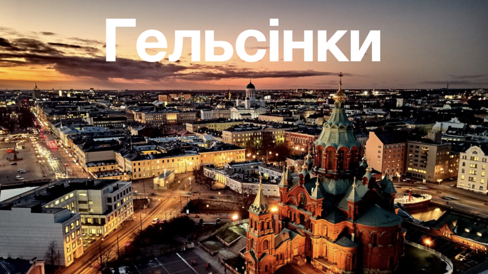

# Гельсінки, Фінляндія 🇫🇮

Гельсінки є столицею Фінляндії. Населення міста - 631 695 людей (наш Львів чи Кривий Ріг).

Фінляндія приєдналася до Євросоюзу у 1995-му році.

## 📜 Історична справка

Коріння спортивної системи Фінляндії нерозривно пов’язане з історією формування громадянського суспільства. У 1809-му році Фінляндію було приєднано до російської імперії, проте поразка росії у Кримській війні (1853-1856) стала ударом для фінської історії росії. Фіни зрозуміли, що росія не є непереможною. Західні ідеї набували дедалі більше підтримки. Насильна русифікація сформувала запит на захисний націоналізм, який сформував громадянське суспільство. Цей період історії Фінляндії називають Національне відродження.

Під час Національного відродження з’явилась фіномовна інтелігенція, преса, відкрились перші фіномовні школи, бібліотеки та спільноти, започаткувались об’єднання та політичні рухи, які існують і сьогодні. Розвиток громадянського суспільства заклав національне відчуття того як можна вирішувати спільні проблеми самостійно. 

Серед перших громадських спільнот були такі, як товариства поміркованості (утримання від споживання алкоголю), робочі спілки, навчальні заклади, рухи за права жінок і спортивні клуби.

Перший спортивний клуб (з яхтингу) було відкрито у 1856-му році. Він працює і сьогодні. Станом на 1900-й рік у Фінляндії налічувався 341 клуб. На початку ХХ-го століття фінські клуби стали тісно поєднані з іншими громадськими рухами, як-то ідеологія за тверезого способу життя чи волонтерські пожежні бригади. Проте у другій половині ХХ-го століття, фокус спортивного руху змістився на змагання та більшу спеціалізацію та професіоналізацію спорту.

Станом на сьогодні спорт Фінляндії базується на сильному залученні громадянського суспільства та активній співпраці з ними державного сектора. Міністерство освіти та культури опікується розвитком спорту на державному рівні, і муніципалітети – на міському рівні.

Спорт є одним з найбільш популярних видів дозвілля у Фінляндії, яка посідає одні з найвищих сходинок фізичної активності населення в Європі.

## 🎓 Законодавча база

 - [Закон про популяризацію спорту та фізичної активності (390/2015)](https://www.finlex.fi/en/laki/kaannokset/2015/en20150390.pdf) (переклад англійською)

## 💰 Бюджет

Загальний бюджет Гельсінки на 2022-ий рік – 4.6 мільярда євро. Загалом на спорт виділено 55.3 мільйони євро, з них 8 мільйонів – на гранти спортивним клубам.

## 🏦 Спортдепартамент

Питаннями спорту у Гельсінки опікується [Департамент культури та дозвілля](https://www.hel.fi/kulttuurin-ja-vapaa-ajan-toimiala/en/about_us/). Він складається з чотирьох відділів – культури, бібліотек, спорту та молоді. Відділ спорту відповідає за розробку та втілення спортивної політики міста та спортивну інфраструктуру. В свою чергу він розділений на три напрямки:
 - спортивного розвитку - відповідає за підтримку спортивних організацій, заходів та організацію занять спортом для малоактивних верств населення або людей, що потребують спеціальних умов для спорту
 - спортивна інфраструктура - відповідає за підтримку стану муніципальних спортивних об'єктів та координує їх використання клубами та окремими спортсменами
 - рекреаційний спорт - наглядає за місцями для кемпінгу та рекреації, лижними треками та відкритими спортивними закладами та активностями, в тому числі на воді, для спортивної рибалки чи яхтінгу

[Сайт](https://www.hel.fi/kulttuurin-ja-vapaa-ajan-toimiala/en/services/sports-and-recreation/sports) відділу спорту пропонує наступні послуги та інформацію:

 - інформація про спортивні об'єкти (криті та відкриті)
 - групові заняття
 - спортивні оздоровчі послуги
 - спортивні клуби
 - оренда спортивних об'єктів

[Розділ](https://www.hel.fi/helsinki/en/culture/sports/clubs/sports-clubs) про спортивні клуби має 4 підрозділи
 - як податися на гранти
 - як орендувати інфраструктуру
 - інформація про асоціацію клубів Парламент спортивного суспільства
 - інформація про нагороди за спортивні досягнення (індивідуальні гранти)

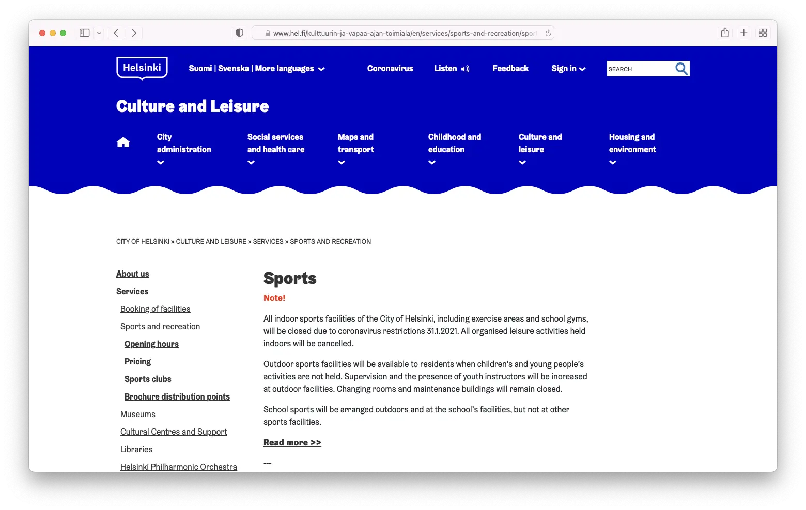

## ✅ Гранти

Гельсінки пропонує велику кількість різноманітної підтримки клубам. Ось такі грантові програми [надаються](https://www.hel.fi/kulttuurin-ja-vapaa-ajan-toimiala/en/grants/grants-for-sports/sports-related-civic-activity-grants) у 2022-му році:

 - Грант на запуск клубу (500 євро, для щойно створених клубів)
 - Грант на діяльність
 - Грант на оренду інфраструктури
 - Грант на організацію змагань
 - Грант на спортивні послуги для цільових малопредставлених груп (жінки, літні люди, мігранти тощо)
 - Гранти на створення спортивних мап (для спортивного орієнтування)
 - Гранти на популяризацію фізичної активності
 - Одноразові грантові програми (на кшталт відновлення після COVID)

#### Процес

Анонс про надання грантів щорічно публікується на сайті мерії та у відповідних новинних ресурсах наприкінці року, невдовзі після прийняття бюджету міста. Відділ спорту розміщує інформацію на своєму сайті та визначає дати для подання.

Заявки на гранти відбуваються виключно онлайн. Кожен грант має свою форму.

Поглянемо на Грант на діяльність.

#### Умови для отримання гранту

 - Клуб має бути громадською неприбутковою організацією
 - Існувати більше одного року
 - Щонайменше 50% членів мають бути з Гельсінки
 - Заняття мають проводитись не рідше 10 разів на 3 місяці
 - Має виконувати принципи "доброчесного управління" (good governance) та "чесної гри" (fair play)

#### На що можна витрачати кошти

Це дискреційний грант, тобто грантоотримувач може на власний розсуд вирішувати, на що і як його витрачати. На що саме витрачати вирішує правління клубу. Єдина заборона – це витрачати його на інвестиційну чи фандрейзингову діяльність. Крім того, грант має покривати не більше 80% витрат (щонайменше інші 20% мають покривати інші джерела).

#### Алгоритм розподілення

Загальна сума гранту розподіляється пропорційно між заявками згідно формулі та рішення відділу спорту.

Для розподілу використовується 2 критерії:
1. Кількість активних членів (під активним членом мається на увазі людина, що займається не рідше ніж 10 раз на 3 місяці). З них 80% оцінки припадає на дітей та молодь (до 20 років) і 20% - на дорослих.
2. Кількість тренерів, що мають принаймні перший рівень національної системи кваліфікації тренерів.

Також застосовується механізм «гальмування» змін з попереднім роко: клуб не може отримати більше ніж 20% чи менше ніж 30% від попереднього року, якщо зміна кількості учасників була спричинена пандемією COVID-19.

#### Моніторинг

Кожен грантоотримувач зобов’язаний самостійно організувати аудит використання коштів. Як правило, це виконують окремі юридичні організації, але відповідальність – на грантоотримувачі.

Також обов’язково заповнити детальний репорт про використання гранту у зазначені в гранті строки.  Відділ спорту має право в будь-який час запросити виписки та документи, що підтверджують використання гранту, а також провести інспекцію діяльності.

## 🧐 Особливості 

🏁 Грант на старт клубу, на який можуть податися одноразово клуби, яким менше 1 року чи щойно зареєстровані. Для цього клуб має бути зареєстрований у Гельсінки, вказати в статуті спортивну діяльність як основну, і задекларувати принципи "доброчесного управління" (good governance) та "чесної гри" (fair play). Розмір гранту - 500 євро.

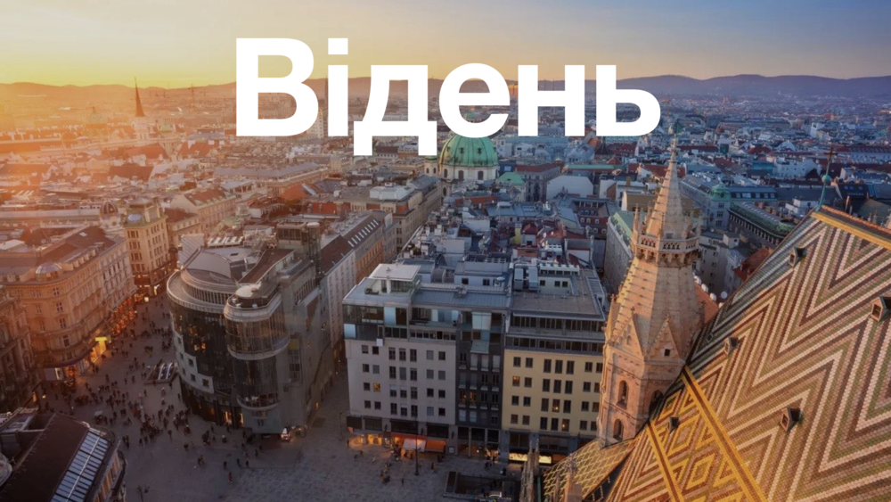

# Відень (Австрія) 🇦🇹

Відень є столицею Австрії з майже двома мільйонами мешканців (наш Харків).

## 📜 Історична справка

Австрія має одну з найзаплутаніших систем організації спорту в Європі. На додачу до федерацій, регіональних та провінційних асоціацій, існує три рівноправні асоціації – ASKÖ, ASVÖ та SPORTUNION – з громадською організацію BSO над ними.

Коріння цього різноманіття йдуть, як і в більшості європейських країн, у середину XIX-го століття. У 1860-му році імператор Франц Йосиф I впровадив нову конституцію, яка лібералізувала спортивні клуби. Це призвело до стрімкого росту появи нових клубів (фехтування – у 1864-му, фігурне катання – 1867-му, велосипедного спорту - 1869-му). Проте, на відміну, від інших країн, Австрійська традиція не відносила спорт до системи освіти, тож формування спортивної системи знаходило інші форми.

Найважливішим чинником тут стали політичні та релігійні погляди. Вони започаткували три асоціації, які діють і сьогодні.

Першою стала [Австрійська Асоціація Спорту та Фізичної Культури](https://www.askoe.at/de) (Arbeitsgemeinschaft für Sport und Körperkultur Österreich, ASKÖ), яка об'єднувала клуби робочого класу, які були близькі до соціал-демократичної партії. ASKÖ просувала ідеї масового спорту, протиставляючи його "буржуазному" спорту задля медалей. Зараз це найбільша спортивна асоціація Австрії, що налічує більше мільйона членів та майже 5 тисяч спортивних клубів.

Другою подібною асоціацією є [SPORTUNION](https://sportunion.at) (перейменована у Австрійську Спортивну Спілку у 2002-му), що зародилась навколо клубів, близьких до християнсько-соціальної партії Австрії.

Третя асоціація - [Австрійська Загальна Спортивна Асоціація](https://www.asvoe.at/de) (Allgemeiner Sportverband Österreich, ASVÖ) з'явилась у 1949-му, з однією умовою вступу – клуби мають бути політично незалежні.

Варто зазначити, що кожен клуб Австрії належить як до федерацій зі свого виду спорту, так і до однієї з трьох асоціацій. На національному рівні існує громадська організація Австрійська Федеральна Спортивна Асоціація (Österreichische Bundessportorganisation, BSO), яка складається з представників федерацій та трьох спортивних асоціацій.

## 🎓 Законодавча база

- [Федеральний закон про популяризацію спорту](https://www.ris.bka.gv.at/GeltendeFassung.wxe?Abfrage=Bundesnormen&Gesetzesnummer=20009941) (BSFG 2017)
 - [Закон про захист спортивних об’єктів](https://www.ris.bka.gv.at/GeltendeFassung.wxe?Abfrage=LrW&Gesetzesnummer=20000194)

## 💰 Бюджет

Загальний бюджет Відня на 2022-уніципий рік – 3.33 мільярди євро. З них на підтримку спортивних клубів виділено 3.5 мільйони євро.

## 🏦 Спортдепартамент

Спортом у Відні опікується [муніципальний департамент 51](https://www.wien.gv.at/kontakte/ma51/) (MA51), який має 3 головних напрямки:
 - муніципальні спортзали
 - популяризація спорту
 - розвиток спортивної інфраструктури

MA51 керує та утримує пару десятків власних спортзалів для громадян, опікується відкритими спортивними майданчиками в місті (на кшталт скейтпарків). Також розподіляє доступ та підтримує стан 584 шкільних залів і 154 спортивної споруди, в яких займаються спортивні клуби та ассоціації.

Розвиток та популяризація спорту відбувається за рахунок надання грантів спортивним клубам.

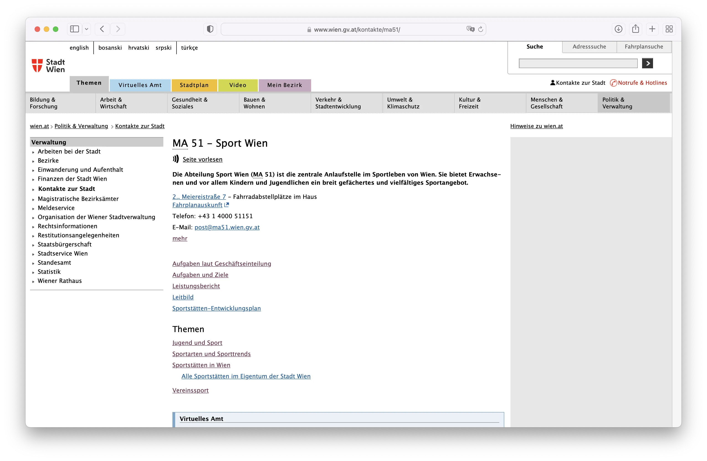

## ✅ Гранти

MA51 [пропонує](https://www.wien.gv.at/amtshelfer/freizeit-sport/sportamt/foerderungen/vereinssport.html) спортивним клубам наступні гранти:

 - на оренду спортивної інфраструктури
 - на проведення спортивних заходів
 - на проєкти для популяризації спорту

#### Процес

Подача заявки на грант відбувається через онлайн форму на сайті MA51, щонайменше за 3 місяці до початку проєкту.

#### Умови для отримання гранту

 - бути неприбутковою громадською організацією, що спрямована на розвиток визнаного виду спорту
 - базуватися у Відні
 - не бути у процесі банкрутства

MA51 досить детально [розписує](https://www.wien.gv.at/freizeit/sportamt/ahs-info/richtlinien-sonstige-sportfoerderung.html) умови щодо можливого використання грантів. Наприклад:

 - чітко пояснити чому це має важливість для міста
 - показати, що іншими шляхами це профінансувати немає можливості
 - клубні святкування чи фестивалі не фінансуються

#### На що можна витрачати кошти

Не менш старанно [деталізується](https://www.wien.gv.at/freizeit/sportamt/ahs-info/richtlinien-sonstige-sportfoerderung.html) і перелік витрат коштів:

- всі витрати мають бути за ринковою вартістю
- витрати на транспорт – тільки на громадський
- подорожі – у виключних випадках
- знижки мають використовуватись доцільно
- будь-які зміни мають надсилатися в MA51
- якщо грант перевищує 50000 євро, має бути проведено тендер з щонайменше 3-х постачальників
- якщо придбані товари більше не потрібні, їх потрібно передати муніципалітету
- чеки та бухгалтерія має зберігатися 7 років
- клуб зобов’язується використовувати лого муніципалітету або декларувати використання публічних коштів

#### Алгоритм розподілення

Рішення про надання гранту приймає комітет у MA51, який оцінює якість поданої заявки, важливість проєкту для міста, цільові групи, які проєкт залучає до спорту, та інші фактори.

#### Моніторинг

Грантоотримувач зобов’язується подати репорт про виконання проєкту та деталізовані виписки витрат. Якщо неможливо довести цільове використання коштів, вони мають бути повернуті.

Також MA51 може проводити рандомні перевірки чеків чи документів. За невиконання умов надання грантів припиняється і клуб має повернути кошти. За сурові порушення – виключається з майбутніх програм фінансування.

## 🧐 Особливості 

📊 [Відкриті дані](https://www.wien.gv.at/finanzen/budget/foerderungen.html) міста дозволяють детальніше поглянути на розміри та обсяг спортивних грантів. Ось гістограма розміру грантів по клубам (N=45):


Сума,Кількість
1000,0
2000,0
3000,3
5000,5
7000,4
8000,7
10000,8
20000,5
30000,3
50000,2
100000,1


Як бачимо, більшість грантів менші за 20000 євро, з медіаною навколо 10000 євро. 

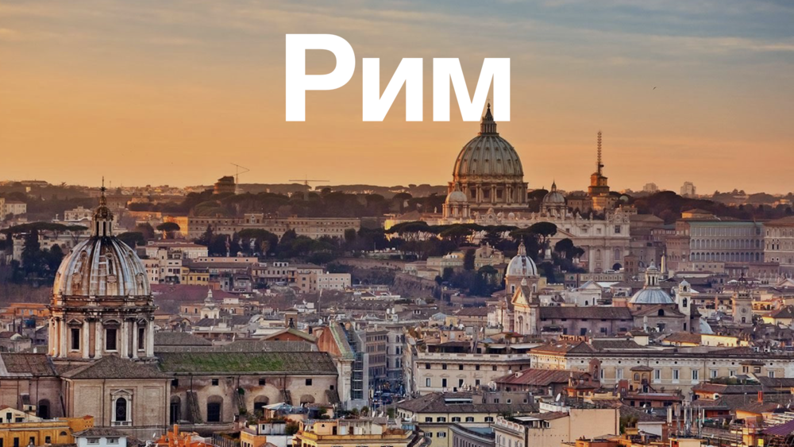

# Рим (Італія) 🇮🇹

Рим – столиця та найбільша комуна Італії, і налічує 2.9 мільйони мешканців (наш Київ).

## 📜 Історична справка

Спортивна система Італії історично базується на громадських спортивних клубах, проте несе на собі відбитки періоду фашизму 1922-1945-го років.

Перші клуби зародились у другій половині XIX-го століття з утворенням Королівства Італії. У соціальному та політичному кліматі нової об'єднаної Італії закон заохочував об'єднання громадян, а в спорті вбачалась переважно освітня функція.  Більшість клубів того часу почались як приватні ініціативи вчителів, які працювали в школах. Хоча довгий час спорт залишався прерогативою буржазного класу та чоловіків, багато зусиль докладалося для залучення робочого класу, жінок та дітей, формуючи важливу роль спорту для соціальної структури нової держави.

Зі стрімким ростом кількості клубів (на 1914-й рік в Італії діяло 555 клубів тільки з велоспорту!), з'явились федерації (об'єднання клубів) з різних видів спорту, що, разом зі зростаючим Олімпійським рухом, призвело до утворення громадської організації CONI (Comitato Olimpico Nazionale Italiano), яка координувала федерації та переймалась підготовкою спортсменів до Олімпійських ігор.

Проте після Першої світової війни в Італії був встановлений фашистський режим. Тоталітарний режим вбачав в спорті інструмент для контролю населення і для підсилення репутації режиму на світовій арені. Уряд швидко підпорядкував собі спортивні організації та заборонив громадські клуби, а CONI стало центральним органом, що контролює спорт в країні.

Централізація влади і майже обов'язкові заняття фізичною активністю мали подвійний ефект - з одного боку, це майже зупинило волонтерський рух та громадські клуби, з іншого – багато ресурсів було вкладено в розбудову спортивної інфраструктури. Після падіння фашистського режиму в Італії у 1945-му році та зворотньою демократизацією клубів, це сприяло розквіту італійського спорту.

З тих часів CONI продовжує мати монополію на розвиток спорту в Італії, проте серед різних політичних течій утворювались окремі спортивні спілки (EPS, Enti di Promozione Sportiva), які позиціонувались як "спорт для всіх" і налічували тисячі клубів – Італійський Спортивний Центр (CSI), Спортивна Спілка ACLI, Національний Центр Libertas, Італійська Спілка Популярного Спорту (UISP), Fiamma, CUS, CSEN та інші – сформувавши спочатку альтернативну CONI систему, але згодом ставши паралельними інституціями до спортивних федерацій.

Кожен клуб в Італії належить або до відповідної федерації, або до спілки (переважно мультиспортивні клуби з фокусом на соціальну функцію спорту). Професійні футбольні клуби Італії мають комерційну форму, проте абсолютна більшість клубів – це неприбуткові громадські організації з великим залученням волонтерства. Волонтерство є фундаментом розвитку та розквіту італійського спорту, завдяки якому клуби вижили в періоди історичної турбулентності та сильного зменшення фінансової підтримки від держави.

## 🎓 Законодавча база
 - [Deliberazione n. 32/2019](https://www.comune.roma.it/web-resources/cms/documents/Deliberazione_Assemblea_Capitolina_n_32_2019..pdf) - "Регуляції щодо грантів по популяризації спорту через спортивні заходи у Римі"

## 💰 Бюджет

Загальний бюджет Рима – 6.4 мільйярди євро. Це найбільший бюджет з 10 міст в цьому дослідженні. На спорт виділено близько 33.8 мільйонів євро. З них – 700 000 на підтримку клубів.

## 🏦 Спортдепартамент

Спортом в Рими займається [Департамент подій, спорту, туризму та моди](https://www.comune.roma.it/web/it/dipartimento-grandi-eventi-sport-turismo-e-moda.page), який має свою сторінку на сайті мерії міста і пропонує наступну інформацію:

 - реєстр спортивних клубів
 - муніципальні спортзали
 - спортивна інфраструктура
 - гранти на популяризацію спорту
 - SUAS - Онлайн система для спорт-сервісів
 - Мисливські ліцензії

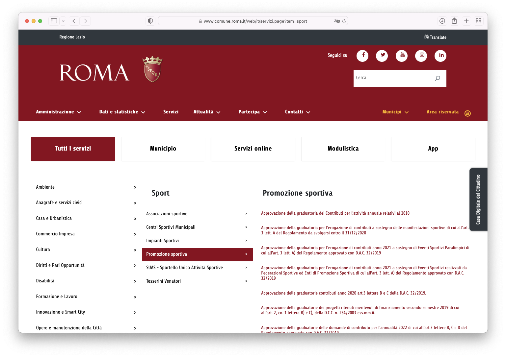

## ✅ Гранти

Програма підтримки та популяризації спорту має два напрямки:

 - гранти на спортивні заходи
 - гранти на діяльність клубів

Умови та критерії підтримки діяльності клубів описані в "Регуляції щодо грантів по популяризації спорту через спортивні заходи у Римі". Як це прийнято майже в усіх грантових програмах, зазначається мета та цілі цієї підтримки: сприяти спорту як головному елементу суспільного життя та благополуччя громадян.

Заявки подаються через онлайн систему або електронною поштою. Спортивні клуби оцінюються по наступним критеріям:

 - активність в останні 3 роки
 - кількість людей, залучених у спорт
 - кількість спортсменів, що виступають на змаганнях
 - наявність класів для людей з інвалідністю
 - наявність класів для літніх людей
 - наявність ініціатив для підтримки малозабеспечених верств населення
 - досягнення у змаганнях на різних рівнях

Процедури подання на грант, правила звітування та моніторингу виконання описані іншими регуляціями щодо грантів. 

## 🧐 Особливості 

🏦 Варто відмітити нестандартну схему розподілу: 20% загальної суми розподіляється між усіма грантоотримувачами порівну і 80% - згідно набраних балів.

---

Переходимо до менших міст, які не є столицями.

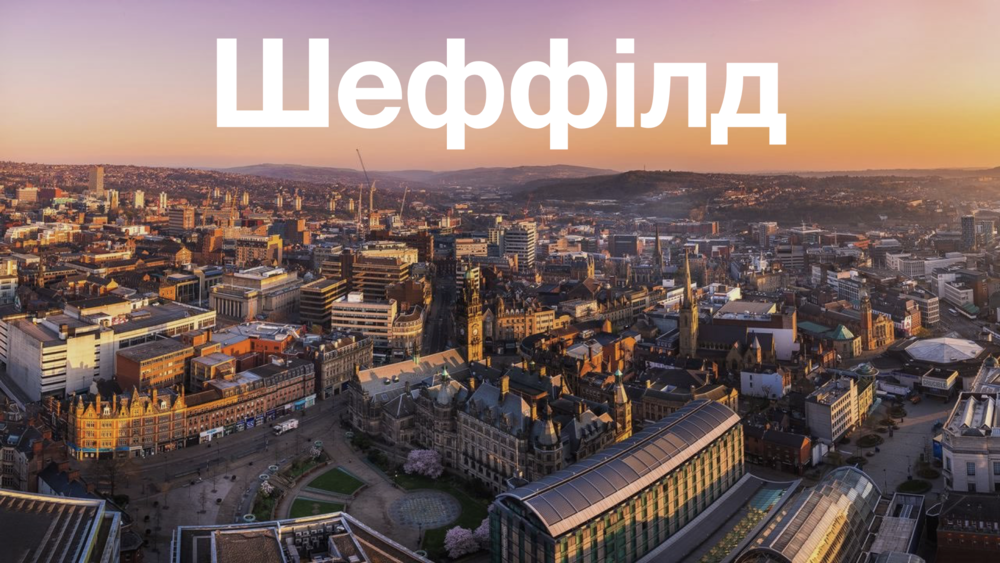

# Шеффілд (Великобританія) 🇬🇧

Шеффілд є десятим за кількістю населення містом Великобританії з населенням 557 тис. мешканців (приблизно, як наш Кривий Ріг).

Він є домівкою для EIS (English Institute of Sport) та пишається титулом Національного Міста Спорту.

## 📜 Історична справка

Великобританія є колискою організованого спорту в світі. Розквіт Британської імперії, а з ним і економіки, призвів до Промислової революції - історичного переходу від аграрної економіки та ручної роботи до машинно-будівної економіки та фабричного виробництва. Цей період докорінно зачепив майже всі аспекти життя у більшості країн світу, в тому числі і спорт. 

Одним з його наслідків стало зменшення часів роботи, збільшення урбанізації населення та появи середнього класу. В середині XVIII-го століття на території Британії вже були популярні кінні забіги, бокс, крікет та "народний футбол", проте саме поява класу, що мав зацікавленість у ставках на спорт, спричинила системну організацію спорту. Уніфікувались правила, публікувались розклади скачок чи поєдинків, зростала кількість людей, що готові були купити квиток на спортивне змагання. Загальні правила дозволяли проводити змагання між школами та університетами.

В ті часи школи були нерозривно пов'язані з церквами, тож спорт знайшов свою нішу і у релігії. Було започатковано цілий рух під назвою "м'язисте християнство" (muscular Christianity), яке культивувало атлетизм як одне з моральних цінностей для хлопців та чоловіків. Перші футбольні клуби утворювались робітниками заводів та місіонерами. Клуб Aston Villa, наприклад, було утворено при каплиці Aston Villa Wesleyan Chapel у 1874-му році. Саме представники публічних шкіл, що переїжджали в різні міста, поширювали практику організованого спорту по всьому острову, а згодом і в інші країни.

Ця традиція самоорганізованого спорту і великої ролі волонтерства заклала основу сучасної європейської моделі спорту. Одними з ключових цінностей організації спорту була соціалізація та об'єднання навколо спільних інтересів. Спорт став головним інструментом об'єднання все більш урбанізованого суспільства, і соціалізація була сама по собі цінністю. Це пояснює, наприклад, чому багато британських клубів мають сильну асоціацію з локальними закладами, на кшталт пабів.

У другій половині XIX-го століття почалася професіоналізація спорту, спричинена стрімким розвитком технологій друку газет та залізничного сполучення. Фанатам стало простіше слідкувати за успіхами своїх команд чи подорожувати до сусідніх міст на змагання. Зростання зарплат та вільного часу посилило попит на професійний спорт, особливо в футболі та регбі, що підняло питання розмежування аматорського та професійного спорту. 

Наступне століття британський спорт проходив через різні етапи, проте залишався вірним традиції об'єднання навколо спільного ентузіазму. Як і з іншими формами громадських асоціацій, спортивні клуби мають сильне почуття незалежності, традиції та зв'язку з містом, в якому вони засновані. Федерації та асоціації, багато з яких були сформовані у XIX-му столітті, також сприймаються клубами як представники їх інтересів, а не інтересів держави.

## 🎓 Законодавча база

Шеффілд має в розробці стратегію міста щодо спорту - Sport and Leisure Strategy. Наразі головними документами є ["Move More - п'ятирічна стратегія фізичної активності у Шеффілді"](https://www.movemoresheffield.com/move-more-strategy-2021-2026) та [стратегія від Sport England](https://sportengland-production-files.s3.eu-west-2.amazonaws.com/s3fs-public/2021-02/Sport%20England%20-%20Uniting%20the%20Movement%27.pdf?VersionId=7JxbS7dw40CN0g21_dL4VM3F4P1YJ5RW).

Крім того, задіяні наступні стратегії:

- The Move More Plan - A framework for increasing physical activity in Sheffield 2015-2020
- Sheffield Joint Health & Wellbeing Strategy 2019-2024
- The Outdoor City Strategy
- Sheffield City Region Active Travel - Implementation Plan
- Building Better Parks Strategy
- Connecting Sheffield
- Age Better in Sheffield

Решта опису фінансування спорту в Шеффілді підпадає під розділ "Особливості".

## 🧐 Особливості

Шеффілд не має свого Департаменту спорту та своїх програм фінансування клубів чи змагань. Значна частка бюджету капітальних інвестицій міста (11%) витрачається на будівництво та підтримку спортивної інфраструктури (Шеффілд успадкував значні спортивні об'єкти після проведення літньої універсіади 1991, відомої як World Student Games).

Це не особливість Шеффілду, а моделі фінансування спорту Великобританії. Спортивні клуби можуть отримувати гранти від Sport England (цього року бюджет на гранти склав 350 мільйонів фунтів стерлінгів), а також від великої кількості інших фондів та організацій.

Взагалі, мережа і система грантів у Великобританії сильно відрізняється від решти країн Європи. Для пошуку грантів клубам пропонують користатися спеціальними ресурсами на кшталт grantsonline.org.uk.

Ось лише деякі з сотень фондів, які радяться спортивним клубам як джерела додаткового фінансування:

- Small Grants fund
- Active Together fund
- Places and Spaces Fund
- Together Fund
- Stratefic Facilities Fund
- Університетські гранти на клуби
- Aviva Community Fund
- Bright Ideas Fund
- Community Foundations
- Landfill Communities Fund
- Lloyds Bank Foundation
- Power to Change
- Social Investment Business
- The Football Foundation
- Lottery funding
- One Family Foundation
- Premier League and FA Facilities Fund 
- Cash 4 Clubs

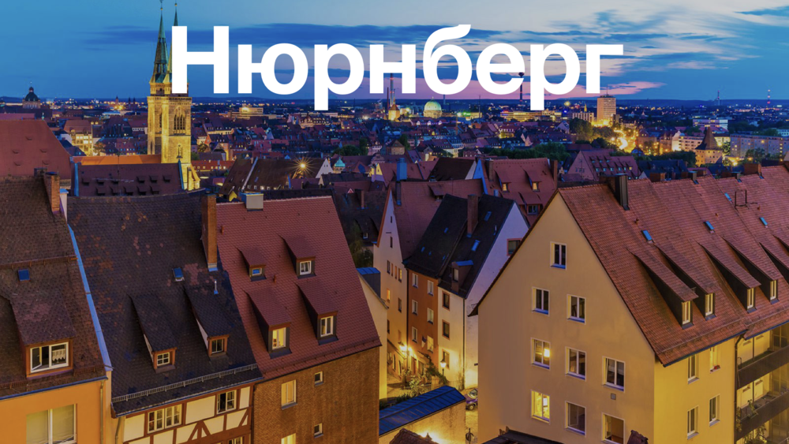

# Нюрнберг (Німеччина) 🇩🇪

Нюрнберг - 14-те місто Німеччини за кількістю населення, та 2-ге у Баварії - 515 543 мешканців (наш Миколаїв).

Згідно статистики 2008-го року, близько 16% фізично активного населення займається у клубах, 8% - у комерційних фітнес-центрах. Станом на 2020-ий рік у місті діяло 300 спортивних клубів, які налічували 122 435 членів (майже 22% населення міста).

## 📜 Історична справка

Історія формування спортивної системи Німеччини – одна з найкраще досліджених та задокументованих. Вона має дві ключові особливості: німецька традиція гімнастичних клубів, яку наслідували сусідні держави, та "природний експеримент" з двома моделями управління спортом під час розділення на Східну та Західну Німеччину.

Традиція гімнастичних клубів (Turnvereine) була закладена на початку ХІХ-го століття Фрідріхом Людвігом Яном – викладачем та піонером фізкультурного руху, винахідником таких знаряддь у гімнастиці як перекладина та бруси. Його модель Turnen-клубів (turnen - буквально означає "гімнастика") мала дуже конкретний формат та філософію. Це були заняття з гімнастики для молодих чоловіків (переважно студентів гімназій), які були вдягнені в однакові біло-сірі спортивні костюми і пояс. Вони звертались один до одного як брати, використовуючи неформальне 'Du' замість загальноприйнятого на той час 'Sie'.

Рух Turnen-клубів був тісно пов'язаний з зародженням національної самоідентифікації, прагнення будувати покоління сильних духом та тілом громадян, що формуватимуть нову націю об'єднанної Німеччини. Ці клуби культивували демократичні цінності та ідеали добровільного об'єднання патріотичної молоді.

Бурхлива історія німецьких земель XIX-го століття приводила до неодноразової повної заборони та відновлення Turnen-руху. Сам Фрідріх Людвіг Ян був ув'язнений, а його послідовники змушені були емігрувати в інші країни (в тому числі США), де продовжували та поширювали формат та ідею гімнастичних клубів. Втім, на початок ХХ-го століття, добровільні гімнастичні клуби Німеччини об'єднували понад 750 000 людей, причому  переважно робочий клас. Головна громадська ассоціація Arbeiter Turnerbund додала слово "sport" у свою назву (перетворившись на Arbeiter Turner- und SportBund, ATSB), відображаючи відкритість до інших спортивних течій, особливо британського футболу.

Демократизація клубної системи Німеччини (залучення якнайбільше людей до спорту, незалежно від їх релігійних та політичних поглядів) була раптово зупинена після отримання влади Адольфом Гітлером. Одним з перших кроків було введення так званого Führerprinzip - фактично демонтування демократичної виборності керівних органів клубів. Клубами тепер мали керувати назначені нацистським режимом керівники. Громадські асоціації клубів було демонтовано і утворено нові, підконтрольні партії органи. Після проведення Олімпіади у 1936-му клуби перетворились у виконавців державної політики щодо підготовки військових кадрів.

8 травня 1945 Німеччина капітулювала у Другій світовій війні. Союзні війська (Антигітлерівська коаліція) ініціювала так звану Директиву 23, яка забороняла всі гімнастичні клуби в Німеччини, на підставі переконання їх тісного зв'язку з нацистською партією. Єдиного погляду, що робити зі спортом на цій території у союзників не було. Британія та США пропонували повернення демократичної клубної системи, французи були більш скептичні, проте також виступали за децентралізовану систему, але радянський союз виступав за централізовану підконтрольну систему, яка не дуже відрізнялась від нацистської.

У 1949-му році Німеччина була поділена на Західну (ФРН) та Східну (НДР). ФРН повернулась до клубної системи, відновивши організації, що існували до Гітлера – це призвело до стрімкого росту залученості у спорт, особливо біженців та внутрішніх переселенців. Як зазначив перший президент ФРН, Теодор Геус, "багато людей знайшли в спортивних клубах 'новий дім' та відновлення після жахів війни". НДР же наслідувало радянську централізовану систему державних шкіл та заборону клубів. Після падіння Берлінської стіни у 1989-му та об'єднання Німеччини, клубна система була встановлена і у НДР, проте ефект від радянської системи добре відчутний у залученності у спорт і сьогодні: лише 15% німців у східній частині Німеччини займаються спортом у клубах (на відміну від 45% у західній).

Баварія, а разом з нею і місто Нюрнберг, належало до ФРН (Західної Німеччини).

## 💰 Бюджет

Загальний бюджет міста - 2.7 мільярда євро. На спорт виділено близько 3 мільйонів євро, з них 1.5 мільйони – на розвиток клубів, і інвестиційні гранти на розбудову спортивних об'єктів – 1.1 млн. євро.

## 🏦 Спортдепартамент

[Департамент спорту](https://www.nuernberg.de/internet/sportservice_nbg/) міста дуже коротко та детально зазначає свою ціль та напрямки роботи, які варто процитувати:

> Спортивний департамент Нюрнберга – це місце зустрічі клубів, громадян та зацікавлених сторін в усіх аспектах спорту в нашому місті. В питаннях популяризації спорту, розподілення доступу до спортоб'єктів, планування заходів та їх реалізації департамент прагне досягати оптимальних результатів, враховуючи інтереси різних груп.

Штат департаменту налічує 17 осіб - 8 повної зайнятості і 7 – часткової, плюс інтерни. Як зазначено вище, три головних напрямки роботи це фінанси (гранти спортивним клубам та співфінансування будівництва спортоб'єктів), організація та координація проведення спортивних заходів та розподіл доступу до муніципальних спортивних об'єктів та підтримка відкритих спортивних майданчиків. Також місто має програми визнання та підтримки найбільш активних волонтерів в спорті для підсилення волонтерського руху.

Базуючись на дослідженнях, департамент зазначає, що найбільша кількість фізичної активності (69%) – самостійні заняття, тому інвестує у відкриті майданчики, лижні траси, і інші парки де громадяни можуть практикувати активні заняття спортом. Крім того, місто має низку власних програм на кшталт "Проєкт Морський коник", мета якого навчити всіх дітей Нюрнберга вправно плавати, чи "Долучаємось до спорт клубу", спрямованого на малозабезпечені сім'ї, в якому 75% витрат сплачує муніципалітет.

Ось, що бачать громадяни міста на [сайті департаменту спорту](https://www.nuernberg.de/internet/sportservice_nbg/):

- Спортивні організації
	- Наші найкращі - топ спорт
	- Організатори змагань
	- Спортивні клуби
- Спортінфраструктура
- Де і як займатись спортом
- Як орендувати спортивні зали
- Підтримка та послуги для клубів
- Події
- Волонтерство

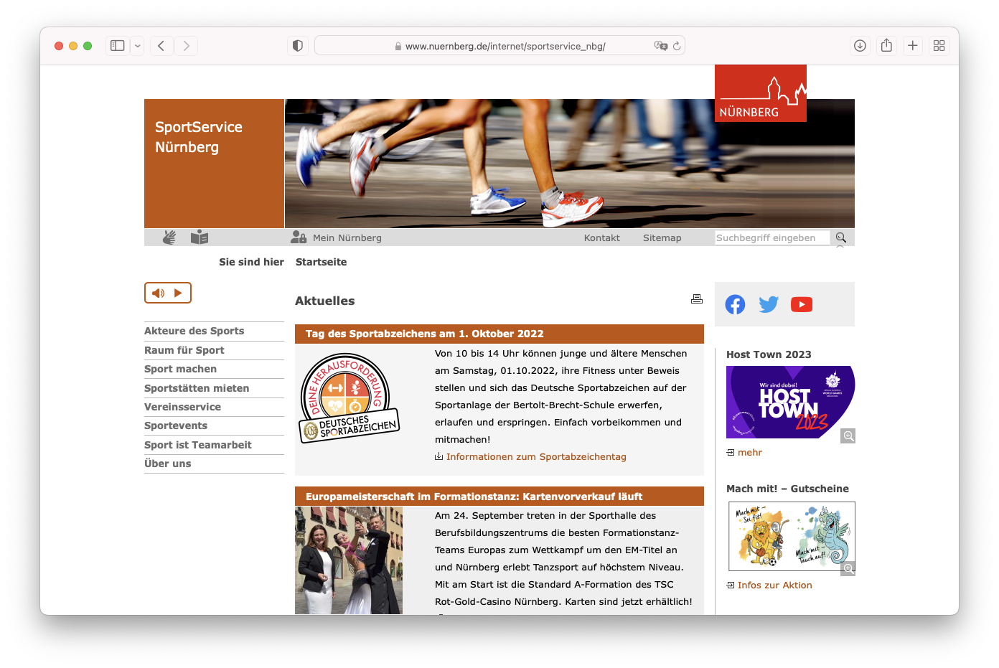

## ✅ Гранти

Місто [пропонує](https://www.nuernberg.de/imperia/md/sportservice_nbg/dokumente/richtlinien_satzungen/sportforderrichtlinien_stand_2018-12-13.pdf) клубам велике різноманіття фінансової підтримки. Ось приблизна структура грантів на спорт:

 - На діяльність клубів (дискреційний грант – 0.70 євро за кожного учасника, 3.5 євро за кожну дитину)
 - На інвестиції в інфраструктуру
 - На довгостроковий розвиток клубів
 - На використання муніципальної спортінфраструктури
 - Залучення малозабеспечених верств населення
 - Інтеграція біженців у спортивні клуби
 - Грант на день народження клубу (кожне 25-річчя клубу – 3250 євро)

Більшість клубів в Нюрнбергу мають власну спортивну інфраструктуру (698 спортивних об'єктів належать клубам і 190 – підпорядковані департаменту), проте для тих, хто не має, місто надає в оренду муніципальну. Клуби можуть отримувати значні знижки на її використання, особливо якщо мають програми для молоді чи людей з інвалідністю.

Крім того, клуби Нюрнберга також отримують [дискреційний грант від Баварії](https://www.stmi.bayern.de/sug/sport/foerderung/vereinspauschale/index.php). В ньому фінансування розраховується по кількості учасників за наступним алгоритмом - загальна сума грантової програми ділиться між клубами згідно набраних "юнітів участі". Юніти участі визначаються наступним чином:
 - 1 юніт – за кожного дорослого члена клубу
 - 10 - за кожну дитину чи молодь (до 26 років)
 - 650 – за кожного тренера/ку з ліцензією (або 325, якщо тренер/ка тренує ще в іншому клубі)

Кількість членів перевіряється звітами з відповідної асоціації чи федерації, до якої належить клуб. Якщо клуб не набирає 500 юнітів, то фінансування не надається.

## 🧐 Особливості

Напевне найбільшою відмінністю Нюрнберга можна назвати різноманіття грантів. Окрім вищезазначених, місто має гранти, що стимулють об'єднання клубів, чи гранти на проєкти, які не підпадають під звичайні гранти. Фактично, місто визнає, що може не володіти всією інформацією щодо потреб клубів, і дає можливість проявити ініціативу та креативність.

❤️ [Наприклад, є грант](https://www.nuernberg.de/internet/sportservice_nbg/sportfoerderung.html) для найбільш цікавих проєктів, що спрямовані на соціально важливі цілі – "Move something". Один з прикладів таких проєктів – заняття з тенісу для людей на візках.

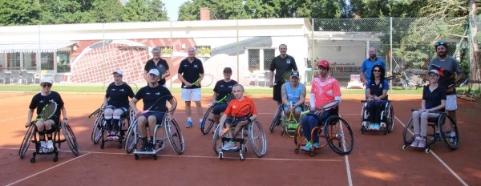

Крім того, для клубів, особливо тих, що мають і елітних спортсменів, доступні ще десятки фондів та програм фінансування від державного та приватного сектору.

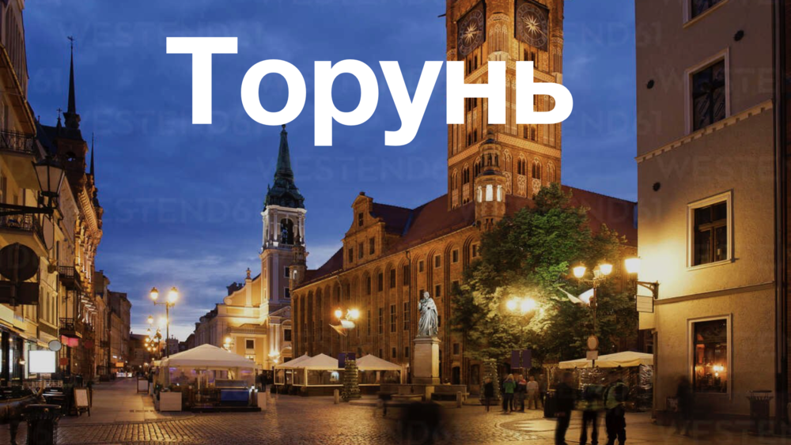

# Торунь (Польща) 🇵🇱

Торунь – одне з найстаріших міст Польщі і налічує 197 тис. мешканців (наша Біла Церква).

## 📜 Історична справка

Спортивна система Польщі базується на традиціях німецької та британської моделей. Початком організованого розвитку спорту вважається заснування у Львові Польського гімнастичного товариства "Сокіл" у 1867-му році (Львів та Польща тоді належали до Австро-Угорщини), яке наслідувало ідеали чеського товариства "Сокіл" і ставило на меті духовне та фізичне зміцнення молодого покоління. На момент заснування у львівському "Соколі" було 125 членів, а вже у 1892-му – понад тисячу. Гілки "Соколу" були відкриті і в інших містах та розширено кількість секцій з різних видів спорту. Товариство вже нагадувало європейські спортивні клуби, хоча й було тісно пов'язано з ідеалами виховання патріотичної молоді, здатної захищати державність.

На початку ХХ-го століття Львів став домом для цілої низки спортивних клубів, які почалися як футбольні клуби і виросли у мультиспортивні: це Lechia Lwów (1903), Czarni Lwów (1903) та Pogoń Lwów (1904). Більшість клубів того часу були тісно пов'язані з системою освіти та утворювались при гімназіях та університетах. Цей зв'язок помітний і сьогодні - польська асоціація студентського спорту об'єднує понад 40000 членів з 250 клубів.

## 🎓 Законодавча база

- Act of June 25, 2010 on sport (Journal of Laws No. 127, item 857 as amended), Chapter 2
- Act of April 7, 1989 Law on Associations (Journal of Laws of 2001, No. 79, item 855, as amended)
- Act of February 15, 1992 on corporate income tax (Journal of Laws of 2000, No. 54, item 654, as amended), Art. 17 sec. 1 point 5a
- [USTAWA z dnia 27 sierpnia 2009 r. o finansach publicznych](https://isap.sejm.gov.pl/isap.nsf/download.xsp/WDU20091571240/T/D20091240L.pdf)
- Ustawa z dnia 24 kwietnia 2003 r. o działalności pożytku publicznego i o wolontariacie

## 💰 Бюджет

Загальний бюджет міста на 2022-й рік – 306 мільйонів євро. На грантові програми виділено 839 тис. євро (3.9 мільйонів злотих).

## 🏦 Спортдепартамент

[Сайт департаменту спорту](https://www.torun.pl/pl/torunpl/sport-i-rekreacja/miejskie-wsparcie-dla-sportu) мерії Торуню пропонує наступну інформацію:

- Спортінфраструктура
- Спортивні клуби
- Підтримка спорту
	- Нагороди та стипендії
	- Гранти на спорт
- Активний відпочинок
- Велосипедом навколо міста

## ✅ Гранти

Місто [пропонує](https://www.torun.pl/pl/ponad-10-milionow-na-konkursy-sportowe) 4 грантові програми для розвитку спорту:

- Конкурс 13/2022 - На розвиток спорту вищих досягнень в старшій категорії
- Конкурс 15/2022 - На розвиток дитячого та молодіжного спорту
- Конкурс 16/2022 - На підтримку та популяризацію фізичної культури та оздоровлення
- Конкурс 53/2022 - На організацію в Торуні національних та міжнародних змагань, що створюють спортивний імідж міста

У 2022-му році [було подано](https://www.bip.torun.pl/dokumenty.php?Kod=1260419) заявки від 56 клубів, 2-ом з них відмовили.

#### Процес

У листопаді на сайті мерії та в офіційних бюлетенях публікується інформація про грантові програми (минулого року – 19 листопада). До кінця грудня клуби мають подати свої заявки через польську систему організації конкурсних програм witkac.pl (але потім підтвердити це листом до департаменту).

#### Умови для отримання гранту

 - бути неприбутковою громадською організацією
 - грант не може перевищувати 70% від загальних витрат проєкту

Цілі програм зазначаються наступним чином:

 - організація тренувань
 - участь у змаганнях
 - надання додаткових умов талановитим спортсменам
 - досягнення високих результатів
 - підсилення спортивного іміджу Торуню

#### На що можна витрачати кошти

 - оренда спортивних об'єктів для тренувань та змагань
 - зарплати та стипендії (але не більше 60%)
 - участь у змаганнях
 - придбання спортивного інвентарю для клубу
 - спортивні збори
 - непрямі витрати на діяльність (але не більше 15%)

#### Алгоритм розподілення

Мер міста призначає комітет для перегляду та оцінки заявок і приймає рішення щодо надання грантів.

## 🧐 Особливості

🙍‍♂️ Можна відмітити той факт, що рішення про надання грантів приймає мер міста. На сьогодні мером Торуня є Міхал Залеськи, який займає цю посаду з 2002-го року. Цікаво було б дослідити ступінь довіри до мера громадянами, але з інформації з відкритих джерел є всі натяки на те, що довіра до мера висока, що пояснює одноосібне прийняття фінального рішення по наданню грантів.

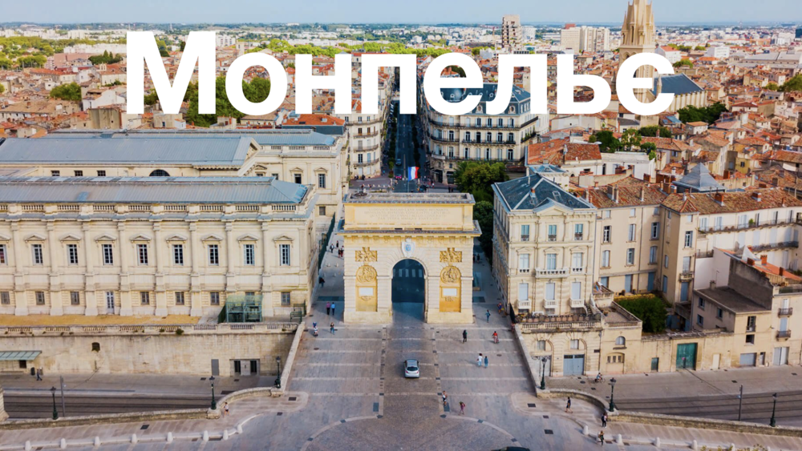

# Монпельє (Франція) 🇫🇷

Монпельє це місто на півдні Франції, що налічує 295 тис. мешканців (наш Чернігів чи Херсон).

## 📜 Історична справка

Французька система спорту утворилась під прямим впливом Британської моделі. Перші спортивні клуби відкрились у Парижі у ХIX-му столітті та були засновані британцями, що мешкали у Франції. Їх членами на початку були виключно студенти університетів, проте наприкінці століття організовані спортивні клуби почали масово з'являтися у інших містах Франції. Цінності та цілі утворення клубів Франції відрізнялися від однієї соціальної групи до іншої, проте соціалізація залишалася фундаментальною цінністю. Втім, клуби часто практикували декілька видів спорту, були тісно прив'язані до релігійних чи політичних об'єднань, з елементами патріотичного виховання. Відкривати нові клуби було відносно складно.

Це змінилося з законом про асоціації 1901-го року. Асоціаціями називались громадські неприбуткові об'єднання громадян, а закон мав на меті в першу чергу відділити церкву від освіти. Новий закон гарантував громадянам свободу утворення нових об'єднань без необхідності отримання згоди чи дозволу. Це мало великий вплив на формування та подальше утворення клубів, регіональних спортивних асоціацій та національних федерацій.

ХХ-те століття сформувало традиційну піраміду французської системи (з клубами як фундамент), і з утворенням федерацій для більшості видів спорту та "інтернаціоналізації" спорту. Фокус розвитку спорту переключився на змагальний спорт. Клуби стали більш сфокусованими на одному виді спорту і утворювали регіональні асоціації та ліги. Останні декілька десятиліть спостерігається зворотній тренд: більший фокус на спорті для всіх, на мультиспортивних клубах, на оздоровчій і соціальній функції спорту та більшій демократизації управління.

На сьогодні Франція налічує близько 175 тис. спортивних клубів, з середньою кількістю членів близько 125.

## 🎓 Законодавча база

- [Code du Sport](https://www.legifrance.gouv.fr/codes/texte_lc/LEGITEXT000006071318/)

## 💰 Бюджет

Загальний бюджет міста на 2022-ий рік – 557 мільйонів євро, з них 20.4 мільйони виділено на спорт (включно з інвестиціями). На спортивні гранти виділяється 2 мільйони євро.

## 🏦 Спортдепартамент

Мерія Монпельє утримує 270 муніципальних спортивних об'єкти та проводить велику кількість власних спортивних заходів, спрямованих для якнайбільшого залучення громадян до спорту. Щороку публікується розклад та мапи організованих занять з різних видів спорту, які є безкоштовними для дітей (або зі значними знижками).

Мешканці міста можуть оформити "Спортивну картку", яка дає доступ до організованих занять у муніципальних спортивних центрах. За попередньою реєстрацією діти також можуть відвідувати спеціальні регулярні та сезонні курси, які підлаштовані під періоди канікул та літній сезон.

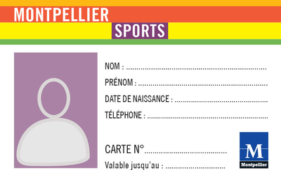

Варто уваги процитувати спортивну політику міста:

> Спорт має значну цінність в сучасному суспільстві. Як джерело самореалізації та вектор колективних цінностей, спорт завжди мав на меті об’єднати людей. Він може – і повинен – бути школою для суспільного життя, сприяючи розквіту ідеалів поваги та толерантності, щедрості та перевершення самого себе. Це також важливий фактор громадського здоров'я, в тому числі, перед обличчям тривожного явища ожиріння серед дітей.

> Заняття спортом, приєднання до клубу – для змагань чи дозвілля – означає розвиток ваших фізичних здібностей і командного духу. Це означає піти назустріч іншим, пізнавати їх, жити з ними краще. Спорт дійсно є одним із важливих векторів соціальної інтеграції та реалізації особистості в нашому суспільстві.

> Саме тому місто Монпельє створило програму «Спорт для всіх», яка дозволяє кожному, незалежно від віку, займатися спортом за власним вибором біля свого дому завдяки сотням спортивних асоціацій, найвідоміші з яких щороку розвиваються в еліту французького та європейського спорту.

## ✅ Гранти

"Безкоштовність" спортивних муніципальних послуг та курсів досягається [за рахунок співпраці](https://www.montpellier.fr/265-subventions-aux-associations.htm#toced_headerH2_8) з клубами – громадськими організаціями з різних видів спорту. Ідеї та пропозиції програм та курсів надсилаються клубами і відбираються на конкурсній основі. Місто надає свою інфраструктуру та фінансує 70% від витрат на проведення.

На сайті мерії є детальні інструкції та шаблони для заповнення заявок на гранти "спортивного партнерства". Заявки відправляються по email, і розглядаються на конкурсній основі.

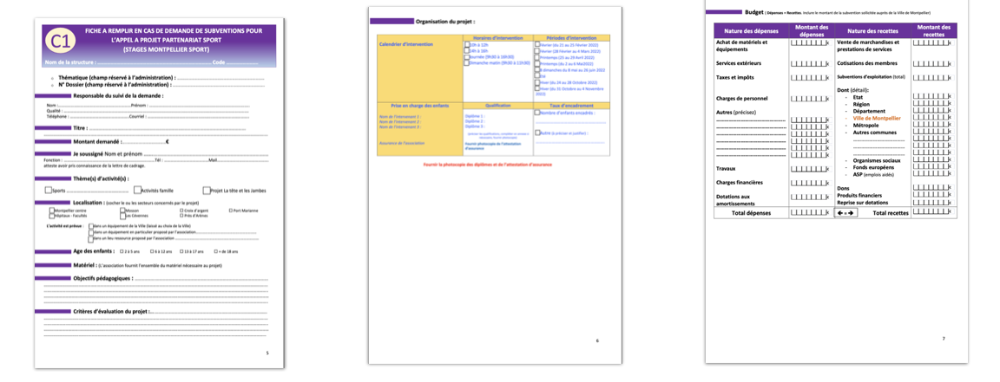

## 🧐 Особливості

🪪 Незвичною є порівняно висока централізація спортивних послуг під брендом муніципалітету та  "спортивна картка" – документ, що надає доступ до занять та курсів, організованих під егідою муніципалітетів.

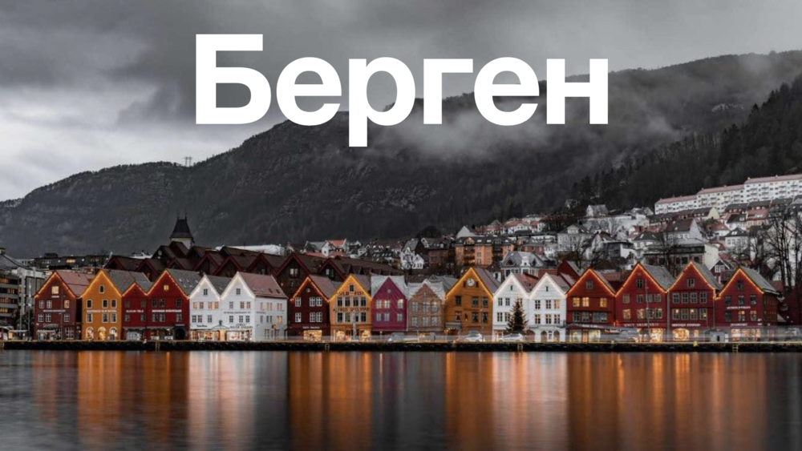

# Берген (Норвегія) 🇳🇴

Берген - це друге за величиною місто Норвегії, з населенням у 285 тис. жителів (приблизно як наша Полтава чи Херсон).

В місті діють 700 спортивних громадських клубів – з них 300 корпоративні (утворені на підприємствах).

## 📜 Історична справка

Cпортивна модель Норвегії має сильні національні традиції, на які вплинули німецька і британська моделі спорту. Перш за все, в Норвегії була власна традиція – idrett - до якої належали типові спортивні заняття, на кшталт лиж, ковзанів та стрільби. Німецька практика гімнастики – turnen – знайшла популярність, як практика формування здорового тіла та дисципліни в группі.

І idrett, і гімнастика добре вкладались у інтереси Міністерства оборони Норвегії, яке розвивало спорт у XIX-му столітті, надаючі фінансову підтримку клубам та асоціаціям. Першою асоціацією клубів є, власне, Центральна федерація фізичних вправ та використання зброї (Centralforeningen for Utbredelse af Legemsøvelser og Vaabenbrug).

На початку ХХ-го століття нові види спорту (особливо футбол), принесені з інших країн, здобували популярності. Норвезьский спорт розділився на два напрямки: спорт для мас (Спортивна Асоціація Робочих, Arbeidernes Idrettsforbund) та більш буржуазний змагальний спорт (Національна Спортивна Федерація, Landsforeningen for Idræt – нащадок Centralforeningen). У 1946 обидві організації було об'єднано в одну – Норвезьску конфедерацію спорту (NIF), яка в 1996-му об'єдналась з Олімпійським комітетом та у 2008-му – з Паралімпійським.

Це сформувало унікальну рису норвезької системи, яка є одночасно і її сильною, і слабкою стороною - спортом займається одна організація, яка представляє історично різні напрямки та інтересі у спорті.

NIF – це не державна організація, проте можна сміливо вважати її фактичним "міністерством спорту" Норвегії. З боку держави питаннями спорту займалось Міністерство оборони, Міністерство церкви та шкільної освіти і, наразі, Міністерство Культури та Рівності. Роль держави історично зводиться до економічної підтримки спортивного руху суспільства. 

Після Другої світової війни та об'єднання, політика розвитку спорту сфокусувалась на двох речах: побудові інфраструктури та стимуляції залучення більших груп людей до спорту, перш за все молоді та жінок. З 1965-го по 1985-й рік кількість членів клубів виросла у 4 рази.

Ця спортивна революція, розквіт норвезького спорту та централізація управління призвели до втілення унікальних для Європи політик. Наприклад, наукові дослідження показали, що головною причиною покидання спорту в ранньому віці є надмірний фокус на змаганнях. У 1974-му році було впроваджено рекомендацію не публікувати результати змагань для дітей до 11 років. У 1985-му це стало обов'язковою вимогою.

Норвегія також є лідером в сфері захисту прав дітей у спорті. Наприклад, дитину не можна змушувати займатись спортом, яким вона не хоче займатись. Взагалі, спортивна політика Норвегії базується на наукових дослідженнях, в які також інвестуються значні фінансові ресурси.

Як результат, 8 з 10 дорослих та 9 з 10 дітей в Норвегії регулярно займаються спортом. Норвегія посідає перше місце в медальному заліку на зимових Олімпійських іграх, та 9-те місце по ОІ загалом.

На сьогодняшній день 90% клубів Норвегії створені та керуються волонтерами. Економічний ефект від волонтерства оцінюється у [10-15 крат від усього бюджету](https://link.springer.com/book/10.1007/978-3-030-02354-6) країни на спорт.
 
## 🎓 Законодавча база

Норвегія не має "Закону про спорт". Регуляції та правила щодо функціонування спортивної системи належать до зони відповідальності NIF та регіональних асоціацій.

## 💰 Бюджет

Бюджет Бергену на 2022-й рік становить 2.5 мільярди євро. З них 2.4 мільйони виділено на гранти спортивним клубам.

## 🏦 Спортдепартамент

Спортивний департамент Бергену формує спортивну політику міста. Вона представлена у об'ємному документі на 400+ сторінок - ["Спортивне місто Берген 2017-2027 - активне та привабливе для всіх"](https://bergen.extend.no/export/bergen/bbsi/docs/doc_7136/attachments/Idrettsbyen_Bergen_aktiv_og_attraktiv_for_alle.pdf).

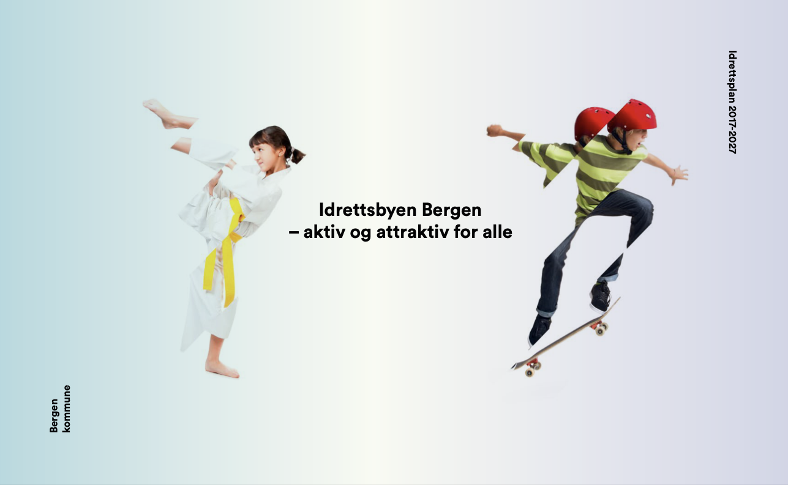

Головна ціль розвитку спорту Бергену – це надати можливість якісно займатись спортом якнайбільшій кількості громадян, як самостійно, так і організовано. Це досягається максимально відкритим діалогом і партнерством з громадськими спортивними клубами міста.

Вартий уваги "принцип безкоштовності інфраструктури" – це політика міста, яка декларує, що місто має докладати всіх зусиль, щоб спортивні клуби мали доступ до потрібної інфраструктури, а свої кошти витрачали на інші цілі. Муніципальна інфраструктура ж розподіляється між клубами.

Розподіл відбувається наступним чином: формується комітет з представників клубів та одного представника/ці департаменту спорту, які раз на рік зустрічаються та обговорюють як найкраще розподілити час. Враховується кількість членів клубу, оцінюються потреби клубів, ранній час (15:30 - 19:30) в пріоритеті для дитячих та юнацьких груп, активно заохочується спільна оренда. Незручний час рівномірно розподіляється впродовж року. 

**Якщо клуби не можуть погодити час, представник департаменту спорту приймає рішення за них.**

Однією з умов використання муніципальної інфраструктури є згода на втілення норвезької політики захисту прав дітей у спорті, про яку згадувалось вище.

## ✅ Гранти

Місто [пропонує](https://www-bergen-kommune-no.translate.goog/innbyggerhjelpen/kultur-idrett-og-fritid/idrett/idrettsanlegg?_x_tr_sl=no&_x_tr_tl=uk&_x_tr_hl=en&_x_tr_pto=wapp#) спортивній спільноті цілу низку грантів та механізмів розвитку:

- [Підтримка на проведення змагань](https://www.bergen.kommune.no/innbyggerhjelpen/kultur-idrett-og-fritid/tilskuddsordninger/idrettsmidler/arrangementsstotte-idrett)
- [Підтримка приватних спортоб’єктів](https://www.bergen.kommune.no/innbyggerhjelpen/kultur-idrett-og-fritid/tilskuddsordninger/idrettsmidler/stotte-til-private-idrettsanlegg)
- [Оренда спортінфраструктури / знаряддя](https://www.bergen.kommune.no/innbyggerhjelpen/kultur-idrett-og-fritid/idrett/idrettsanlegg/soke-om-fast-treningstid-og-terminfestede-arrangementer-i-idrettshaller)
- [Гранти клубам на дитячий/юнацький спорт](https://www.bergen.kommune.no/innbyggerhjelpen/kultur-idrett-og-fritid/tilskuddsordninger/idrettsmidler/barneog-ungdomsmidler-for-idrett)
- [Грант шкільної активності від Fysak](https://www.bergen.kommune.no/innbyggerhjelpen/kultur-idrett-og-fritid/fritid/fritidstilbud/fysak-aktivitetshus-for-barn-og-unge)
- [Фонд підтримки спортивних талантів](https://www.bergen.kommune.no/innbyggerhjelpen/kultur-idrett-og-fritid/tilskuddsordninger/idrettsmidler/talentutviklingsmidler-idrett)
- [Гранти на інновативні та нові проєкти](https://www.bergen.kommune.no/innbyggerhjelpen/kultur-idrett-og-fritid/tilskuddsordninger/idrettsmidler/nye-idrettstiltak-og-egenorganisert-fysisk-aktivitet)
- [Стимулювання інклюзивного спорту](https://www.bergen.kommune.no/innbyggerhjelpen/kultur-idrett-og-fritid/tilskuddsordninger/idrettsmidler/stimuleringsmidler-til-aktivitet-og-inkludering)
- [Призи та стипендії спортсменам Бергену](https://www.bergen.kommune.no/innbyggerhjelpen/kultur-idrett-og-fritid/tilskuddsordninger/idrettsmidler/stipend-og-priser-idrett)
- [Гранти на залучення біженців у спорт](https://tilskudd.bergen.kommune.no/portal/#call/8573/details)

Наприклад, грант на розвиток дитячого та молодіжного спорту працює наступним чином:

#### Процес

Клубам не потрібно нічого робити. Муніципалітет раз на рік отримує від Норвезької спортивної конфедерації реєстр членів клубу, розраховує кількість членів молодших за 19 років і розділяє загальну суму гранту поміж клубами. Гроші автоматично приходять на банківський рахунок клубу восени.

#### На що можна витрачати кошти

Вирішує правління клубу.

Цікавий також підхід до інфраструктури. Наприклад, є грант власникам приватних спортивних об'єктів – місто компенсує, по мірі можливості, використання приватної спортивної інфраструктури клубами в рамках програми "безкоштовної інфраструктури".

## 🧐 Особливості

Берген виділяється в цьому дослідженні багатьма пунктами, проте це більше особливість Норвегії, ніж міста.

🖥 Унікальним є автоматичний розподіл та фінансування по дискреційним грантам: клубу не потрібно навіть подавати заявки, достатньо бути в реєстрі Норвезької спортивної конфедерації та вчасно звітувати про членство в клубі.

🏟 Також цікаве формулювання та політика "безкоштовної інфраструктури" – стратегічно розумне рішення, яке знімає значний біль з клубів, дозволяючи фокусуватись на більш специфічних для свого спорту задачах.

💰 Незвично бачити детальні економічні дослідження по ефективності спортивної політики міста. В інших країнах таке можна побачити на національному рівні, але не міста. Одним з цікавих факторів була оцінка економічного ефекту волонтерства (добровільного залучення свого часу та знань) в клубах. Цифра збігається з [загальнонаціональними дослідженнями в Європі](https://link.springer.com/book/10.1007/978-3-030-02354-6) – 10-15 разів від загальних витрат на спорт. Оцінка Бергена – 75 мільйонів євро користі від волонтерства.

🧒 Політика захисту прав дітей в спорті є однією з причин, чому майже 9 з 10 дітей в Бергені займаються спортом, і роблять це не заради медалей (до 11 років дітей навіть заборонено ранжувати). При цьому Норвегія стабільно займає перше місце у медальному заліку на Зимових олімпійських іграх і 9-те – загалом.

# Висновки

Отже, ми поглянули на 10 дуже різних міст з 10-ти різних країн Європи. Серед них 5 столиць і 5 менших міст.

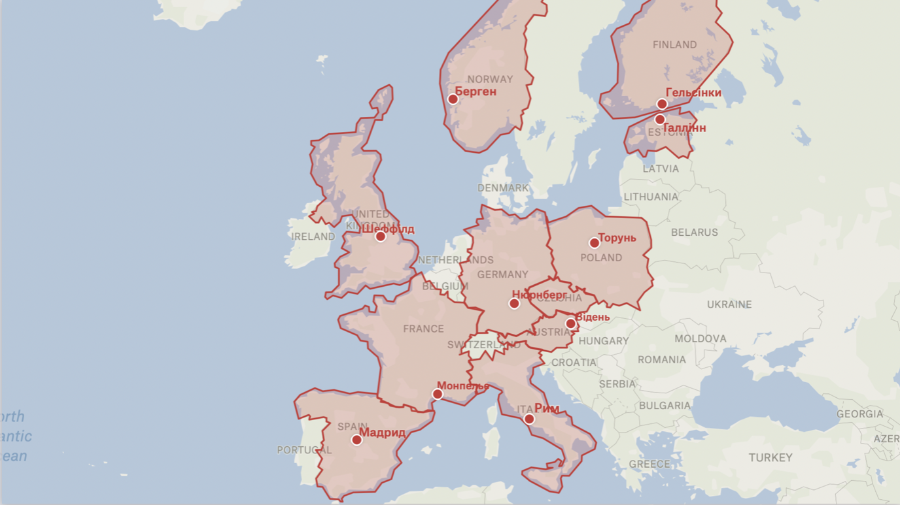

Міста мають сильно різні бюджети, різний відсоток фінансування виділеного на спорт та на людину.

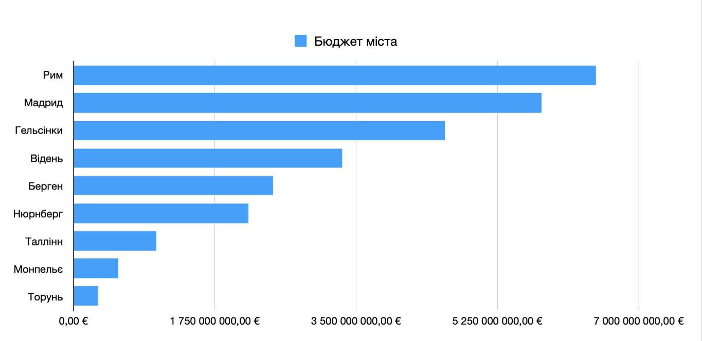

В кожному місті є свої особливості, відмінності у підходах, програмах, імплементації та комунікації з громадянами. Проте спільними залишаються ключові речі, які і називають "європейською моделлю спорту":

### 1. Спорт = суспільство

🇪🇺 У всіх вищенаведених містах основою спорту є суспільство, яке представлене у формі спортивних клубів. Головною функцією спорту зазначається соціальна складова та функція об'єднання суспільства.

🇺🇦 В Україні досі залишається сильним уявлення, що спорт – це функція держави, а задача спортивної системи - приносити результати державі.

### 2. Клуби = громадські організації

🇪🇺 За вийнятком Таллінну, клуби - це виключно неприбуткові громадські організації. Це логічно, з огляду на перший пункт – адже громадські організації це головна форма об'єднання громадян, якщо ціль об'єднання не є бізнес.

🇺🇦 В Україні навіть директори спортдепартаментів твердо переконані, що клуби – "це бізнес" та "середній клас". Популярна хибна дихотомія про "ДЮСШ – безкоштовно і для дітей" проти "клуби – тільки для тих, в кого є гроші".

### 3. Волонтерство = фундамент та економічна суперсила

🇪🇺 Волонтерство є фундаментом міцності клубної спортивної системи, який дозволяв клубам переживати важкі періоди, на кшталт війн. Економічні дослідження по ефекту волонтерства в спортивних клубах системно показують цифри більші в 10-15 раз (!) від загального бюджету країни чи міста на спорт. Багато зусиль докладається до стимулювання волонтерського руху, підримки, визнання та нагородження волонтерів.

🇺🇦 В Україні поняття "волонтерство в спорті" поки що зустрічається з усмішкою. Економічна цінність цього природнього явища в громадянському суспільстві залишається незрозумілою та невідомою для широкого загалу спортивних функціонерів.

### 4. Політика = залучити якнайбільше людей до спорту

🇪🇺 Майже в усіх містах є чітко сформулювані цілі фінансування спорту, адже це кошти платників податків. Головна ціль – це дати якнайбільшій кількості людей якомога якісні та різноманітні спортивні послуги. Фактично, питання політики розвитку спорту зводиться до стимуляції громадського та приватного сектору, та ефективної координації і розподіленню обмеженого ресурсу (як-то інфраструктура чи бюджет міста для розвитку спорту).

Якщо представити це у вигляді графіка, де вісь Х – це кількість мешканців міста (у відсотках), а вісь Y – задоволення від спортивних послуг, які можна отримати в місті, то політика зводиться до збільшення площини цього графіка:

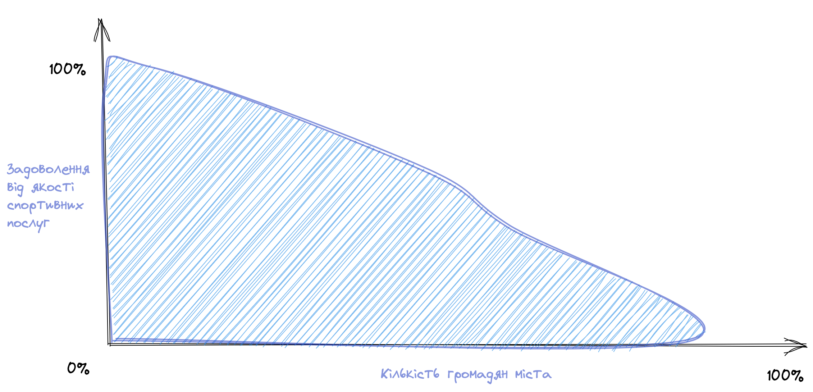

🇺🇦 В Україні ж досі немає міст, які б мали подібну політику розвитку спорту. Департаменти спорту, які історично були елементами радянської машини з  виконання планів по медалям, продовжують працювати за тими самими схемами, поглядами та політиками.

Левова частка коштів бюджету міста йде на утримання маленької кількості державних шкіл (ДЮСШ), які були створені для досягнення зовсім інших цілей в іншій країні без ринкової економіки та громадянського суспільства.

Політика розвитку спорту українських міст оптимізована по радянській моделі "під результати", тому замість збільшення площі графіку, вона, навпаки, побудована для її зменшення: діти, які "не показують результат", викидаються зі спорту (щоб не займати цінний ресурс), масовий спорт зневажливо називається "фізкультура" або "несправжній спорт", політика використання спортивної інфраструктури має на меті дати доступ тільки маленькій групі "талановитих", а спорт для дорослих, літніх людей та людей з інвалідністю навіть не сприймається як важлива тема для обговорення.

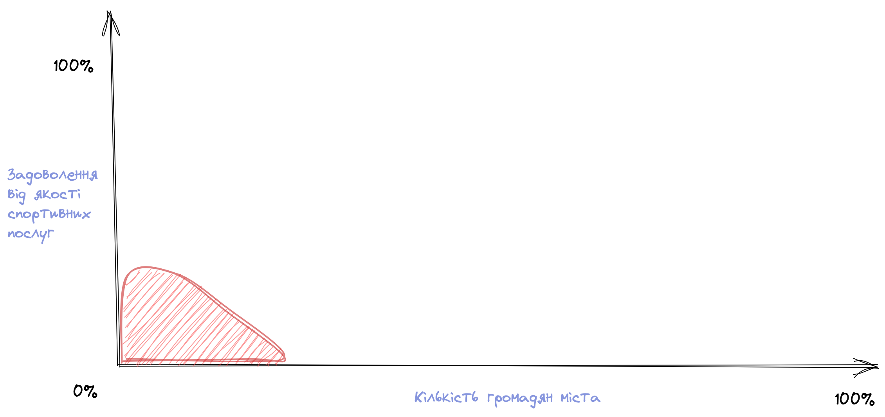

### 5. Департамент спорту = партнер та інвестор

🇪🇺 Департаменти спорту в усіх 10 містах – це, перш за все, ланка у комунікації між спортивною громадою міста та муніципальною владою. Їх головна задача – дати максимум можливостей клубам розвивати спорт, забезпечити прозорість та чесність використання коштів платників податків, та використати їх найбільш ефективно, щоб залучити до спорту всі верстви населення, особливо малопредставлені та малозабезпечені. Це досягається формуванням власної політики розвитку, постійною комунікацією з громадянами, стратегічним плануванням і інвестуванням публічних коштів у довгостроковим горизонтом планування.

🇺🇦 В Україні департаменти спорту – це бюрократії, створені для утримання радянської системи ДЮСШ. В них немає досвіду формування власної політики розвитку спорту – їх задача утримувати державну систему, яка не змінювалась з радянських часів. Найбільш прогресивні департаменти спорту українських міст мають лише ініціативи, які намагаються залатати проблеми існуючої системи, як-то оцифрування ДЮСШ для зменшення корупції, чи створюють нові комунальні підприємства, називаючи їх "клубами".

---

Резюмуючи, всі розглянуті міста розвивають спорт через громадські неприбуткові клуби, виступаючи партнером та інвестором. Незважаючи на різноманіття підходів, різні розміри міст та бюджетів, фундаментом спорту європейських країн залишається громадянське суспільство і клуби.

Будемо вдячні, якщо поширите це дослідження у соцмережах!

PS. В процесі цього дослідження було використано сотні джерел та наукових робіт. Підготовка та публікація повного списку джерел займе певний час, тож якщо ви побачили якусь помилку чи неточність, чи хочете глибше копнути якусь з тем – сміливо [пишіть нам](/contacts), спробуємо виправити та відповісти.

---

Читайте також: [Чому спортклуби ЄС - громадські організації](/2022/07/nonprofits)
