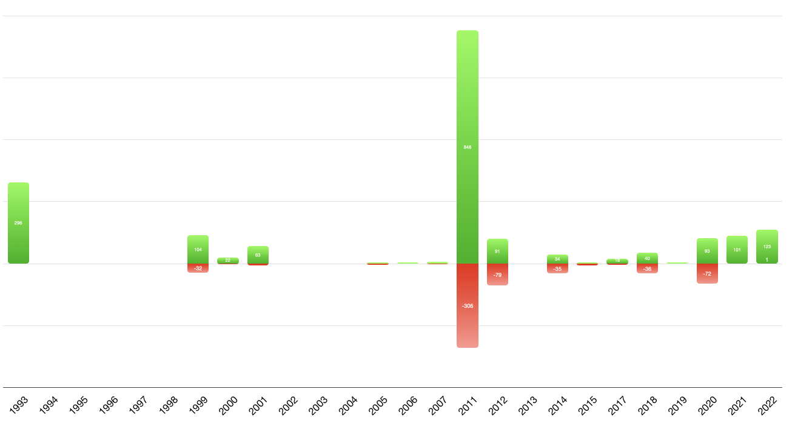
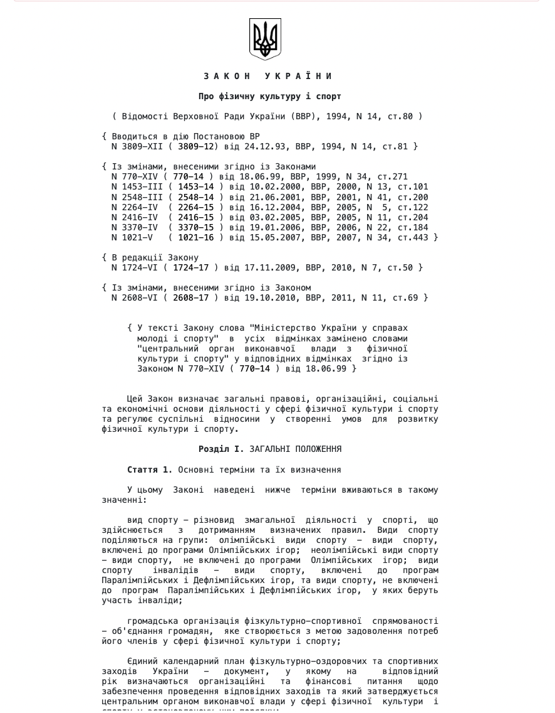
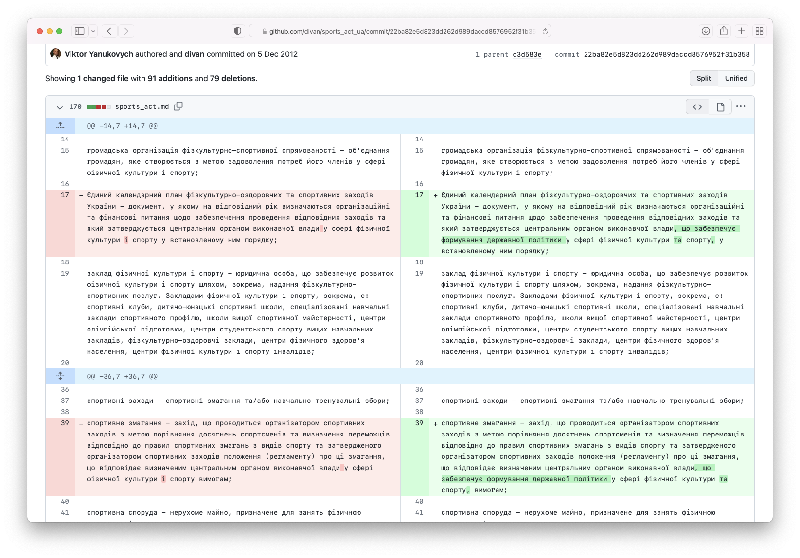

Головним джерелом права що регулює спорт в Україні є ["Закон про фізичну діяльність та спорт"](https://zakon.rada.gov.ua/laws/show/3808-12) (далі - Закон про спорт). За роки незалежності України законотворці змінювали закон 25 разів. Ми проаналізували всі зміни, щоб глибше зрозуміти зміни в Українському спорті, які відбувались за останні 30 років.

### Резюме
Закон про спорт не має фундаментальних змін з 1993-го року. Він був переписаний один раз у 2011-му і збільшився на 50% у розмірі, але головні тези і норми залишились без змін. 

### Історія змін Закону про фізичну культуру та спорт

<small>Зеленим – додані рядки, червоним – прибрані рядки</small>

### Початок - 1993 рік

Перша редакція Закону [датується](https://zakon.rada.gov.ua/laws/card/3808-12/ed19931224#History) 1993-м роком. Закон містив 41 статтю, що визначала загальні основи фізичної культури та спорту України. 

В першій редакції Закону завдання спорту визначалось наступним чином:

> Основними завданнями фізичної культури і спорту є постійне підвищення рівня здоров'я, фізичного та духовного розвитку населення, сприяння економічному і соціальному прогресу суспільства, а також утвердження міжнародного авторитету України у світовому співтоваристві.

Цікаво, що виконавцями завдань називались громадські організації - цьому присвячена окрема Стаття No.5 "Громадські засади у сфері фізичної культури і спорту". Стаття про державне регулювання спорту також має такі фрази як "...держава регулює відносини... шляхом ... визнання широкого самодіяльного статусу фізкультурно-спортивного руху... і комплексної взаємодії державних органів з громадськими організаціями...".

Показниками стану розвитку спорту Закон називає:

 - рівень здоров'я та фізичного розвитку різних верств населення
 - ступінь використання фізичної культури в різних сферах діяльності
 - рівень розвитку системи фізичного виховання
 - рівень розвитку самодіяльного спорту
 - високі досягнення спортсменів України в коремих видах спорту

Ми поки що не знайшли автора законопроєкту першого українського закону про спорт, але буде не дивно, якщо при розробці цього закону використовувались тези з законів про спорт деяких європейських країн. Принаймні, акцент на громадськість та самодіяльність в ньому є з самого початку.

Втім, більша частину закону повертає нас в часи СРСР, в якому Держкомспорт (та його попередні реінкарнації) керували і контролювали спорт. Це такі речі як: державна система спортивних звань, нагрудні значки, державна мережа дитячо-юнацьких шкіл, фізкультурно-спортивні товариства, ліцензування спортивної діяльності, гарантії безкоштовності навчання у ДЮСШ, суттєві обмеження прав федерацій тощо. Монополія держави не ставиться під питання у багатьох напрямках на кшталт освіти тренерів, будівництва спортивної інфраструктури, проведення всеукраїнських змагань тощо.

### 1993 - 2011 роки

В наступні 20 років було 7 змін до Закону. Наводимо таблицю кількості змінених рядків в кожній зміні, та короткий опис змін.

| Дата  | Видалено  | Додано  | Опис  |
|---|---|---|---|
| [17.07.1999](https://github.com/divan/sports_act_ua/commit/2d3f09f4585f400cccbcfee5b7dde7ef831c8b9a)  | -32  | +104 | Перейменування "Міністерство України" у "Центральний орган виконавчої влади", деталізовані статті про федерації |
| [21.03.2000 ](https://github.com/divan/sports_act_ua/commit/b3ef84c7bb30f61517ce38ffb4648f789c854641) | -3 | +22  | Додана глава про "Фізкультурно-спортивні товариства" |
| [27.07.2001](https://github.com/divan/sports_act_ua/commit/7d9247ae893471e3c7f6296871221149d4a517df)  | -6  | +63  | Переписано розділ про "професійний спорт" |
| [12.01.2005](https://github.com/divan/sports_act_ua/commit/d78e34fde45f97b919629418681c0498c327ed96)  | -2  | +2  | Виправлене написання слова "Паралімпійський" |
| [25.02.2005](https://github.com/divan/sports_act_ua/commit/0a9736ca17ac54a0c4816a39bec8256f341d2964)   | -3  | +3  | Деталізовано набуття статусу національної федерації  |
| [17.02.2006](https://github.com/divan/sports_act_ua/commit/6d80a60d9ec3f9115e2686d8ad6503afe7e904fc)   | 0  | +4  | Додано статтю про ліцензування спортивної діяльності |
| [08.06.2007](https://github.com/divan/sports_act_ua/commit/2bde6bf7b538e80f6984c05686d6e13ded56128e)   | -3  | +7  | Додано тезу про "недопущення скорочення мережі закладів фізичної культури і спорту"  |
| 17.11.2010   | 0  | 0  | Скасовано статтю про ліцензування спортивної діяльності  |

Детальний аналіз причин кожної зміни виходить за рамки цієї статті, але можна сміливо припускати, що ці зміни були "заплатками" у відповідь на системні конфлікти всередині української спортивної спільноти.

### Нова редакція 2011 року

У 2008-му році був [зареєстрований](http://w1.c1.rada.gov.ua/pls/zweb2/webproc4_1?id=&pf3511=32618) Проєкт нового закону. Ініціаторами значяться [Віктор Корж](https://uk.wikipedia.org/wiki/Корж_Віктор_Петрович), [Павло Костенко](https://uk.wikipedia.org/wiki/Костенко_Павло_Іванович) та [Олександр Волков](https://uk.wikipedia.org/wiki/Волков_Олександр_Михайлович).

Лише у 2011-му році новий закон [було прийнято](https://zakon.rada.gov.ua/laws/show/3808-12/ed201101016#Text). Аналізувати зміни по статтям не має сенсу, тому що текст закону було переписано з нуля, в нього інша структура. Закон виріс на 50%.

Прочитавши цю редакцію і попередню, можемо спробувати відповісти на питання – що суттєво змінилось в цій редакції?

Коротка відповідь – нічого. Структура змінилась, додалось більше чітких визначень термінів, але фундаментальних змін не відбулося.

Наприклад, стаття про "Фізкультурно-оздоровчу діяльність у виробничій сфері" отримала назву "Фізкультурно-оздоровча діяльність за місцем роботи громадян". Стаття про "громадські засади у сфері спорту" зникла, хоча з'явилось чітке визначення терміну "спортивний клуб". По аналогії з комунальними закладами, Закон чомусь визначає джерела фінансування клубів, в яких немає ні слова про підтримку з місцевих бюджетів.

#### Хаос с суб'єктами
Розділ другий "Суб'єкти сфери фізичної культури і спорту" фактично є переліком зоопарку видів спортивних організацій в Україні. Це:
 - "спортивні клуби"
 - "дитячо-юнацькі спортивні школи (ДЮСШ)"
 - "спеціалізовані навчальні заклади спортивного профілю"
 - "школи вищої спортивної майстерності"
 - "центри олімпійської підготовки"
 - "центри студентського спорту вищих навчальних закладів"
 - "фізкультурно оздоровчі заклади"
 - "центри фізичного здоров'я населення"
 - "центри фізичної культури і спорту інвалідів" (правильне написання "людей з інвалідністю" буде додано пізніше)
 - "колективи фізичної культури"
 - "фізкультурно-спортивні товариства"
 - "спортивні федерації"
 - "громадські-організації фізкультурно-спортивної спрямованості учнів та студентів",
 - "громадські організації фізкультурно-спортивної спрямованості ветеранів фізичної культури і спорту"

Хаосу в цю складну систему розгалуження "спортивних суб'єктів" додає і факт розмитості відповідальності. Наприклад, забеспечує ДЮСШ Міністерство молоді і спорту, але зазначено, що ДЮСШ належить до системи освіти, яка підпорядкована Міністерству освіти.

Конфлікт між системою освіти і системою розвитку спорту є звичним явищем в історії формування спортивних систем багатьох країн, але в СРСР його і не було – ДЮСШ є центральним компонентом системи відбору талановитих дітей для спорту вищих досягнень. Структура фінансування, умови оплати праці, тощо – визначаються Міністерством молоді і спорту, і спрямовані на ранній відбір талантів. Закон, тим не менш, описує ДЮСШ як заклади, що "...створюють необхідні умови для гармонійного виховання, повноцінного оздоровлення, змістовного відпочинку, дозвілля дітей та молоді, самореалізації, набуття навичок здорового способу життя..."

#### Державна політика у сфері спорту
Втім, закон також сформулював ключові тези державної політики спорту, серед найперших з них наступні:
 
* визнання фізичної культури і спорту як пріоритетного напряму гуманітарної політики держави;
* визнання фізичної культури як важливого чинника всебічного розвитку особистості та формування здорового способу життя;  
* визнання спорту як важливого чинника досягнення фізичної та духовної досконалості людини, формування патріотичних почуттів у громадян та позитивного міжнародного іміджу держави; 
* гарантування рівних прав та можливостей громадян у сфері фізичної культури і спорту;
* сприяння безперервності та послідовності занять фізичною культурою і спортом громадян різних вікових груп;
* забезпечення підтримки громадських організацій фізкультурно-спортивної спрямованості;
* забезпечення різноманітності, високої якості та доступності фізкультурно-спортивних послуг для громадян;

У державній політиці у цій редакції закону немає ні слова про спорт вищих досягнень, окрім одного пункту про "формування позитивного міжнародного іміджу".

Резюмуючи, можна сказати, що закон добре вхопив стан речей на той час – хаос з розумінням, хто, як і навіщо розвиває спорт, і, в той же час, задекларував відносно Європейські погляди на цінності спорту. Проте фундаментальних змін не відбулося – той самий невиправдано високий рівень залученості держави у керування спортом, те саме обмеження федерацій у свободі розвитку своїх видів спорту, ті самі рудименти радянської системи спорту, яка була створена для задоволення запитів на спорт комуністичної партії в умовах планової економіки.

Ця редакція закону, з невеличкими змінами, діє і на сьогодняшній день.

### 2011-2022 роки

Зміни з 2011 року переважно є виправленнями та заплатками.

| Дата  | Видалено  | Додано  | Опис  |
|---|---|---|---|
| [15.05.2011](https://github.com/divan/sports_act_ua/commit/d3d583e28081df0a70e0d92fd6ef8095f6827a3a) | -10 | +5 | Прибрано вимогу атестації волонтерів |
| [5.12.2012](https://github.com/divan/sports_act_ua/commit/22ba82e5d823dd262d989daccd8576952f31b358) | -79 | +91 | У довгу назву "*центрального органу виконавчої влади у сфері фізичної культури і спорту*" додано "*, що реалізує державну політику*", бо незрозуміло :) |
| [1.01.2015](https://github.com/divan/sports_act_ua/commit/252b2c7d5bf02a62b1e0a35cf4ea70012cc33566?diff=split&w=1) | -529 | +528 | Додано про те, що зарплату тренерів ДЮСШ визначає Кабмін, та про "безкоштовність" для певних груп населення |
| [11.06.2015](https://github.com/divan/sports_act_ua/commit/243482afd6b570825b75ac03145e02bc4a173734) | -6 | +4 | Видалено про те, що зарплату тренерів ДЮСШ визначає Кабмін, та про "безкоштовність" для певних груп населення. Додана заборона скорочення ДЮСШ без згоди Міністерства спорту |
| [14.09.2017](https://github.com/divan/sports_act_ua/commit/3e2b0ef72ca965f847add60f9f362ed552e0eb51) | -3 | +7 | Додано поняття "національних видів спорту" |
| [27.09.2017](https://github.com/divan/sports_act_ua/commit/3c4862ecd5cf7e79c344974069561d292b660a9a) | -2 | +11 | Додані поняття "службово-прикладний та військово-прикладний спорт" |
| [16.02.2018](https://github.com/divan/sports_act_ua/commit/efdf750d047ad73efe676247bbcd6ec1fdbf0a32) | 0 | +4 | Додано поняття "спортивна зброя" |
| [3.06.2018](https://github.com/divan/sports_act_ua/commit/2f4af3fb2660cbfc1dab9556af8fcb9b9444f1da) | -36 | +36 | Перейменовано "інвалідів" у "людей з інвалідністю" |
| [16.07.2019](https://github.com/divan/sports_act_ua/commit/c36a0d4e399dd613e4713949ad6b437540163784) |0 | +4 | Додана вимога проведення спортивних змагань державної мовою 🇺🇦 |
| [12.07.2020](https://github.com/divan/sports_act_ua/commit/db826c5bcd77016dda23eafb66509e6b69352d82) | -12 | 33 | Додано статті про Українську федерацію учнівського спорту та спортивну студентську спілку |
| [16.10.2020](https://github.com/divan/sports_act_ua/commit/bdaca9dd898a23d7db088f093a99d6d255a51637) | -1 | +1 | Змінено вимоги до спортивної форми - на користь вимог міжнародних федерацій |
| [1.01.2021](https://github.com/divan/sports_act_ua/commit/721b3c1739a5c1df2bd35f5c494ef674772ac432) | -59 | +59 | Поновлення формулювань (на кшталт "громадська організація" на "громадське об'єднання") |
| [6.06.2022](https://github.com/divan/sports_act_ua/commit/2f0f39371d3c76c9ce708436e5cdd1759a8692d5) | 0 | +2 | Додано пункт про те, що майно ліквідованих ДЮСШ має використовуватись для спорту. |
| [17.06.2022](https://github.com/divan/sports_act_ua/commit/2929b784f3e871bf7b385a6aba45b0fd910763a0) | -1 | +10 | Додана стаття про "Спорт ветеранів війни" |
| [15.06.2022](https://github.com/divan/sports_act_ua/commit/cbaf972b44cb429d259f099741cc02c15c7cdc72) | 0 | +111 | Додано вимоги щодо діяльності Національної лабораторії антидопінгового контролю |

### Закон на Github

Якщо ви хочете самі проаналізувати зміни, ми перенесли всі редакції Закону на популярну платформу системи контролю версій Github. На ній ви зможете самостійно подивитись історію змін в зручній формі чи виконувати власний аналіз (на кшталт git blame по потрібній строчці закону).

Посилання: https://github.com/divan/sports_act_ua

### Резюме

Аналіз змін Закону про фізичну культуру і спорт дозволяє стверджувати, що закон про спорт фундаментально не змінювався за всю історію незалежної України. Текст був переписаний у 2011-му році, проте всі головні складові радянської моделі керування спортом залишились фактично без змін.
