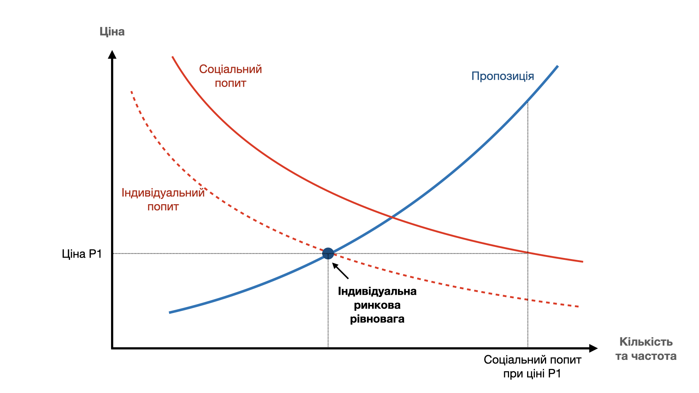

*Ця стаття знайомить читача з основами мікроекономіки спорту - що таке криві попиту та пропозиції у спорті, позитивні екстерналії спорту, індивідуальний та соціальний попит, індивідуальна ринкова рівновага та роль держави у ринку спортивних послуг.*

Політики розвитку спорту в Європі базуються на фундаментальних принципах ринкової економіки. Під ринком у спорті мається на увазі сукупність всіх хто споживає спортивні послуги (громадяни) і надає їх (клуби, фітнес-центри, спортзали тощо). Це називається попитом та пропозицією, і стан будь-якого ринку є рівновагою між функцією попиту та функцією пропозиції.

## Індивідуальна функція попиту
Як показано на графіку нижче, попит – включаючи попит на спорт – залежить від оціночної вартості занять окремо кожною людиною. "Оціночна вартість" означає сукупну вартість – безпосередньо вартість заняття, вартість одягу та необхідного знаряддя, вартість дороги до місця занять, та вартість часу, який людина витрачає на спорт замість того, щоб робите щось інше.

Чим нижча ця вартість, тим більше людей будуть займатись спортом. Чим вона вища - тим менше очікуване залучення у спорт. В економіці ця обернено пропорційна залежність має назву **закону попиту**.

## Позитивні екстерналії
Наступний важливий економічний термін для розуміння європейських політик у спорті називається екстерналією (externality). Екстерналія - це будь-який  вплив економічної транзакції на зовнішнє (external) середовище чи інших людей.  

Екстерналії бувають негативними та позитивними. Наприклад, якщо в процесі виробництва сировини завод викидає шкідливі речовини у середовище - це негативна екстерналія, оскільки вона несе шкоду суспільству. Прикладом позитивної екстерналії може служити вакцинація – людина, що вакцинувалась цим самим зменшує ризик зараження іншим людям.

Зменшення негативних екстерналій та збільшення позитивних є одним з головних економічних інструментів які є у держави для покращення добробуту суспільства. Оскільки позитивні екстерналії несуть користь для суспільства, то суспільство в цілому має більший попит на діяльність, що має позитивні екстерналії.

## Соціальна функція попиту
Спорт має значну кількість добре досліджених позитивних екстерналій для суспільства:
 - краще фізичне та ментальне здоров'я
 - менші витрати на охорону здоров'я
 - більше задоволення життям та працездатність
 - краща інтеграція суспільства, нижчі рівні кримінальності

Наявність позитивних екстерналій означає, що соціальний попит буде більший ніж індивідуальний. Соціальна функція попиту на спорт буде зміщена "праворуч" від індивідуального попиту і мати наступний вигляд:

## Функція пропозиції
Означивши функцію попиту, потрібно проаналізувати функцію пропозиції – стейкголдерів які можуть задовольнити цей попит.

Потенційними постачальниками спортивних послуг є:
 - спортивні клуби
- окремі індивідуальні особи / тренери
- школи та університети
- інші комерційні чи державні заклади

Окрім цього, стейкголдерами ринку, що задовольняють попит також є:
 - виробники та продавці спортивного одягу та знаряддя
- організатори змагань та заходів
- власники спортивної інфраструктури
- інші сервіси причатні до спортивних тренувань та змагань - кейтеринг, транспортні послуги, страхування, медичні сервіси тощо.

Щоб запропонувати ці послуги, постачальники мають нести витрати - постійні та змінні. Чим вища ціна на послуги та більша кількість людей, що займаються спортом, тим більше рівень пропозиції. Це збільшує дохід постачальника, дозволяючи знизити вплив постійної вартості послуги. Волонтерство у спортивних клубах також дозволяє підняти якість та кількість послуг не змінюючи ціни.

Загалом, чим більше ресурсів (монетизованих чи волонтерського часу), тим більша пропозиція. Функція пропозиції має наступний вигляд:

В мікроекономіці ця залежність пропозиції від вартості надання послуги називається **законом пропозиції**.

## Функція пропозиції та додаткові джерела

Збільшення ресурсів для надання спортивних послуг у клубі зсуває криву пропозиції праворуч, якщо збільшення не залежить від кількості людей, і праворуч-вгору - якщо залежить.

В ринковій економіці клубної системи майже всі джерела залучення ресурсів так чи інакше залежать від кількості людей, що займаються спортом. Чим більше членів у клубі – тим більше дохід від членських внесків. Чим більше членів у клубі – тим більше можливості залучення спонсорів, оскільки спонсори шукають видимості свого бренду. Чим більше членів – тим більше активних волонтерів, які витрачатимуть свій час та кошти на діяльність клубу.

Функція пропозиції після збільшення ресурсів має наступний вигляд:

Як видно, залучення додаткових ресурсів дозволяє надавати більше і якісніше спортивні послуги зберігаючи ту саму ціну.

## Індивідуальна ринкова рівновага
Індивідуальною ринковою рівновагою називається точка перетину функцій індивідуального попиту та пропозиції. Якщо немає спотворюючих ринок факторів, то ціни на спортивні послуги будуть знаходитись навколо цієї точки. Ціни менші не будуть надавати достатньо ресурсів для задоволення попиту, а ціни більші будуть не будуть залучати достатньо споживачів.

Проте, як видно з графіка нижче, за ринкової рівноваги рівень залучення у спорт є меншим ніж соціальний попит. Іншими словами, велика кількість людей яка б могла отримувати позитивні екстерналії від спорту будуть не взмозі отримувати спортивні послуги за тими цінами, які сформували сили ринку. Більш того, за ринкової ціни рівень пропозиції є меншим, ніж того вимагає соціальний попит.

Отже якимось чином потрібно "збільшити" ціну для постачальників, щоб створити для них умови збільшення пропозиції, і, одночасно, цим стимулювати і попит на спорт у майбутньому.

Головним інструментом досягнення цього є субсидії - або гранти.

На графіку вище видно, що державні (муніципальні) субсидії необхідні та виправдані для того щоб вирівняти неефективність ринку. Це можна зробити двома шляхами:
 - субсидування постачальників послуг (клубів) – гранти клубам дозволять зсунути функцію пропозиції праворуч і наблизити вартість надання послуг до рівня соціального попиту
- субсидування споживачів послуг (громадян) - стимулювання громадян збільшити рівень попиту, наблизивши криву індивідуального попиту до кривої соціального попиту

Це може мати різні форми - гранти клубам, прямі виплати громадянам на спорт ("гроші ходять за послугою"), податкові пільги для спортивних клубів, пільговий або безкоштовний доступ до муніципальної спортивної інфраструктури тощо.

Це дозволяє клубам надавати більше і краще послуги, не збільшуючи ціни. Разом з механізмами фінансової солідарності в клубній системі це дозволяє надавати безкоштовні спортивні послуги малозабеспеченим верствам населення чи підтримувати недопредставлені види спорту.

## Яка тут роль держави?
Європейські держави при формування спортивних політик прагнуть відповісти на два запитання:
1. Який бажаний соціальний рівень залучення у спорт і наскільки ми далеко від нього?
2. Як найефективніше використовучи гроші платників податків наблизити пропозицію до соціального попиту.

В Україні, нажаль, перед тим, як задавати ці питання, доведеться відповісти на ще одне питання: наскільки руйнівним на економіку українського спорту є  державне регулювання сектору, яке дісталося у спадщину від СРСР (комунальні "безкоштовні" ДЮСШ, відсутність грантів клубам, фінансові винагороди прив'язані до "результатів", а не до залученості у спорт тощо), але це тема для наступної статті.

## Резюме
Фундамент формування політик розвитку спорту в країнах Європи є оптимізація ринку - наближення задоволення попиту до соціально бажаного рівня. Роль державних органів полягає у визаченні цього рівня та стимулювання стейкголдерів ринку за допомогою різних інструментів, таких як гранти спортивним клубам.

## Що почитати?

Корисні ресурси:
 - Externalities - https://www.imf.org/external/pubs/ft/fandd/2010/12/basics.htm
 - Shifting the demand curve to improve social welfare - https://www.telefonica.com/en/communication-room/blog/shifting-the-demand-curve-to-improve-social-welfare/
 - Study on the funding of grassroots sports in the EU - https://op.europa.eu/en/publication-detail/-/publication/50e6357c-6e20-43fc-8cf7-b7ca073b197c
