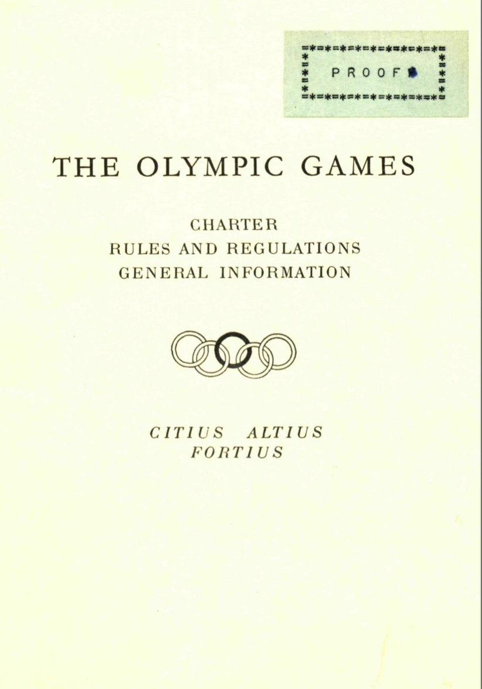
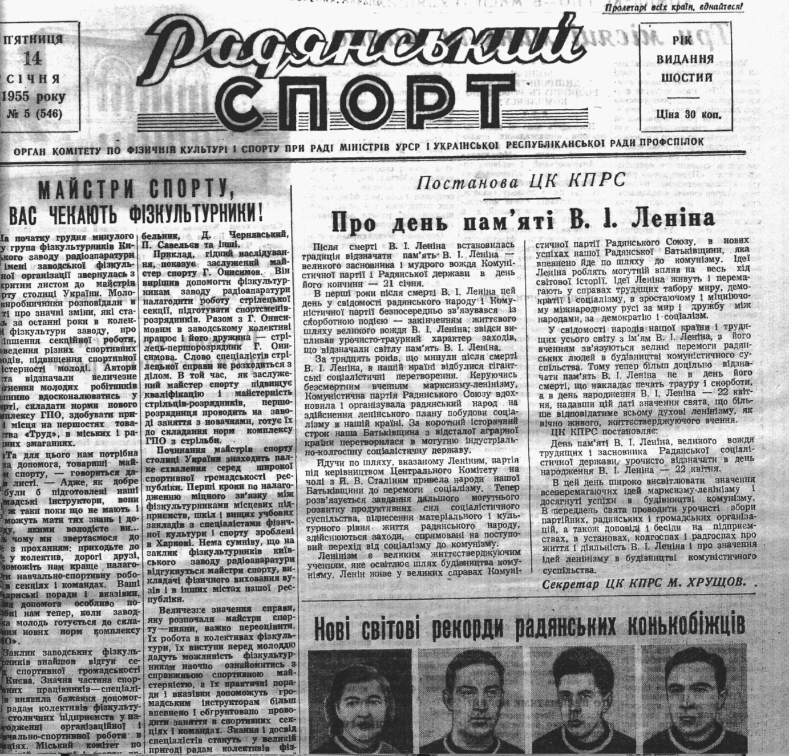
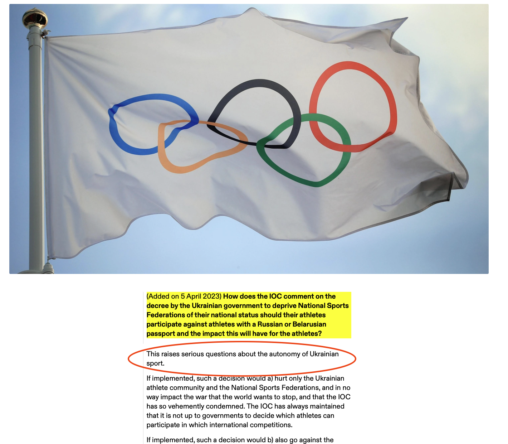

## Автономія спорту

Автономія є ключовим принципом організації Європейського та міжнародного спорту. Простими словами він означає, що правила управління спорту визначає виключно спортивна спільнота, а не єдиний стейкголдер на кшталт держави чи комерційної організації. Цей принцип закладено в Європейській спортивній хартії та Олімпійській хартії.

В Україні принцип автономії спорту є маловідомим і грубо порушеним одночасно, тож в цій статті розбираємось, що таке автономія, чому вона важлива і яке її майбутнє в світі та Україні.

### Визначення

Автономія - це комбінація двох грецьких слів “авто” та “номос” – що означає “ті, що самі визначають закони”. Це, фактично, синонім поняттю самоврядування.

Автономія спорту означає, що спортивні організації (клуби, асоціації, федерації) мають право створювати та змінювати свої правила вільно, без політичного чи економічного впливу, проводити вільні вибори в свої органи, та отримувати публічні кошти на свою діяльність без зайвих умов та тиску.

### [Європейська спортивна хартія](https://rm.coe.int/recommendation-cm-rec-2021-5-on-the-revision-of-the-european-sport-cha/1680a43914):

> Стаття 4
> 
> 3. Організації спортивного руху мають повну свободу об'єднань, гарантовані Конвенцією захисту прав людити та фундаментальних свобод. Вони мають автономне прийняття рішень і мають обирати своїх лідерів демократичним шляхом згідно правил "доброчесного управління". Державні органи та спортивні організації мають визнавати потреба у взаємоповазі до їх рішень.

### [Олімпійська Хартія](https://stillmed.olympic.org/media/Document%20Library/OlympicOrg/General/EN-Olympic-Charter.pdf):

> Фундаментальні принципи олімпізму
> 
> 5. Розуміючи, що спорт функціонує в рамках суспільства, спортивні організації в Олімпійському русі повинні мати дотримуватися політичного нейтралітету. Вони мають права та обов’язки, притаманні автономним організаціям, які включають незалежне створення спортивних правил та контроль за ними, визначення структури і керівництво своїми організаціями, дотримання права на проведення виборів, вільних від будь-якого зовнішнього впливу, а також відповідальність за забезпечення застосування принципів добросовісного управління.

Втім, визначення і погляди на автономію спортивних організацій суттєво змінились за останні 50 років, тож варто зробити короткий історичний огляд.

### Історія

Спорт є частиною суспільства. Він не належить одній людині чи одній організації. Організований спорт, що зародився у Британії і поширився у XIX-му столітті у Європу, мав повну свободу самоврядування відповідно до правил про об'єднання в цих країнах.

Право на самоврядування в неприбуткових організаціях дозволило клубам та федераціям ефективно розвивати та популяризувати свої види спорту в своїх країнах, а з появою міжнародних федерацій та міжнародних змагань, і представляти свою країну.

На початку ХХ століття слово "автономія" фактично не використовувалось. З одного боку, самоврядування в спорті було "здоровим глуздом", якому нічого не загрожувало. З іншого – це були часи до появи телебачення, стрімкої комерціалізації та політизації спорту.

### Автономія в Олімпійському русі

Ситуація почала змінюватись у 1930-ті роки. Засновник Олімпійського руху, Барон П'єр де Кубертен, писав: "... доброзичливість членів будь якого спортивного руху втрачається, коли в ньому з’являється гігантська розмита пика небезпечного створіння під назвою держава...”. Барон, ще будучи президентом Міжнародного Олімпійського Комітету (МОК), важко переживав за те, як справа його життя перетворювалась з загального руху у політичний інструмент в руках нової політичної сили в Німеччині - партії Адольфа Гітлера, який мав плани перенести штаб-квартиру МОК у Берлін і змінити правила, щоб Олімпійські ігри перманентно проводились в Німеччині.

Проте лише у 1949-му термін "автономія" вперше з'явився в Олімпійській хартії. Правило 25 редакції Хартії 1949 року визначало, що членами МОК можуть бути лише "незалежні та автономні" національні олімпійські комітети. Цим правилом МОК намагався закласти фундамент для збереження автономії спорту в Олімпійському русі від нової загрози - комуністичного режиму СРСР. До 1952-го СРСР не приймав участь у Олімпійських играх та всіляко висміював саму ідею. Проте після Другої Світової війни, Йосип Сталін побачив у спорті потужний інструмент для домінації та просування комуністичного режиму. У другій половині 1940-х років СРСР раптово стала членом низки міжнародних федерацій та розпочала розмови про вступ до МОК.

У 1958-му в Олімпійську Хартію було додано:

> ... НОК мають бути повністю незалежні та автономні і повністю вільні від політичного, релігійного чи комерційного впливу...

Це також співпало з початком нової ери телевізійних та спонсорских прав на Іграх в Мельбурні 1956-го року.

Для Олімпійського руху автономія має особливо важливе значення через структуру самого руху. Він побудований через ієрархію від МОК до Національних Олімпійських Комітетів (НОК) та міжнародних федерацій. Міжнародні федерації складаються з національних федерацій. І якщо саме автономія є передумовою для збереження філософії та духу Олімпізму, то порушення автономії хоча б в одній з ланок цієї ієрархії ставить під загрозу всю структуру Олімпійського руху.

З популяризацією телебачення, структура фінансування як Олімпійських ігор так і багатьох міжнародних федерацій суттєво змінилась, створивши тиск з боку комерційних організацій. Вступ СРСР до МОК та період Холодної війни також додав політизацію спорту. Передбачаючи збільшення судових процесів пов'язаних зі спортом і боючись втрати автономії спорту, МОК на початку 1980-х ініціював створення Спортивного Арбітражного Суду (Court of Arbitration for Sport - CAS).

### Коли знищувалась автономія

Впродовж ХХ-го століття автономія в спортивних організаціях знищувалась при переході влади до фашистських або комуністичних режимів.

#### Італія

До Першої світової війни в Італії був стрімкий ріст появи громадських спортивних клубів. Наприклад, новостворена федерація футболу в Італії виросла з 15 клубів у 1905 до 262 у 1914-му. Федерація ж велосипедного спорту налічувала 555 клубів. Цей процес було зупинено з приходом фашистської партії до влади. Новий режим вбачав у спорті інструмент контролю мас та підсилення міжнародної репутації Італії. Першим кроком було взяття під централізований контроль спортивні організації та централізації спортивного виховання.

#### Іспанія

По закінченню громадянської війни у 1939-му році в Іспанії до влади прийшов диктатор Франсіско Франко. Спортивні клуби та федерації втратили свою автономність, свободу прийняття рішень та демократичність вибору правління. Національна Спортивна Делегація – організація створена новим диктаторським урядом для контролю спорту – тепер призначала керівників федерацій, які, в свою чергу, блокували чи дозволяли певним людям займати керівні посади в клубах. Хоча спортивні клуби і залишались ледь не єдиним джерелом оппозиційного руху, їх функціонування тепер контролювалось державою. У своїх статутах клуби мали погодитись на субординацію Національній Спортивній Делегації.

#### Німеччина

Демократизація клубної системи Німеччини (залучення якнайбільше людей до спорту, незалежно від їх релігійних та політичних поглядів) була раптово зупинена після отримання влади Адольфом Гітлером. Одним з перших кроків було введення так званого Führerprinzip - фактично демонтування демократичної виборності керівних органів клубів. Клубами тепер мали керувати назначені нацистським режимом керівники. Громадські асоціації клубів було демонтовано і утворено нові, підконтрольні партії органи. Після проведення Олімпіади у 1936-му клуби перетворились у виконавців державної політики щодо підготовки військових кадрів.

### Поточні виклики

У 1990-х питання збереження автономіі спорту залишалось напруженим після ряду справ пов'язаних з допінгом та трансфером гравців. З одного боку ставало все більш очевидно, що деякі аспекти спорту не є вищими за законодавство країн. З іншого, ніяк не врегульовано де знаходиться ця межа, коли спорт має можливість насолоджуватись автономією. Дві справи заслуговують на особливу увагу:

#### Справа Босмана

У 1995-му році Європейський суд з питань юстиції ухвалив рішення у справі бельгійського футболіста Жан-Марка Босмана щодо права вільного переходу в інший клуб. До цього, клуби (окрім Іспанії та Франції) могли вільно перешкоджати гравцям переходити в інші клуби. Суд ухвалив, що поточна система трансферів порушує законодавство ЄС. Ця справа мала великий вплив на подальший дискурс автономії спорту в ЄС.

#### Справа Медіна-Мека

До 2006 року спорт в Європі мав так звану "спортивну винятковість", базуючись на справі двох датських велосипедістів 1974 року. Вона запевняла, що антидискримінаційні правила ЄС стосуються винятково "економічної активності", під яку спорт не підпадає, тому має вирішуватись виключно правилами спортивних федерацій.

У 2006-му Європейський суд з питань юстиції ухвалив рішення, яке ставило законодавство ЄС вищим за спортивні федерації. Рішення стосувалося справи позитивного допінг-тесту та відсторонення двох пловців (Девид Мєка-Медіна та Ігор Маджсен).

#### 2000-2022 роки

Ці справи підняли питання збереження автономії спорту на новий рівень, і МОК провів ряд семінарів присвячених вивченню проблеми. Автономія від кого? Стосовно яких питань? До яких кордонів вона має бути збережена?

Питання автономії значно більше та ширше ніж лише закони щодо переміщення робочої сили в межах країн ЄС чи анти-допінгові регуляції. Наприклад, у 2008-му році МОК отримав колективний позов до Верховного Суду Британської Колубмії (Канада) щодо відсутності дисципліни жіночих стрибків на лижах на Олімпійських іграх 2010 року у Ванкувері. Згідно законодавства Канади це є дискримінацією, оскільки спортсменки мали можливість, право та бажання виступити, проте МОК заборонив жінкам виступати на цих іграх посилаючись на недостатню кількість учасниць. Рішення було ухвалене на користь МОК, проте це ще один приклад того, як МОК ризикував втратити контроль над прийняттям рішень щодо формування програми Олімпійських ігор.

Очевидно, що "абсолютна автономія" не можлива. Законодавство країн має право регулювати, наприклад, рівень насильства, який дозволено в спорті.

Є декілька термінів, які використовують для різних форм імплементації автономії в спорті зараз:

- відповідальна автономія (responsible autonomy)
- автономія з наглядом (supervised autonomy)
- автономія за домовленістю (negotiated autonomy)

МОК використовує термін "відповідальної автономію", яка радить спортивним організаціям втілювати принципи "доброчесного управління".

Наостанок, принцип автономії спорту був [визнаний](https://olympics.com/ioc/news/historic-milestone-united-nations-recognises-autonomy-of-sport) Організаціїєю Об'єднаних Націй (ООН) у 2014-му році. В листі до 205 національних олімпійських комітетів, МОК закликав підсилювати та розвивати автономію спорту в своїх країнах та будувати діалог з політичними лідерами своїх країн, щоб надати автономії спорту достатньо уваги в контексті плану розвитку ООН.

### Де Україна?

В Україні був короткий період розвитку громадських клубів та товариств на початку ХХ-го століття. Значний вплив мав розвиток гімнастичного товариства "Сокіл", який наслідував чеське одноіменне товариство. Львів був домівкою для цілої низки спортивних клубів та асоціацій. Цей рух з розвитку демократичних спортивних автономних організацій було зупинено з утворенням СРСР.

Як і у випадку з фашистьскими та диктаторськими режимами, першим кроком комуністичної влади була централізація фізичного виховання та спортивних організацій. Спортивні клуби та добровільні об'єднання було заборонено. Ось як це описує колишній секретар Йосипа Сталіна у своїй книзі "Спогади колишнього секретаря Сталіна":

> ...Сейчас же с возражениями выступил Ягода. До революции спортом занимались, главным образом, представители буржуазного класса; спортивные организации были и будут сборищем контрреволюционеров; дать им возможность собираться и объединяться - опасно. Да и всякий спорт - это против коллективистических принципов...
> ... Ягода пытался еще сказать, что спортивные клубы будут гнездами контрреволюции и что за ними надо смотреть в оба...

З тих пір автономія спортивного руху в Україні знищена. Після другої світової війни вся система була переорієнтована на досягнення цілей компартії – здобуття медалей. З розпадом СРСР існуючі федерації перереєструвались як "громадські організації", залишившись гілками радянської центральної системи. Комуністичні винаходи на кшталт державних спортивних титулів "майстрів спорту" та комунальних шкіл для раннього відбору талантів (ДЮСШ) досі домінують в нарративах українського спорту.

Національні федерації не можуть самі визначати свої титули, плани проведення змагань і зборів, призначати керівників чи визначати правила змагань. Не розвинувши громадську складову та принципи доброчесного управління, вони залишились повністю залежними від державної системи фінансування. Український НОК є, здебільшого, тією самою радянською інституцією, яка мала відчитуватись державі за медалі, а не демократичним об'єднанням демократичних федерацій, які колективно розвивають олімпійський рух, представляють Україну та комунікують з державою.

У березні 2023 року Міністерство молоді та спорту [випустило наказ про заборону](https://mms.gov.ua/npas/pro-deiaki-pytannia-uchasti-ofitsiinykh-delehatsii-natsionalnykh-zbirnykh-komand-ukrainy-u-mizhnarodnykh-zmahanniakh-z-olimpiiskykh-neolimpiiskykh-vydiv-sportu-ta-vydiv-sportu-osib-z-invalidn) українським федераціям приймати участь у змаганнях, де будуть приймати участь росіяни чи білоруси. МОК [відреагував](https://olympics.com/ioc/news/q-a-on-solidarity-with-ukraine-sanctions-against-russia-and-belarus-and-the-status-of-athletes-from-these-countries) на це питанням, чи взагалі існує автономія спорту в Україні.

# Що почитати?

Якщо вам цікаво заглибитись в вивчення автономії в спорті, ось декілька корисних джерел:

  - Autonomy of sport in Europe (Jean-Loup Chappelet, 2010)  - https://rm.coe.int/autonomy-of-sport-in-europe/168073499f
  - Autonomy of Sport (Safe Sport. Critical Issues and Practices) - https://ecampusontario.pressbooks.pub/safesport/chapter/autonomy-governance-and-safe-sport/#return-footnote-137-4
  - Limits to the autonomy of sport: EU law - https://www.playthegame.org/media/0lvoanuy/aggis_geeraert_-_limits_to_the_autonomy_of_sport.pdf
  - Sporting Autonomy Principle - https://sportsdesk.com.mt/2021/02/21/sporting-autonomy-principle/
