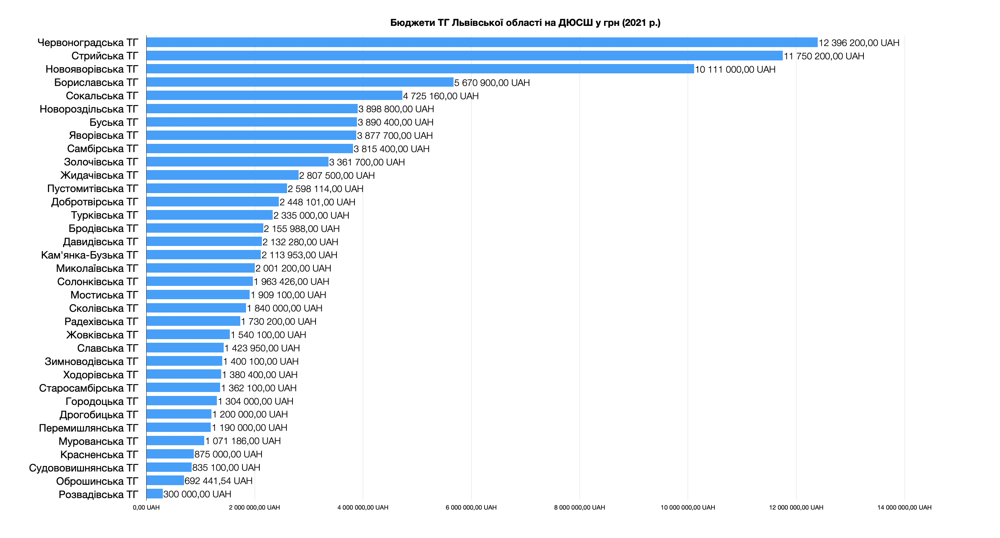

Фундаментом української системи спорту є дитячо-юнацькі спортивні школи (далі - ДЮСШ). Майже всі українські чемпіони робили свої перші кроки у ДЮСШ. Питання збереження ДЮСШ на фоні браку коштів [домінує](https://poglyad.tv/pytannyam-shhodo-likvidatsiyi-dyussh-zajmatymetsya-genprokuratura-zhan-belenyuk-article) [в дискусіях](https://kontrakty.ua/article/174958) про майбутнє українського спорту.

Проте в цих дискусіях мало хто ставить ключове питання – як система ДЮСШ впливає на український спорт насправді? Чому, попри ріст української економіки та видатків на спорт, ДЮСШ продовжують закриватись?

<figcaption>
<small>
(джерело - <a href="https://www.slovoidilo.ua/2021/02/11/infografika/finansy/skilky-koshtiv-vytratyla-ukrayina-fizkulturu-ta-sport-ostanni-14-rokiv"
target="_blank">Слово та діло</a>, <a href="https://mms.gov.ua/fizichna-kultura/statistichna-zvitnist/zviti" target="_blank">
статистичні звіти Міністерства молоді та спорту</a>)
</small>
</figcaption>

Щоб відповісти на це питання, потрібно зробити крок назад та розібратись в тому, що таке система ДЮСШ і як працює спортивна економіка.

Зміст:

1. [Огляд системи ДЮСШ](#1-огляд-системи-дюсш)
2. [Економіка спорту](#2-економіка-спорту)
3. [Вплив ДЮСШ на економіку спорту](#3-вплив-дюсш-на-економіку-спорту)
4. [Як борються з цими проблемами в Україні](#4-як-борються-з-цими-проблемами-в-україні)
5. [Висновки](#5-висновки)

 
 
 

# 1. Огляд системи ДЮСШ

Система ДЮСШ є унікальною в світі. Вона існує лише на росії та пострадянських країнах (включаючи Україну) та ряді симпатизуючим комуністичним режими країн (як-то Китай).

## Історія системи ДЮСШ

ДЮСШ як модель розвитку в спорті народилася у 1930-х роках в Радянському союзі. До утворення СРСР в Україні починався розвиток спортивних громадських клубів, проте радянською владою вони сприймались як потенційні гнізда контрреволюції. Всі спортивні організації мали підпорядковуватись Вищій раді фізичної культури (з 1936 року - Всесоюзний комітет у справах спорту та фізичної культури) через ієрархію комітетів та мережу відомчих спортивних товариств. Їх утворювали при міністерствах та відомствах державного апарату компартії. Товариства мали назву "добровільних" (окрім "Динамо" та "ЦСКА" – що належали НКВД та Міноборони відповідно і називались "відомчими"). Їх залишки досі існують в Україні і називаються ФСТ (Фізкультурно-Спортивні Товариства).

Першу Дитячу Спортивну Школу (ДСШ) в Україні було відкрито в Миколаєві у 1935 році при загальноосвітній школі. За 1935-36-і роки ДСШ були відкриті у 20 містах України.

На той час радянська влада вбачала у спорті інструмент побудови "нової людини" комунізму, підготовку фізично здібного населення для виробничих та військових цілей. ДСШ були орієнтовані на виконання цього запиту. На той час СРСР не приймав участь в "буржуазних" Олімпійських іграх, проводячи власні "спартакіади" (ще один радянський рудимент) і не був членом міжнародних спортивних федерацій до 1946-го року. Проте після завершення Другої світової війни, спорт став важливим політичним інструментом для пропаганди комунізму.

Мережа ДЮСШ стала фундаментом цієї системи. Повністю контролюючись та фінансуючись державою, вона працювала на виконання планів по результатам. Держава визначала плани, директори ДЮСШ мали звітувати про їх виконання і раз на рік звинувачувати одне одного в недбальстві та ненаданні достатніх ресурсів для виконання планів.

<figcaption>
<small>1956 рік - типова стаття про ДЮСШ з газети "Радянський спорт" (випуск №.2 від 6 січня 1956 року)
</small>
</figcaption>

Впродовж буквально одного десятиліття СРСР швидко став вагомим гравцем у спорті вищих досягнень. Централізований контроль над спортивною системою відкрив можливості відбору спортивних талантів, майже недосяжні для демократичних країн.

## ДЮСШ як система відсіву талантів

Кожна країна має свої підходи до пошуку спортивних талантів, проте загалом вони діляться на дві моделі - демократичну та соціалістичну. Як ви знаєте із статті ["Автономія спорту"](https://eusport.org.ua/2023/04/autonomy/), в демократичних державах спорт має свободу прийняття рішень та організації незалежно від держави. Тож практики пошуку талантів беруть до уваги інтереси всіх членів спортивної спільноти (звідці назва "демократична"). В СРСР це було не потрібно – централізована система ДЮСШ виконувала плани держави, а не служила задоволенню інтересів громадян.

У книзі ["Управління системами елітного спорту"](https://www.routledge.com/Managing-Elite-Sport-Systems-Research-and-Practice/Andersen-Ronglan-Houlihan/p/book/9781138633575)наводиться наступна аналогія:

> Якщо провести аналогію між системою елітного спорту та пошуком скарбу, то замість того, щоб використовувати металодетектор - інструмент пошуку, що базується на наукових принципах - комуністична система просто переорювала все поле. Обидві системи є ефективними в пошуку, але лише одна з них економічно спроможна та не марнотратна."

Система ДЮСШ стала для СРСР тим самим інструментом "переорювання поля". Побудована під планову економіку, вона працювала за чіткою вертикаллю влади та субординації і повністю фінансувалась державою. Для цього була створена система стимулів та заохочень на основі результатів, медалей та здобуття державних спортивних звань.

Спорт в СРСР мав велике політичне значення, тож в цю систему залучались величезні ресурси. Оскільки в плановій економіці не існувало поняття "рентабельності", система ДЮСШ не була оптимізована під економічну ефективність. Навіть якщо половина державних коштів розкрадались, іншої половини було достатньо, щоб приносити результати державі.

Ось як цю модель описують у вищезгаданій книзі:

> якщо взяти цю модель як систему, то її головні характеристики це марнотратство (державних коштів), брутальність (по відношенню до інтересів молодих спортсменів), корупція (в тому числі через допінг) і оцінка потенціалу спортсменів (яка переважно базується на суб'єктивних оцінках тренерів).

Через ці риси систему інколи називають "пірамідою відсіву", а не "пошуку талантів".

## ДЮСШ в Україні 2023-го року

Станом на 2023-й рік ДЮСШ це комунальні заклади, що створюються органами місцевої влади. Ці заклади працюють відповідно до [положення про Дитячо-юнацькі спортивні школи](https://zakon.rada.gov.ua/laws/show/993-2008-%D0%BF#Text), [Закону про позашкільну освіту]([https://zakon.rada.gov.ua/laws/show/1841-14#Text]) та наказів Міністерства молоді та спорту України. Держава визначає [норми наповнюваності шкіл](https://ips.ligazakon.net/document/RE16813?an=367&ed=0000_00_00) та плани по успішності, які ДЮСШ мають виконувати.

Як і всі комунальні підприємства, ДЮСШ мають юридичну особу та рахунки в казначействі (державний орган для обслуговування державних коштів). Фінансуються ДЮСШ з місцевих бюджетів. ДЮСШ можуть бути [присвоєні категорії](https://zakon.rada.gov.ua/laws/show/z2201-13#n68) "вища", "перша" та "друга", базуючись на показниках таких як кількість "майстрів спорту" підготовлених школою, "заслужених" тренерів тощо. Майже 90% витрат ДЮСШ – це зарплати керівників та тренерів.

Частина ДЮСШ належать до системи освіти, частина до спорту, а частина до мережі ФСТ. Практика перекидування комунальних закладів від одного відомства до іншого тягнеться ще з радянських часів.

В статутах ДЮСШ метою зазначається "...гармонійний розвиток, повноцінне оздоровлення, змістовний відпочинок і дозвілля дітей та молоді, самореалізації, набуття навичок здорового способу життя та підготовки спортивного резерву для зібрних команд України...". При цьому діти, що не здають нормативи, не витримують абьюзивних тренерських підходів чи чиї батьки мають конфлікт з директором, просто виключаються зі школи. Директори ДЮСШ призначаються органами місцевої влади.

## Кількість ДЮСШ та спортсменів

Станом на 2021 в Україні офіційно діяло 1238 заклади ДЮСШ. Найбільше ДЮСШ зареєстровано у м. Київ, Дніпропетровській, Харківській та Львівській областях.

<figcaption><small>
(джерело - <a href="https://mms.gov.ua/sport/dityacho-yunackij-ta-rezervnij-sport/dityacho-yunacki-sportivni-shkoli/perelik-ta-rejting-dyussh" target="_blank">Перелік та рейтинг ДЮСШ за 2021 рік</a>
</small></figcaption>

Станом на 2021-й рік, кількість людей, що займається у ДЮСШ, ШВСМ (Школи вищої спортивної майстерності) та ЦОП (Центри Олімпійської Підготовки) – 438 555. При офіційному [населенні України](https://uk.wikipedia.org/wiki/%D0%A7%D0%B8%D1%81%D0%B5%D0%BB%D1%8C%D0%BD%D1%96%D1%81%D1%82%D1%8C%5C_%D0%BD%D0%B0%D1%81%D0%B5%D0%BB%D0%B5%D0%BD%D0%BD%D1%8F%5C_%D0%A3%D0%BA%D1%80%D0%B0%D1%97%D0%BD%D0%B8) в 41 млн людей (дані на 2021 рік), це 1.07% або **одна ДЮСШ на 33 тисячі українців**. Ось деталізація залученості у спорт по областях України через систему ДЮСШ:

<figcaption><small>(джерело - власні розрахунки на основі даних з <a href="https://mms.gov.ua/fizichna-kultura/statistichna-zvitnist/shchorichnij-informacijnij-dovidnik-ukrayina-sportivna" target="_blank"> Щорічного інформаційного довідника «Україна спортивна»</a>
</small></figcaption>

## Бюджети ДЮСШ

До проведення децентралізації влади у 2015-му році ДЮСШ фінансувались з Фонду соціального страхування. Після 2015-му фінансування ДЮСШ легло на місцеві бюджети. Місцеві бюджети значною мірою складаються з податків громадян.

Для розуміння загальної картини, поглянемо на бюджети територіальних громад (далі - ТГ) Львівської області по [кодам видатків](https://zakon.rada.gov.ua/rada/show/v0793201-17#Text) 5031 та 5031 ("Утримання ДЮСШ" та "Фінансова підтримка ДЮСШ") за 2021 рік.

Львівська ТГ мала найбільший бюджет через на порядок більшу кількість населення громади. Він становив 93 млн. грн. (2.9 млн євро по курсу 2021 року) на 26 закладів ДЮСШ (в середньому 3.5 млн. грн на одну ДЮСШ).

З решти 72 громад Львівської області, 37 не мають ДЮСШ, дві громади мають 3 (Стрийська та Пустомитівська ТГ), п'ять громад мають по дві ДЮСШ (Червоноградська, Сокальська, Бориславська, Яворівська та Самбірська ТГ), і решта – по одній ДЮСШ на громаду. Сумарно це 104 млн. грн на рік. Бюджети ТГ Львівської області на ДЮСШ показані на графіку нижче:

Тож лише **на підтримку ДЮСШ Львівська область витрачає майже 200 млн. грн**. Насправді, реальні цифри вищі, оскільки тут не враховані видатки з бюджету по таким [кодам](https://zakon.rada.gov.ua/rada/show/v0793201-17#Text) як "Забезпечення підготовки спортсменів школами вищої спортивної майстерності" (5033), "Проведення навчально-тренувальних зборів і змагань з олімпійських/неолімпійських видів спорту" (5011/5012) чи "Утримання та фінансова підтримка спортивних споруд" (5041). Здебільшого ці кошти також використовуються для діяльності ДЮСШ.

Проте ці цифри мають мало користі без розуміння того, як працює економіка спорту та ринкова економіка взагалі.

# 2. Економіка спорту

Для початку згадаємо, що таке ринкова економіка, особливості економіки України і до чого тут спорт.

## Україна та ринкова економіка

Економіка це система того, як люди виробляють та споживають послуги та продукти. Бартерна економіка – кожен обмінюється з кожним. Планова економіка – держава вирішує скільки чого виробляти та скільки що коштує. Ринкова економіка – люди, що виробляють та споживають кінцевий продукт, вирішують обсяги та ціни за допомогою ринкових механізмів.

Економіка України зазнала тектонічної трансформації з планової у ринкову після розпаду СРСР. Перехід відбувався повільно, проте, станом на 2020-й рік, малий та середній бізнес приносив до 55% ВВП країни, а українці забули про радянські гастрономи і звикли до супермаркетів. Інколи цей перехід від планової економіки ще називають "роздержавленням".

Ринкова економіка має таку назву, тому що головним механізмом в ній є ринок – система, в якій вільно можуть відбуватись економічні обміни. Ринок завжди існує там де є обмежений ресурс (товар чи послуга), і двоє чи більше людей, які цей ресурс продають чи купляють. Наприклад, повітря – це необмежений ресурс, тому немає "ринку повітря". Проте тренерський час чи басейн – це обмежений ресурс, тому є "ринок спорту". 

Чим більше людей приймають участь в ринках галузі – тим більша економіка. Збільшуємо економіку – розвиваємо галузь. Зменшуємо економіку – знищуємо галузь.

## Оцінка економіки спорту

Немає єдиного способу оцінити економіку. Для загальної економіки економісти використовують метрики на кшталт ВВП – сума споживання, інвестицій, державних видатків мінус чистий експорт. Для спорту [Sports Industry Research Center (SIRC)](https://sthm.temple.edu/sport-industry-research-center/) використовує модель, де спортивна економіка розділена на 7 секторів по яким оцінюються а) **витрати споживачів**, б) **додана вартість** та с) **працевлаштування**:

- **споживачі** - громадяни країни, що споживають спортивні продукти та послуги
- **бізнес (спорт)** - виробники спортивного знаряддя чи одягу, комерційні спортивні футбольні клуби, фітнес-центри, платні спортивні трансляції тощо.
- **бізнес (не спорт)** - інші сфери, які не надають спортивні послуги чи товари, але залучені у їх виробництво. Готелі, що приймають спортсменів на змагання, витрати на подорожі, спортивна медицина, харчування, страхування, спонсорство тощо.
- **волонтерство** - включаючи громадські спортивні клуби, які засновуються та розвиваються його членами
- **муніципальний уряд** - спортивний бюджет міст та областей та його розподілення між іншими секторами
- **центральний уряд** - державний бюджет на спорт, податки та інші витрати та доходи пов'язані зі спортом.
- **зовнішній сектор** - витрати та доходи, які відбувається за межами країни

Дослідження опубліковані Європейською комісією [доходять висновку](https://www.euoffice.eurolympic.org/new-study-economic-impact-sport-released-european-commission/), що частка спорту у ВВП ЄС складає 2.12%. Або, "кожне 47-е євро та кожен 37-й працівник напряму пов'язані зі спортом". 

## Структура ринку спорту

Європейські дослідження також дають змогу поглянути на структуру ринку спорту в країнах без ДЮСШ. У 2008-му році ринок спорту сягав 153.8 мільярди євро (без урахування економічної цінності волонтерства). Розподіл доходів бюджету спорту ЄС мав наступний вигляд:

**Спортивний бюджет ЄС (2008 рік)**

| Сектор                | Доходи        |
|-----------------------|---------------|
| Громадяни             | 101.0 млрд. € |
| Волонтерство          | 28.3 млрд. €  |
| Місцеві бюджети       | 26.0 млрд. €  |
| Державний бюджет      | 10.7 млрд. €  |
| Спонсори та донори    | 10.5 млрд. €  |
| Медіа-права           | 5 млрд. €     |
| Лотореї (не державні) | 0.2 млрд. €   |

<figcaption>
<small>
(джерело - <a href="https://op.europa.eu/en/publication-detail/-/publication/50e6357c-6e20-43fc-8cf7-b7ca073b197c" target="_blank">Study on the funding of grassroots sports in the EU</a>)
</small>
</figcaption>

Найбільшим джерелом фінансування спорту є самі громадяни, що займаються спортом. Європейська клубна система обертається навколо громадян – їх участі та інтересів в спорті. Держава є лише одним з багатьох стейкголдерів в спорті. Громадяни фінансують державу за допомогою податків, і очікують ефективних економічних політик, які покращать їх участь у спорті. 

"Ринок спорту" це сукупність різних ринків між різними стейкголдерами. Спрощена візуалізація фінансових потоків між ними має наступний вигляд:

Проте центральним серед них є ринок "участі громадян у спорті", тож далі під "ринком спорту" матимемо на увазі саме його. Простими словами це означає, що **чим більше людей залучено до спорту, тим більше економіка спорту**.

Цей принцип ще відомий як "масовість".

## Масовість як основа економіки спорту

Розглянемо декілька простих причинно-наслідкових зв'язків, які, начебто, не викликають заперечень в Україні.

- чим більше людей в клубі, тим дешевше вартість заняття для кожного з членів
- чим більше людей займаються певним видом спорту, тим більше стимул виробляти та продавати спортивні товари для цього спорту
- чим більше людей хоча б раз спробували та полюбили певний спорт, тим більше їм буде цікаво слідкувати за ним
- чим більше людей займаються спортом, тим більше людей поза спортом (друзів, родичів), які будуть знайомитись і потенційно зацікавлені підтримати
- чим більше людей зацікавлені в спорті, тим вищий шанс, що їм цікаво буде купити квитки чи трансляцію змагань з нього
- чим більше людей готові дивитись змагання, тим більше стимул для компаній капіталізувати на цьому і стати спонсорами змагань чи клубів
- чим більше спонсорських коштів, тим більше можливостей у клубів та організаторів підвищити якість, залучивши ще більше людей
- чим більше людей, тим більше бюджети і клубів, і змагань від членських внесків
- чим більше клубів, тим більше конкуренція та якість послуг
- чим більше клубів, тим більше попит на тренерів
- чим більше тренерів, тим більша конкуренція за якість, і, відповідно, якість навчання в клубах
- чим більше клубів, тим більше попит на спортивну інфраструктуру
- чим більше коштів з різних джерел, тим більша диверсифікація бюджету і тим менше ризики
- чим більше сильних клубів, інфраструктури та людей залучених до спорту, тим вищі шанси на досягнення і високих результатів

Цей список можна продовжувати довго, але головна теза залишається простою – **фундамент економіки спорту це кількість залучених у неї людей**. У будь-якій ролі – як спортсмени, тренери, менеджери, журналісти чи глядачі. Державна політика що прагне розвивати економіку спорту має шукати ефективні шляхи збільшення залученості громадян у спорт.

## Економіка спорту та держава

Зі статті ["Економіка спорту 101"](https://eusport.org.ua/2023/03/economics101/) ви можете знати, що в умовах вільного ринку ці громадяни з часом знайдуть рівновагу в ціні та послугах. Проте суто ринкова рівновага призведе до того, що люди, для яких ця ціна є зависокою не зможуть дозволити собі заняття спортом. Через позитивні екстерналії спорту та соціальну користь, уряди демократичних країн прагнуть вплинути на ринок, наблизивши ринкову рівновагу до соціальної рівноваги.

Головним інструментом розвитку спорту є стимулювання економіки. Здебільшого це відбувається через субсидії надавачам послуг. Оскільки субсидії комерційним спортивним організаціям є не дуже ефективними, більш економічно вигідним механізмом є субсидії громадським організаціям (детальніше про це в статті ["Чому спортклуби ЄС - громадські організації"](https://eusport.org.ua/2022/07/nonprofits/)). Також держава прагне виправляти фіаско та перекоси ринку спорту – наприклад, допомагати більше малопредставленим видам спорту чи малоспроможнім та малоактивним групам населення.

Тож розвиток спорту в країні з ринковою економікою має починатись с формування політики, яка збільшить кількість людей, що залучені до спорту, з повагою основних принципів розвитку спорту - автономії та самоврядування. Політика яка зменшує кількість людей, або стримує його, має вважатись за таку, що знищує спорт.

Що повертає нас до питання впливу ДЮСШ на економіку українського спорту.

# 3. Вплив ДЮСШ на економіку спорту

Отже фактична спроможність системи ДЮСШ – це надання спортивних послуг 1.07% населення (або 10% дітей та молоді). Це не було проблемою для задач, які ставились перед нею радянською владою – відсіювати тих, хто не принесе державі медалі. Кількість людей і кількість грошей, залучених у спорт, в плановій економіці не пов'язані. Проте це є катастрофічно мало для країни, яка прагне розвитку економіки спорту. Чому в Норвегії 9 з 10 дітей займаються спортом, а в Україні – 1 з 10? В чому причина такої неефективності?

Їх, декілька, але почнемо з очевидного: **ДЮСШ це комунальні підприємства**.

## Комунальні підприємства – біч української економіки

Що таке комунальні підприємства? Це організації, які створюються органами влади для задоволення суспільних благ. **Суспільні блага** (public goods) – це такі послуги, які неможливо надати лише одній людині, без того щоб не надати їх всім іншим (і споживання яких однією людиною не зменшує їх для інших) – як-то вуличне освітлення.

Якщо ці послуги є важливими для суспільства, то спочатку шукають шляхи задовольнити попит через приватний сектор (бізнес). Якщо це занадто дорого та нерентабельно, то утворюють комунальні підприємства. Наприклад, у Швеції сніг на вулицях чистять не "комунальщики", а приватні компанії, які ще й конкурують одна з одною. Завдяки цьому місцеві бюджети витрачають значно менше коштів, ніж якби їм довелося утримувати своє комунальне підприємство і отримують вищу якість.

Проте в Україні комунальні підприємства – це одночасно і рудименти радянської системи, і ледь не єдиний зрозумілий управлінцям інструмент вирішення проблем.

## Проблеми комунальних закладів

Центр економічної стратегії (CES) [називає](https://ces.org.ua/utility-companies-4/) головними проблемами комунальних закладів непрозорість, збитковість, **економічна неефективність**.

Станом на 2020-й рік в Україні існувало 14 018 комунальних підприємств (майже 8% з них – це ДЮСШ) і їх кількість зростала протягом останніх трьох років. Антимонопольний комітет України [зазначає](https://amcu.gov.ua/news/komunalni-pidpriyemstva-hronichna-problema-krayini-yak-ce-zminiti#:~:text=%D0%92%20%D0%A3%D0%BA%D1%80%D0%B0%D1%97%D0%BD%D1%96%20%D1%96%D1%81%D0%BD%D1%83%D1%94%2014%20018,%D0%B7%D1%80%D0%BE%D1%81%D1%82%D0%B0%D1%94%20%D0%BF%D1%80%D0%BE%D1%82%D1%8F%D0%B3%D0%BE%D0%BC%20%D0%BE%D1%81%D1%82%D0%B0%D0%BD%D0%BD%D1%96%D1%85%20%D1%82%D1%80%D1%8C%D0%BE%D1%85%20%D1%80%D0%BE%D0%BA%D1%96%D0%B2.), що у 2018-му році сукупний збиток 6947 комунальних закладів сягав 9.8 млрд. гривень. Однією з причин збитковості називають державне регулювання цін на їхні послуги. Іншою причиною є неефективне управління та корупція працівників комунальних закладів.

Проте найбільшою проблемою для галузі спорту є те, що сам факт існування комунальних підприємств та фінансування їх з бюджетів, **спотворює ринки та знищує конкуренцію**.

## ДЮСШ та ринок спорту

Існує поняття ["ідеального ринку"](https://uk.wikipedia.org/wiki/Досконала_конкуренція) – ринку з досконалою конкуренцію, який гарантує якнайвищу якість та ефективність. На такому ринку є велика кількість учасників з обох боків, вільний вхід та вихід на ринок, свобода ціноутворення та симетрія інформації. Всі ринки є неідеальними, тож ця теоретична модель служить орієнтиром для аналізу ринків. Порівняємо це з ринком який формує система ДЮСШ:

1.  ❌ **Велика кількість учасників ринку** – ні. ДЮСШ є одночасно і монополією (єдина хто "продає" послугу) і монопсонією (єдиний, хто "купляє" послугу тренерства на ринку праці).
2. ❌ **Вільний вхід та вихід** - ні. Утворити нову ДЮСШ надзвичайно складно, потребує тісних зв'язків з депутатами місцевої ради, року чи більше очікування, змін бюджету громади/міста та політичної волі інших гравців.
3. ❌ **Свобода ціноутворення** – ні. Зарплати, ціни та витрати регулюються державними актами та наказами.
4. ❌ **Повна симетрія інформації** – ні. Тут можна виділити дві окремі проблеми.
   1. Перша – спорт в принципі належить до розряду діяльності, де є асиметрія інформації (спортсмен чи батьки не мають змогу оцінити реальний рівень якості навчання – його буде видно лише через роки).
   2. Друга – ДЮСШ часто змушують батьків платити тренерам напряму, хоча офіційно послуги надаються "безкоштовно" (сплачені з податків).

**Складно уявити ще більше пригнічення ринкових механізмів**. Але саме в цих умовах перебуває український спорт.

Уважний читач може зауважити – але ж законодавство України не забороняє відкривати клуби. Хто завгодно може відкрити комерційний чи громадський спортивний клуб, якщо не подобається ДЮСШ. Так, і саме тому, що фактично весь бюджет на спорт віддається в комунальні ДЮСШ, це не дає можливості клубам конкурувати на рівних умовах або навіть зайти на ринок. Ви можете створити клуб, але питання буде вижити в умовах спотвореного ринку.

## Як ДЮСШ знищують клуби

Більшість спортивних клубів в світі – це неприбуткові громадські організації. В Україні це поки що здебільшого комерційні заклади (ФОП та ТОВ), інколи замасковані під громадські організації (ГО). Ось з якими проблемами через ДЮСШ клуби зустрічаються в Україні:

1.  **Незручні умови** – муніципальна спортивна інфраструктура (оплачена громадянами з податків) надається в користування виключно комунальним ДЮСШ ("безкоштовно" або "за 1 грн"). Клуби (які засновують ці самі громадяни) не мають до неї доступу. Вони змушені шукати приватні спортоб'єкти, інколи в незручних локаціях або в значно гіршому становищі. Навіть якщо вдається офіційно домовитись про оренду (таким чином сплачуючи двічі) – це майже завжди незручний час. Небагато людей готові їхати на край міста чи вставати о 4-й ранку. Лише через це багато клубів не можуть вирости та стати на ноги.
2.  **Ціна послуг** – не маючи підтримки з бюджету, клуби змушені піднімати вартість занять для своїх членів, щоб хоча б виходити "на нуль". Для багатьох членів клубу це лише питання часу, коли "безкоштовні" ДЮСШ стануть більш привабливим варіантом. Особливо, коли дитині починає подобатись цей спорт і хочется більше часу. Складно конкурувати з "безкоштовністю". Віддтік членів клубу не дає клубам зростати.
3.  **Ідеологія** - навіть в кабінетах Міністерства молоді та спорту та департаментів спорту можна почути зневажливе ставлення до клубів, та дихотомію "ДЮСШ – це про спорт", а "клуби – це аматори". Аматорський спорт має велику повагу в світі, але це теж спорт. Нажаль цю ментальність успадковують і самі тренери, які часто навіть не реєструють клуби, а займаються тренерством як фрілансери-одиначки, не без причин вважаючи що іншого варіанту аніж працювати в системі ДЮСШ в них немає.

Руйнування ринку простіше зрозуміти, коли ринок вже існує. Уявіть, що станеться з супермаркетами, якщо завтра місцева влада відкриє в центрі міста "комунальний супермаркет", що існуватиме на бюджетні кошти і роздаватиме "безкоштовні" або значно дешевші продукти.

У випадку ж спортивних клубів, цей ринок навіть не має змоги народитись. Саме через це розвинуті спортивні клуби системно не з'являються в Україні. Одиночні героїчні спроби українців розвивати свої клуби в умовах пригнічення ринкових механізмів не призводить до росту та успіхів.

Гальмуючи ринок спортивних клубів та конкуренцію, система ДЮСШ призводить до зменшення кількості та якості можливостей для українців займатись спортом, а з цим і зменшує кількість українців залучених в економіку спорту.

## ДЮСШ та конкуренція

Ринкова економіка є ефективною завдяки такому явищу як конкуренція. Конкуренція за якість та ефективність задоволення потреб громадян участі в спорті. В клубний системи країн Європи, будь хто може відкрити свій клуб, і бути в рівному становищі на ринку. Все вирішує кількість людей, що обирають саме цей клуб, а не інший. Неефективні клуби зникають та розпадаються, ефективні – залишаються та ростуть. Це не швидкий процес, але саме так працює еволюційний відбір на ринку. Найбільше від цього виграють кінцеві споживачі – громадяни країни.

Система ДЮСШ не має цього інструменту. Бюрократична та процедурна складність відкриття нової ДЮСШ унеможливлює конкуренцію за якість. Орієнтація ДЮСШ на накази Міністерства молоді та спорту, а не на інтереси громадян, робить саму систему неспроможною для розвитку та покращення методом конкуренції. Знищуючи клуби, система ДЮСШ ще більше пригнічує економічний ефект від ринкових механізмів.

## ДЮСШ та інновації

Один з цих механізмів це інновації. В умовах вільного ринку, кожен клуб може втілювати свої підходи, які вважає кращими. Сфера спорту невпинно розвивається, з'являються нові підходи, знання, практики, гаджети та технології. Конкуренція за якість стимулює використання інновацій, як інструменту зменшення витрат та покращення якості тренувань та досвіду.

В ДЮСШ інновації можуть мати місце, проте частіше караються, оскільки загрожують сталим порядками та ієрархії субординації. Молоді тренери, які намагаються тренувати інакше (і часто – успішно) становлять загрозу "старшим" тренерам. Оскільки в ієрархічній системі ДЮСШ вищі посади дають владу над "молодшими" та більшу державну зарплату, таких ініціативних людей легко позбуваються. Сам дизайн моделі фінансування в ДЮСШ стримує іновації.

Як наслідок – велика кількість сучасних підходів та інновацій в спорті в Україні залишаються невідомі, а механізми інновації та конкуренції не з'являються.

## ДЮСШ та любов до спорту

Повернемось до цифри в 1.07%. Для розвитку економіки спорту потрібно залучати у спорт якнайбільше людей. Щороку ДЮСШ звітують про набір нових дітей. Але що стається зі "старими"?

Модель ДЮСШ побудована для відсіву по результатам, тому "неталановиті" діти відсіюються – або формально, через нездачу нормативів, або за примхою директора/ки, або просто не витримують жорстких та агресивних тренерських підходів. Пам'ятаєте вчителів в школі, що б'ють дітей лінійками та принижують? В українському спорті це явище нормалізовано вдесятеро сильніше. Ця тема табуйована – ніхто не хоче закривати своїй дитині єдину можливість займатись улюбленим спортом. Монопольне становище ДЮСШ тут працює беззаперечно.

Сама структура ДЮСШ побудована так, що у спортсменів та батьків фактично немає ані прав, а ні голосу у прийнятті рішень. "Батьківські комітети" чи "наглядові ради" які інколи дійсно існують у ДЮСШ, виконують здебільшого декоративну функцію. Це формує культуру вседозволеності тренерів та абьюзивного тренерства. Разом з правилами відсіву це призводить до високих рівнів покидання спорту (dropout rates).

Офіційної статистики по рівням покидання спорту в Україні немає. Це питання не вивчається, оскільки в радянській системі це очікувалось. Система оптимізована під інші метрики. Чи ДЮСШ покинуло 10 дітей в рік, чи 100 – це ніяк не відображається на фінансовому становищі працівників ДЮСШ.

Через це велика кількість українців чесно [зізнаються](https://weekend.today/lica/yak-kyyanky-zajnyalysya-sportom-pid-chas-vijny.htm?) "Я ненавидів/ла спорт з дитинства...". Система, що генерує мільйони людей, які ненавидять спорт, не просто не залучає людей до спорту, а виштовхує їх. Ці люди не стануть витрачати гроші на квитки, спортивні товари, членські внески, і не віддадуть своїх дітей в цей спорт. Кращого способу знищувати економіку спорту складно знайти.

## ДЮСШ та якість навчання

Для роботи в ДЮСШ потрібно мати державний диплом тренера. Це має відсіювати "непрофесіоналів" і покращувати якість навчання спорту в країні.

Проте структура фінансування ДЮСШ побудована навколо "державних звань" [Єдиної спортивної класифікації](https://mms.gov.ua/sport/yedina-sportivna-klasifikaciya) – ще одного радянського рудименту, якого немає в демократичних країнах. Чим більше ДЮСШ підготувала "майстрів спорту" – тим ближче до отримання статусу "вищої" і, відповідно, більшого фінансування. Звання даються за перемоги на змаганнях. Що може піти не так? **Це створює стимул тренерам не ділитися знаннями**. Поділиться знаннями – твої учні не виграють змагання. Інший тренер отримає надбавку, а ти – ні. Тож кожен тримає знання при собі.

Якщо ви володієте англійською і цікавитесь тренерством, то. напевне бачили тисячі відео на Youtube чи Instagram від тренерів в країнах з клубною системою? Вони буквально розжовують секрети та методики, за якими тренують. Клуби регулярно організовують семінари, де приїжджають в клуби сусідніх міст, щоб поділитись знаннями. Ініціативу тут йде від тренерів та клубів знизу. Чому так?

В Європейській клубній моделі інша система стимулів. Рішення про те, хто буде тренером приймають демократично його члени, а не одноосібно директор, призначений депутатами. Але як члени клубу чи люди, що обирають клуб, можуть дізнатись про якість навчання? Ніяк, якщо тренер не витратить час, щоб її продемонструвати. Тому тренери в клубній системі витрачають чимало зусиль, щоб комунікувати свою професійність. Якість тренування, комунікації та людські якості мають значення. Від медалей учнів їх дохід теж не залежить, тому стимулу приховувати знання немає.

Без постійного трансферу знань, їх рівень не зростає. Страждають від цього саме українці, які змушені отримувати неякісні та застарілі підходи до тренерства, які призводять до травм, покиданню спорту та, банально, до не можливості досягнути свого потенціалу в спорті.

Виміряти економічний вплив зменшення якості навчання неймовірно складно. Можна навести лише проксі-метрики – наприклад кількість медалей українських спортсменів, що залишились в Україні і тих, що перейшли в країни з клубною системою за останні 30 років. Така статистика є по фігурному катанню [на сайті Skate Ukraine](https://skateukraine.org/competitors/transfers). З 1991-го року 90 фігуристів перейшли змагатись під іншими прапорами. Лише з 2006-го вони завоювали 41 медаль, з яких 5 – олімпійських та 17 - золотих медалей чемпіонатів світу та Європи. Українців, що залишились в українських ДЮСШ та СДЮСШОР здобули 1 бронзову медаль юніорського чемпіонату світу.

<figcaption><small>
Олімпійське золото Альони Савченко на Зимових Олімпійських Іграх 2018 року під прапором Німеччини. Альона змушена була полишити Україну у 2002-му, після того як тренери ДЮСШ майже знищили її кар'єру та називали "непридатною до спорту".
</small></figcaption>

## ДЮСШ та задоволення попиту

Проблема використання бюджетних коштів на розвиток спорту – не є простою. Як ви можете знати, хто, де, і наскільки хоче займатись яким спортом? Як приймати рішення, як розділити кошти? Можливо одні діти б полюбили фігурне катання на роликах, другі – футбол, а треті б взагалі спорт про який ви не чули. Можливо у вас в громаді є геніальний бадмінтоніст, або талановитий тренер зі скелелазіння. Як приймати рішення?

В ринковій економіці ці рішення "приймають" ринкові механізми. В плановій – державний урядовець на власний розсуд. Це одна з головних проблем планової економіки – планувальник нагорі не може знати що насправді потрібно кінцевим споживачам. Тож рішення є часто неефективними та не відображають справжніх потреб та бажань громадян. Економіка спорту втрачає через системне незадоволення цього попиту.

## ДЮСШ та спортивна інфраструктура

В багатьох видах спорту критичною є наявність спортивної інфраструктури. Ці об'єкти часто потребують значних фінансових ресурсів, тож роль ефективного використання бюджету тут особливо чутлива. В Європейських країнах 2/3 спортивних об'єктів - це споруди комерційної власності. Уряди держав та міст оцінюють соціально-економічну користь від будівництва нових спортоб'єктів та співфінансують будівництво спортивних об'єктів.

Для того, щоб приватний сектор був зацікавлений у будівництві спортивної інфраструктури, це має бути рентабельно хоча б в середньостроковій перспективі. В Європі інвестори розуміють, що користувачами будуть клуби, які будуть конкурувати за якість, та які зможуть дозволити собі довгострокову оренду. Масовість спорту (в Європі від 40 до 80% громадян займаються спортом) робить інвестиції в спортивну інфраструктуру приваблим варіантом. Інвестори часто є фанатами свого виду спорту і прагнуть його розвитку в своєму регіоні.

В Україні ж ринок, спотворений комунальними ДЮСШ, не створює стимулів інвестувати в спортивні об'єкти. Їх збитковість та корумпованість в принципі не здатна привабити інвесторів. За офіційними даними лише 15% українців займаються спортом. Один відсоток який може забезпечити система ДЮСШ робить приватні інвестиції в спортивну інфраструктуру фінансовим самогубством.

## Українці платять двічі

Спортивна інфраструктура що утримується на місцеві бюджети це ковзанки, басейни та спортмайданчики, що сплачені громадянами України за свої податки. Якщо громадяни захочуть об'єднатись щоб грати разом в баскетбол – вони не зможуть на рівних умовах скористатися сплачними майданчиками, оскільки вони надаються в оренду виключно ДЮСШ.

ДЮСШ не мають стимулу використовувати інфраструктуру ефективно. Чи там 100 людей, чи 0 – це ніяк не впливає на діяльність ДЮСШ. Тож пустуючі зали директори ДЮСШ можуть напівлегально здавати в оренду громадянам.

Укранці, що сплатили за цю залу зі свої податків, мусять платити ще раз, щоб мати змогу скористатись залою. Дякуючи системі фінансування ДЮСШ, українці платять двічі.

## ДЮСШ та волонтерство

Волонтерство в спорті це феномен, коли люди, що є членами клубу, роблять безкоштовно для свого клубу певну роботу. Чи то будучи в правлінні клубу, чи допомагають з транспортом та щоденними потребами, чи навіть тренують.

Економічні дослідження, що добре описані в книзі ["Спортивне волонтерство навколо світу"](https://link.springer.com/book/10.1007/978-3-030-02354-6), наводять наступні цифри – вартість волонтерства сягає від 10 до 15 крат від усього бюджету країни на спорт (!). Це ті кошти, які б клуб мав би платити, якби не було цієї культури волонтерства. В норвезькому містечку Берген, яке я висвітлював у дослідженні ["Як фінансується спорт в 10 містах Європи"](https://eusport.org.ua/2022/09/ten-cities/) – видатки на підтримку клубів 2.4 мільйони євро (приблизно 96 млн. грн), а вартість волонтерства – 75 мільйонів євро.

Волонтерство в спорті це не організований державою рух. Важливо не плутати волонтерство в спортивних клубах з будь-яким типом "волонтерства". Коли держава створює чергові комунальні заклади "Спорт для всіх" і кличе людей попрацювати "волонтерами" – це не те саме, коли люди є членами та власниками клубу одночасно. Така розкіш є тільки у громадських клубів, і тільки тих, які активно розвивають саме громадську та суспільну складову і не ставляться до своїх членів виключно як до клієнтів. Волонтерство починається з відчуття причетності до свого клубу. У кого є діти - ви колись хотіли своїй дитині зробити щось класне?

Тож система ДЮСШ нівелює цей надзвичайно потужний економічний важіль. Сотні мільйонів євро непрямої економічної вигоди для спортивної системи України втрачаються завдяки структурі системи ДЮСШ.

## ДЮСШ та корупція

Наостанок, славнозвісна корупція комунальних закладів. Досліджень по корупції саме в ДЮСШ немає, але є безліч скандалів та судових позовів. Антимонопольний комітет України також наголошує на високих корупційних ризиках комунальних закладів.

В міжнародних антикорупційних організаціях використовують наступну формулу для оцінки ризику корупції систем: C = M + D - A. Корупція – це монополія (M - Monopoly) + розсуд (D - Discretion) мінус відповідальність (A - Accountability). Неважливо, чи це корупція в держорганах, чи корпорації, чи в нонпрофіті, чи це в Новій Зеландії чи на росії – якщо у людини чи організації є (M) монопольна влада над послугою чи товаром, яка на власний (D) розсуд може вирішувати хто і скільки отримує, і за ці рішення не несеться (A) відповідальність - там буде корупція.

Як ми вже знаємо, система ДЮСШ через спотворення ринку має монополію (М) на спорт в країні. Замовником послуги є держава, виконавці назначаються згори донизу і мають шалений простір прийняття рішень на власний розсуд (D). Коли спортивний клуб в Україні за готівку орендує у директора ДЮСШ спортивну залу попри те, що вона вже сплачена з місцевих бюджетів - проблема не в "корумпованості" директора, а в системі.

У системи ДЮСШ настільки глибоке коріння, що в неї немає стимулів змінювати саму себе. В таких системах розквітають ті, хто максимізують політичне виживання, а не реформи. Реформаторів, які не готові ламати її до кінця, система знищує та викидає. Збільшення відповідальності (А) – це політичне самогубство, тому речі залишаються без змін десятиліттями.

Як наслідок, українці платять значно більші кошти і отримують значно менше в плані якості та кількості можливостей спортивного досвіду.

## Резюме

- ДЮСШ це комунальні заклади, економічно неефективні, мають високі корупційні ризики та непрозорість
- ДЮСШ спотворюють ринок спорту, не даючи клубам зайти чи розвинутись
- ДЮСШ виштовхують зі спорту та призводять до того, що чимало українців ненавидять спорт
- ДЮСШ стимулюють приховування знань, що веде до поступового зменшення якості тренувань
- ДЮСШ не дають запрацювати економічному потенціалу клубного волонтерства в Україні
- ДЮСШ призводять до того, що українці платять двічі за спортивну інфраструктуру
- ДЮСШ є шаблоном для корупції

# 4. Як борються з цими проблемами в Україні

Проблема утримання економіки спорту є достатньо серйозною, щоб вирішувати її на загальнонаціональному рівні. Що було зроблено за 32 роки незалежності України щоб її вирішити?

## Міністерство молоді та спорту

Жодного дослідження чи публікації, які б підіймали питання невідповідності комуністичної системи реаліям ринкової економіки та демократичного суспільства, проведено не було.

У 2015-му році в "Закон про фізичну культуру та спорт" [було додано](https://eusport.org.ua/2022/08/sports-act/) заборону закривати ДЮСШ. Публічна комунікація більшості українських спортивних чиновників обертається навколо обіцянок "зберігти ДЮСШ" та збільшити фінансування.

Проте неефективність і нескінченні проблеми ДЮСШ складно ігнорувати. Тож Міністерство молоді та спорту вирішує проблему неефективності комунальних ДЮСШ методом... створення мережі нових комунальних закладів "Спорт для всіх". Попри трохи більш сучасні підходи та брендінг і відсутність орієнтації на результати, економічна неефективність комунальних закладів і невідповідність їх запиту демократичного суспільства на спорт залишається повністю проігнорованою.

## Департаменти та управління спорту міст, громад та областей

На місцевому рівні керівники департаментів спорту мають достатньо повноважень, щоб формувати власну модель розвитку спорту. Деякі спортдепартаменти "латають" проблеми – проводять навчання для ДЮСШ по користуванню соціальними мережами, або цифровізують звітність про заняття спортом, щоб побороти феномен "мертвих душ" у ДЮСШ.

Найбільш проактивні управління спорту, які бачать неефективність комунальних ДЮСШ, вирішують боротись з ними... утворюючи нові комунальні заклади. Як правило їх називають "муніципальний клуб". Суттєвих відмінностей з ДЮСШ, окрім назви та трохи меншої зарегульованості, в них немає. Всі вищеописані проблеми впливу комунальних закладів на економіку зберігаються і в "муніципальних клубах".

Як бонус, використання слова "клуб" для комунальних закладів надсилає українцям повністю хибне уявлення про те, як має функціонувати демократична клубна система.

# 5. Висновки

Тож 93 млн. грн на утримання ДЮСШ у Львові – це мало чи багато? Якщо порівняти витрати на клуби схожого за розміром міста Європи – наприклад, [Гельсінки](http://localhost:1313/2022/09/ten-cities/#гельсінки-фінляндія-), – та скоригувати по ВВП на душу населення, то Гельсінки витрачає **майже втричі менше** бюджетних коштів в розрахунку на одну людину. І завдяки клубній системі має **понад 1000 спортивних клубів**. Мешканцям Львова пропонують 22 ДЮСШ. Але справжнє питання не про суми, що виділяються, а про те, наскільки економічно ефективно вони використовуються. 

Радянські системи будувались для іншого типу економіки, іншого суспільства та інших цілей. Вони завжди були марнотратними, проте за відсутності ринкової економіки це не було проблемою. В англійській мові є два окремих слова – effective (досягає цілей) та efficient (досягає цілей без марнотратства). В українській мові обидва перекладаються як "ефективно".

Система ДЮСШ була ефективною в пошуку та відборі талантів, але й неймовірно марнотратною. Будучи фундаментом системи спорту, вона не підходить для ринкової економіки. Залишаючись в основі українського спорту, система ДЮСШ знищує його економіку - а з нею і сам український спорт.

Економіку неможливо обманути, але нею можна обманутися. Не можна побачити очима те, чого не сталося, хоча могло би статися. В ДЮСШ часто працюють чудові люди, закохані у спорт, які щиро бажають успіху спортсменам та розвитку спорту. Але їх можливості та дії обмежені тією системою, в якій вони існують. Спочатку люди формують системи, потім системи формують людей.

## Що робити?

Чимало людей в Україні вже побачили, як спорт працює в світі. Клубна модель, в якій громадяни розвивають клуби та федерації, а держава є лише партнером та ефективним інвестором, вже не є чимось принципово незрозумілим. Проте втілення та розвиток цієї моделі в Україні потребує іншого типу мислення, знань та поглядів на спорт, яких історично не було.

Витрачаючи мільярди гривень на паліативну підтримку вмираючої радянської системи ДЮСШ, ми зберігаємо людей зі старим типом мислення та поглядами на спорт. Підписуючи чергову програму розвитку спорту, управління спорту не роблять Social Cost-Benefit Analysis, як їх іноземні колеги. Просто й далі витрачають сотні мільйонів гривень платників податків на фундаментально непристосовану для розвитку спорту систему ДЮСШ.

Країни Балтії відмовились від ДЮСШ одразу після розпаду СРСР. Здебільшого через нелюбов до окупаційної влади СРСР, але також через брак коштів на підтримку економічно неспроможної системи. Март Лаар, колишній прем'єр-міністр Естонії, який очолював трансформацію країни після розпаду СРСР, мав вираз про те, як робити такі зміни – "Goodbye Lenin and just do it" ("Гудбай Ленін і просто зробіть це").

Україна втратила той шанс. Навіть якщо наступний очільник Міністерства молоді та спорту буде мати достатньо мужності сказати "Гудбай Ленін", реформування спортивної системи буде значно складнішим та болісним процесом, ніж міг би бути 30 років тому. Проте досвід інших сфер показав, що реформи можливі, що українціі готові відмовитись від комуністичних систем, що готові навчатися і будувати нову Україну, яка говорить однією мовою з Європою та цивілізованим світом.

Проблема комунальних ДЮСШ лише одна з серії структурних проблем українського спорту. Проте навіть її вирішити можливо лише розробивши якісну стратегію реформи. Наприклад, більшість спеціалістів називають приватизацію головним рішенням проблеми комунальних закладів. Проте це рішення не враховує специфічність спорту, потребу автономії, клубну модель Європи, роль громадських організацій та держави. Тож спортивна спільнота України має найти дієву стратегію реформи саме для спорту.

Коаліція EUSport це платформа для того щоб разом розробити та втілити стратегію цієї реформи. [Приєднуйтесь](https://eusport.org.ua/join/) до коаліції – навіть якщо ви не знаєте як можете допомогти, кожна людина, кожна організація, що поставить свій підпис про підтримку – вже допомагатиме. Якщо ж у вас є бачення, ідеї чи ресурси, щоб разом змінювати український спорт – [долучайтесь](https://eusport.org.ua/join/) до регулярних зустрічей членів коаліції.

### Додаткові матеріали про проблематику комунальних закладів

- [П’ять міфів про комунальні підприємства](https://ces.org.ua/myths-about-utilities/)
- [Комунальні підприємства – хронічна проблема країни. Як це змінити](https://ces.org.ua/utility-companies-4/)
- [Як фінансування комунальних підприємств спотворює конкуренцію?](https://ces.org.ua/how-does-utility-financing-impairs-competition)
- [Комунальні підприємства – одні з найзакритіших установ в країні](https://ces.org.ua/utility-companies-transparency/)
- [Комунальні підприємства: Як перезавантажити систему?](https://uplan.org.ua/analytics/komunalni-pidpryiemstva-iak-perezavantazhyty-systemu/)
- [Навмисна збитковість, або Що потрібно розуміти про комунальні підприємства](https://www.epravda.com.ua/columns/2020/09/11/664992/)
