Що таке європейська модель спорту, з чого вона складається, які її характеристики, як вона працює, та її порівняння з ситуацією в Україні.

Відео презентації:


## 🇪🇺 Ключові принципи

Європейська модель спорту, на наше щастя, це є річ яка досить детально описана. Ключові принципи європейської моделі спорту, як вони сформульовані у документі ["Study of the European Sport Model"](https://op.europa.eu/en/publication-detail/-/publication/d10b4b5b-e159-11ec-a534-01aa75ed71a1/language-en/format-PDF/source-258671565), виданий Європейською Комісією у квітні 2022 року.

За цим документом ключовими принципами є такі речі як:

- ✅ пірамідальна структура спорту
- ✅ відкритість змагань
- ✅ фінансова солідарність
- ✅ автономія спорту
- ✅ волонтерство

Також деякі дослідження та документи на цю тему додають до ключових компонентів європейської моделі принцип "одна федерація на вид спорту і на країну".

Європейська модель - це ціннісно-орієнтована модель, на противагу від економічно-орієнтованої, яка орієнтована на отримання прибутку.

Кожен з цих зелених боксів це дуже велика тема. Про кожну можна написати окрему книгу. І про них
пишуть окремі книги.

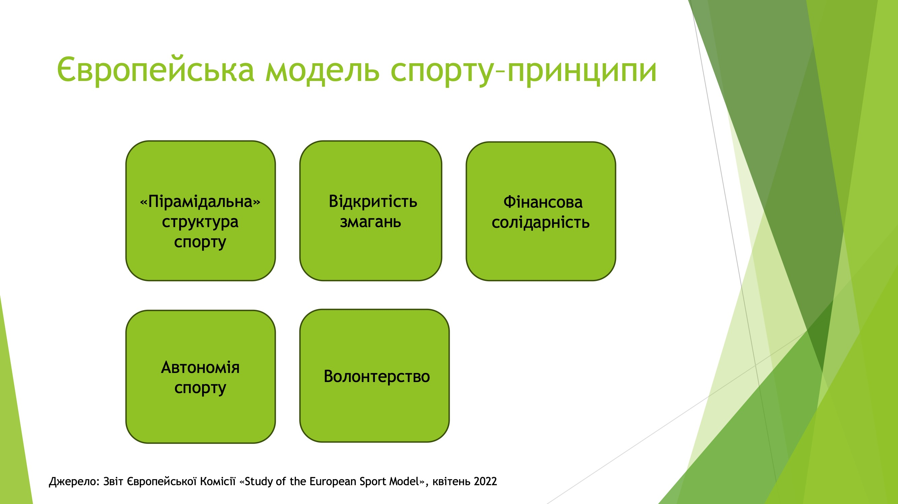

Але ключовим у європейській моделі є саме **пірамідальна структура**. Будь-який вид спорту базується на основі масовості – залученості до виду спорту. До спорту в країні залучено дуже багато людей, на діяльності яких – на залученості – все це працює.

**Відкритість змагань** це є поєднаний принцип, який говорить про те що змагання відкриті – доступні для всіх бажаючих. Будь-хто може прийняти участь і є система promotion/relegation – тобто за результатом спортивних змагань ви можете підніматися на вищий рівень змагань або опускатися на нижчий рівень. Це у порівнянні, до прикладу, з такими системами, як американська – де я є багато закритих змагань.

Дуже важливим принципом є принцип **фінансової солідарності**, який полягає умовно в тому, що хтось, у кого є надлишок коштів, платить гроші на заняття спортом на комусь іншому, у кого цих грошей не вистачає. Це працює як перерозподіл. Наприклад, з високих доходів професійних футбольних клубів у Вищій Лізі у аматорський футбол. Або коли клуб не бере кошти за заняття для дітей – тобто дорослі, які мають джерела доходу, фінансуюють заняття для дітей за рахунок солідарності.

Інший ключовий принцип - це **автономія спорту**. Заради чого почалися всі ці дослідження – тому що європейський спорт був під певним тиском. По-перше, цих американізованих видів, коли в європейській спорт приходили великі гроші і намагалися робити приватні закриті ліги. По-друге, є декілька знакових судових процесів у Європейському спорті. Це [кейс Медіна](https://en.wikipedia.org/wiki/Meca_Medina_and_Majcen_v_Commission) та [кейс Босмана](https://en.wikipedia.org/wiki/Bosman_ruling), які намагалися притягнути економічні закони в галузь спорту. Європейська комісія завжди казала: чекайте, спорт - це особливе. Вони наполягали на принципі "специфічності спорту": не всі економічні закони у спорті працюють і тому він є автономним. Автономним фінансово, організаційно, юридично та в інших вимірах.

І п'ятим ключовим принципом є **принцип волонтерства**. Це дуже важлива компонента, яка є важливою за тим економічним внеском, який вона робить у систему європейського спорту.

## Фінансування спорту

Якщо ви хочете розібратись в тому як працює складна система, розберіться в тому, як вона фінансується: хто, кому, за що і скільки платить в цій в системі.

Ось схема фінансування спорту із вищезгаданного дослідження. Воно трохи застаріле, тому що йому від 12 до 15 років вже, і зараз данський інститут спорту робить апдейт дослідження. Воно планувалось вийти цього року. Але така вона була в Європі у 2008-2011 роках.

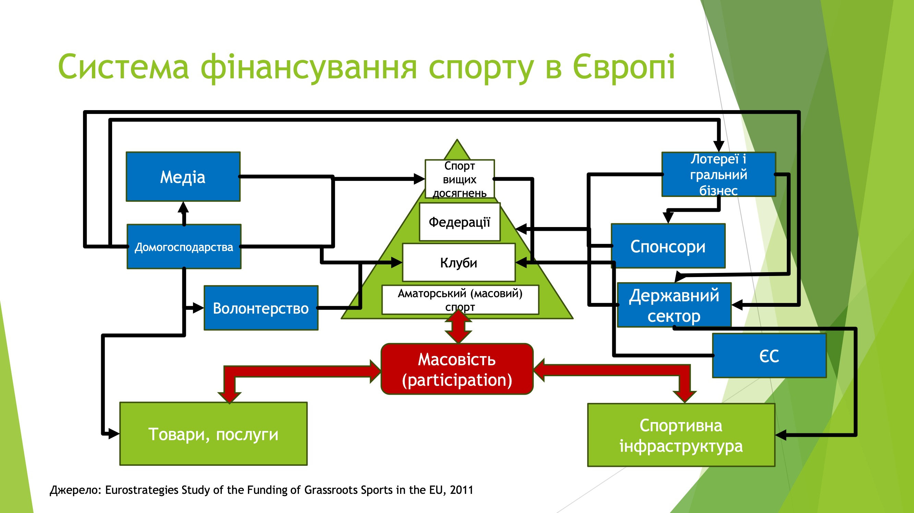

Посередині ми бачимо цю піраміду – перший принцип європейської моделі. Внизу – аматорський спорт. Він об'єднаний у клуби, клуби діють під егідою федерацій і зверху знаходиться спорт вищих досягнень. Цікавим тут є декілька речей.

По-перше, це те що є декілька джерел і видів фінансування. Вони поділяються на приватні та публічні джерела.
По-друге, в основі цієї системи є масовість. Вона впливає на аматорський спорт, на споживання спорту, на розбудову, наявність і попит на спортивну інфраструктуру.

В середньому по країнам Європи фінансування спорту виглядає так: половину дають домогосподарства – це самі люди, які займаються спортом. Десь 14-15% дає бізнес – в основному у вигляді спонсорства і купівлі медіа прав на трансляції. Решта - це розподілене між місцевими органами влади і центральним бюджетом державне фінансування спорту. Воно складає відповідно 30 відсотків. Суттєвою частиною цього фінансування публічного сектору є фінансування інфраструктури та субсидії федераціям і підтримка спортивних клубів.

Одразу треба сказати, що цей графік і цей розподіл це трошки "середня температура по лікарні", тому що цей розподіл залежить від того яка країна ЄС, як і в якому стані її економіка, скільки вона існує в ЄС.

Є такі країни, де приватні джерела фінансування дають близько 90%. Є і інша сторона спектру, де держава фінансує більшість видатків на спорт. Але цікавим тут також є те, що це фінансування по-різному корелює з рівнем економічного розвитку країни і з рівнем ВВП на душу населення. Якщо говорити про приватне фінансування, то там кореляція пряма. Чим багатіше країна, тим більше її громадяни витрачають на спорт. Якщо говорити про державні і місцеві органи влади, як вони фінансують спорт, то це більше питання політики підтримки спорту. Це більше питання полісімейкінгу, ніж економіки.

Це дуже добре проілюстровано ось на цьому слайді:

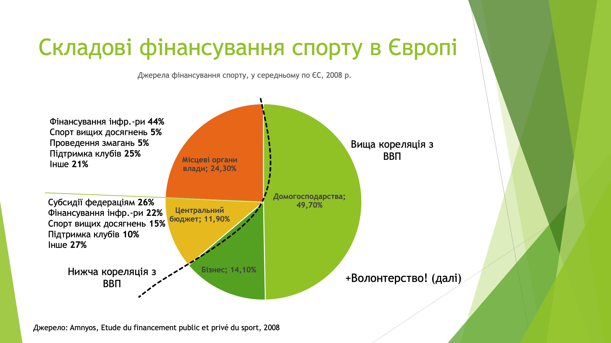

Є такий водорозділ між вже розвиненими країнами і тими, які розвиваються. Розвинені країни витрачають приблизно від 1.2% до 1.8% всього сукупного ВВП на спорт. Країни що розвиваються – в них цей відсоток перерозподілу ВВП на спорт нижчий і він зростає із зростанням економічного добробуту країни.

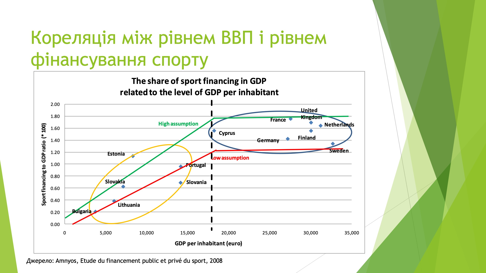

Інше дослідження про спорт 2011 року поділило фінансування на групи країн. Тут є рівень фінансування приватний, домогосподарства та публічний. Це у перерахунку на одну людину (per capita). Розмір цих бульбашок - це скільки людей є членами спортивних клубів, асоціацій або федерацій.

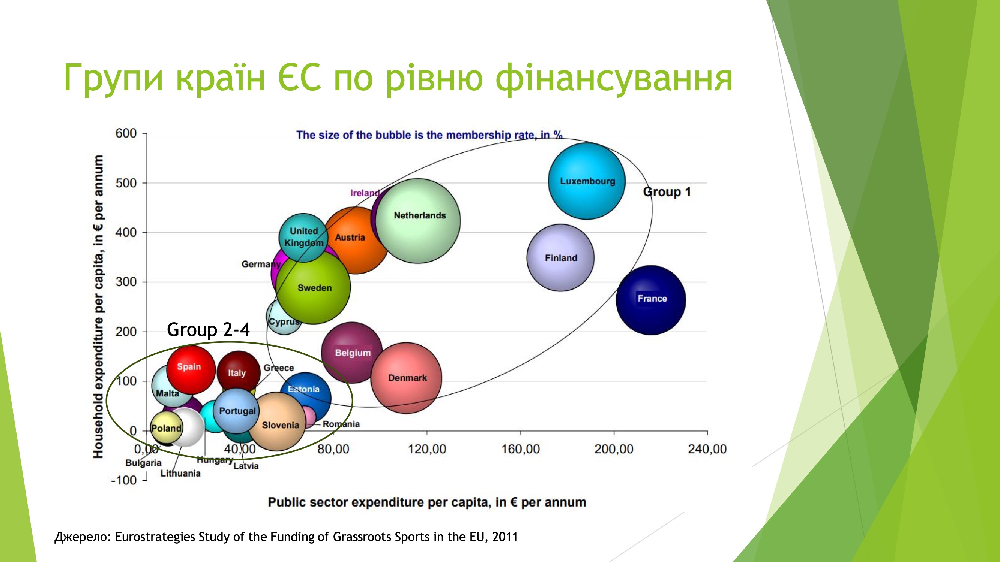

Перша група – це ті самі розвинені країни. Ця група більш-менш однорідна в тому, що витрачають багато і приватні особи, і публічний сектор, і в них велика ступінь залученості громадян у спортивну систему.

Цікавішим для нас може бути аналіз груп 2, 3 та 4. Група 2 – середземноморські країни. Група 3 – так звані, Rainbow країни. Група 4
– сама малорозвинена. Вони малорозвинені з точки зору витрат домогосподарства спорт і з точки зору залученості.

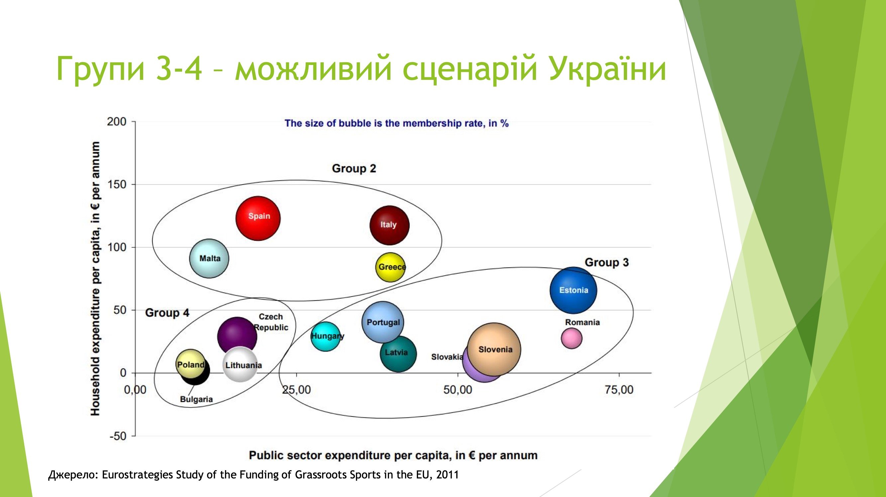

## Залученість / масовість

Всі дослідження, які я на цю тему читав, в один голос говорять про те що для того, щоб ці групи рухалися вверх на цьому графіку, уряду, який впроваджує політику підтримки спорту, треба залучати людей до спортивної системи. Треба заохочувати членство у спортивних клубах і допомагати розвивати спортивні клуби.

Розвиток залученості - це є наріжний камінь розвитку європейської спортивної системи.

Якщо зробити аналіз взаємозв'язків цих компонентів європейської системи спорту, і якось візуалізувати залежності, то стає очевидно, що ані пірамідальна структура, ані автономія чи волонтерство не існують ізольовано одне від одного.

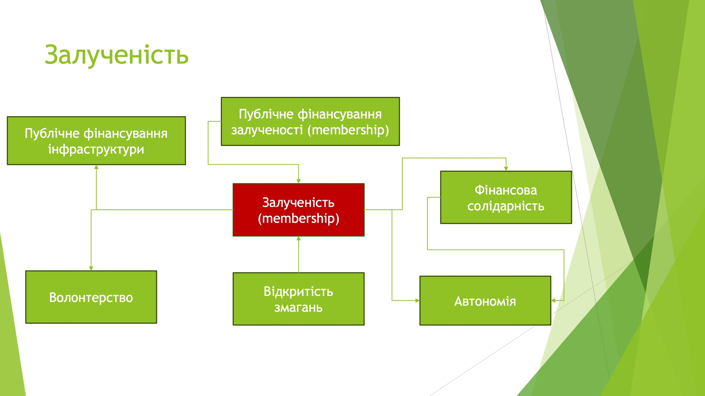

На залученості базується попит – і відповідно, пропозиція – на публічне фінансування інфраструктури. На ній базується певною мірою волонтерство. На ній базується фінансова солідарність. Відкритість змагань також впливає на залученість, тому що людям цікавіше
приєднуватися до того, що відкрите та інклюзивне. На ній базується автономія спорту.

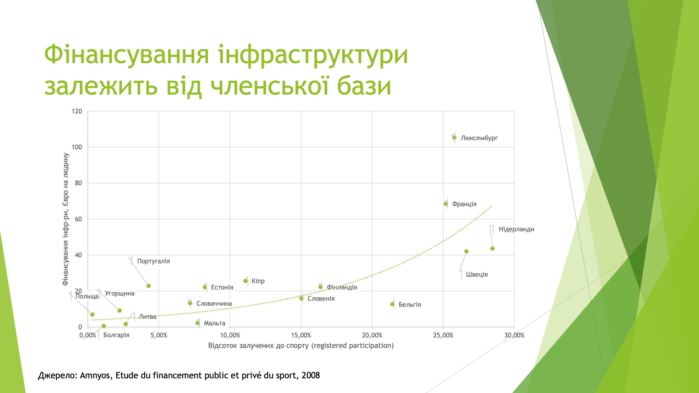

## Волонтерство

У Європейському спорті волонтерство - це 14 мільйонів спортивних волонтерів, або майже 4% працездатного населення. В еквівалентні повної зайнятості, тому що
вони витрачають 10% робочого часу, це 1,4 млн працівників. 90% волонтерів - це члени спортивних клубів. Один з п'яти членів спортивних клубів є волонтер.

Якщо умовно монетизувати оці 1,4 млн працівників повної зайнятості, то ми отримаємо станом на 2011 рік 28,4 млрд євро додаткового вкладу внеску волонтерства у
систему фінансування спорту. Або ще 24% до загального фінансування по Євросоюзу.

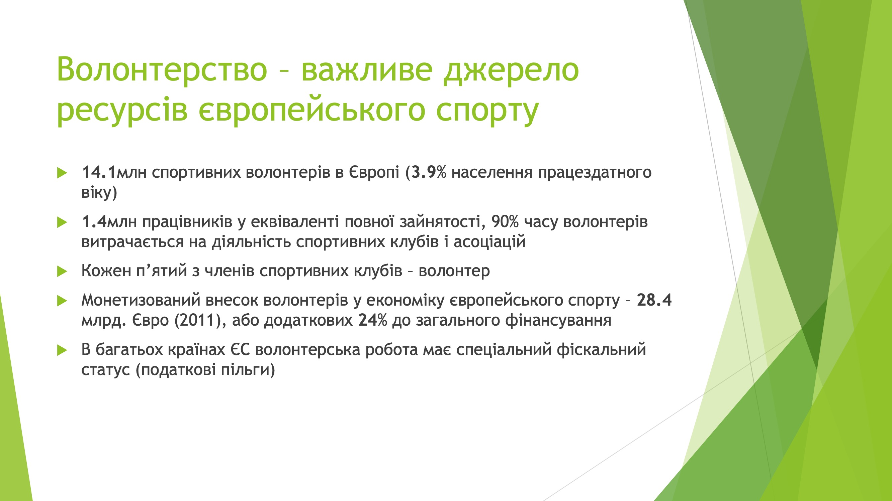

Ще дуже очевидним у всіх дослідженнях є зв'язок волонтерства та членства в клубах. Від того наскільки великим є членство у спортивних клубах в країні залежить і те, скільки волонтерів країна має на 100 чоловік населення.

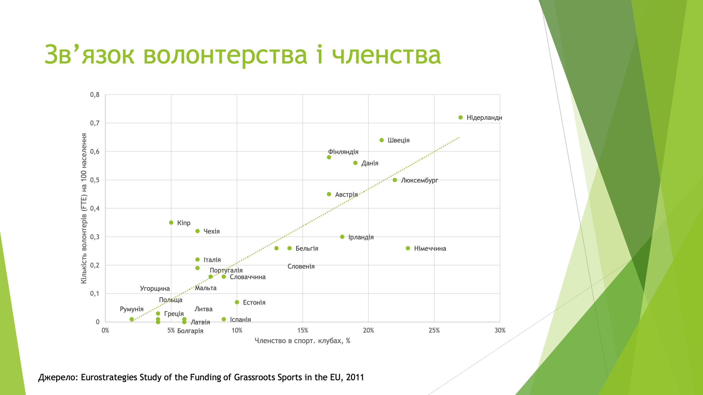

# 🇺🇦 Українські реалії

Тепер подивимось на українськіі реалії. Українська спортивна "піраміда" у нас виглядає ось так:

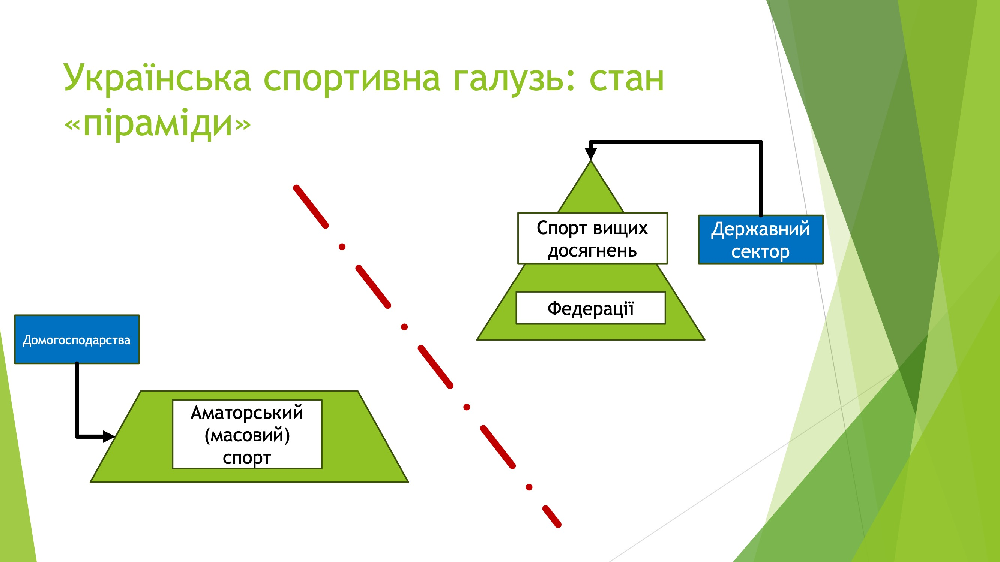

Станом на зараз у нас існує спорт вищих досягнень – існують федерації, які переймаються його якби розвитком, і отримують на це державне фінансування.

Паралельно з цим – і фактично ніяк не пересікаючись із правою частиною – у нас є аматорський, або масовий, спорт. Який фінансується виключно за рахунок
домогосподарств – тобто тих людей, які займаються цим спортом.

Це те, в якому стані українська спортивна галузь знаходиться зараз.

Є багато свідчень тому що в Україні відбулися певні спортивні буми у видах спорту. У нас продовжується біговий бум вже певний час - сім чи вісім років. У нас відбувся і відбувається бум велосипедного спорту. Але ці буми абсолютно ніяк не вплинули на залученість широкої бази аматорів-спортсменів до діяльності федерацій, а також до виникнення і розвитку клубної системи.

Це є такий український певний спортивний парадокс. Але я думаю, що він є для нашого суспільства більш характерним ніж лише у питанні розвитку спорту.

Якщо подивитися на моє улюблене питання "як це фінансується?" то система виглядає приблизно ось так:

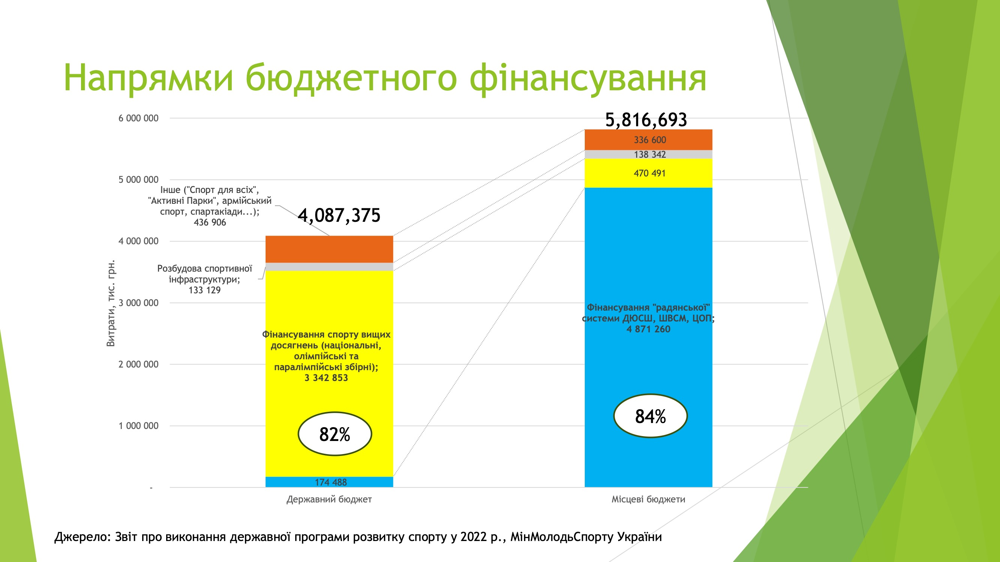

Це звіт про виконання державної програми розвитку спорту. У нас є дві ключові складові фінансування спорту за цією програмою – це державний бюджет і місцевий бюджет. Вони складали у 22-му році 4 і 5,8 млрд грн відповідно. Частка з державного бюджету фінансується на спорт вищих досягнень – 82% на діяльність національних олімпійських та паралімпійських збірних. З місцевими бюджетами 84% направлені на фінансування радянської системи ДЮСШ. І дуже маленьким є відсоток і частина на розбудову спортивної інфраструктури. Але система виглядає так, що левова частка – 80% - це спорт вищих досягнень і ДЮСШ, які з радянських часів його обслуговують.

## Медалецентричність

На цьому в принципі можна було б аналіз фінансово складових українського спорту і закінчувати, але ще є дві цікаві речі.
Це, по-перше, те, на основі чого це фінансування – той жовтий великий стовбець – розподіляється між федераціями, і це досить цікаве питання. Це медалецентрична система.

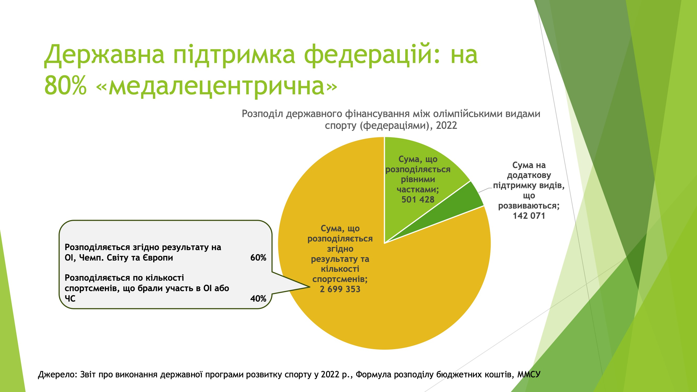

Воно розподіляється на основі страшного документу під назвою "Формула розподілу бюджетних коштів між видами спорту".

- 15% розподіляється між всіма федераціями рівними частками
- потім ще 5% є сума на підтримку видів спорту, розвиваються
- все інше розподіляється згідно результату на Олімпійських іграх, Чемпіонатів світу та Європи або по кількості спортсменів у збірній команді

Це абсолютно однобока система розподілу, вона не бере до уваги жодних показників залученості і скільки у федерації є членів, скільки їх було і скільки їх стало.

## Резюме

Резюмуючи, система європейської моделі спорту і взаємозв'язків її компонентів в Україні виглядає так:

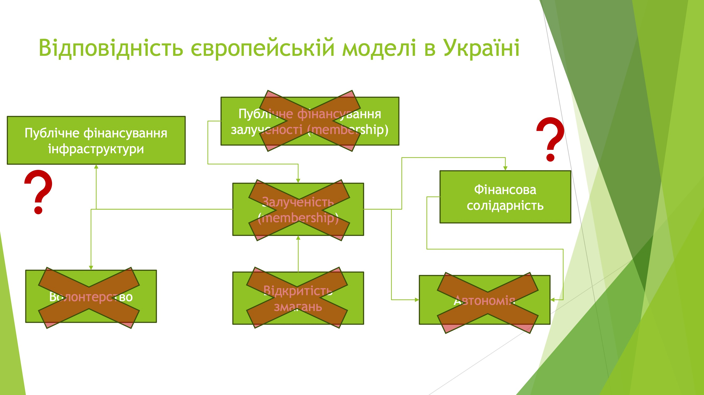

Публічне фінансування заохочення залученості до спорту у нас повністю відсутніє. Через це, відповідно, відсутнє таке явище, як волонтерство. Так само відсутня автономність. Всі ці ключові принципи і засади взаємопов'язані і вони базуються на спортивній піраміді.

Спортивна піраміда в Україні не є побудованою. Вона не існує. Це дві частки, які існують відокремлені одна від одної і ніяк не пов'язані. Тому говорити про відповідність українського спорту європейський моделі ніяк не можна.
